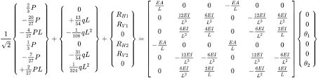
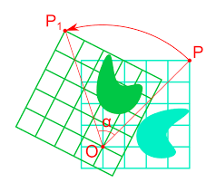
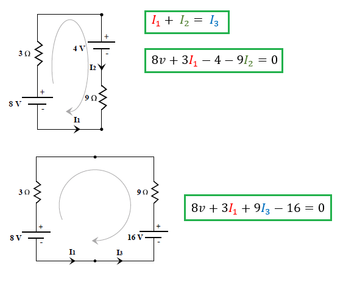
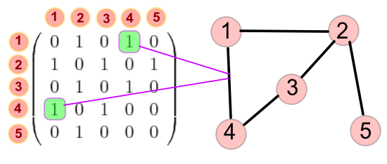
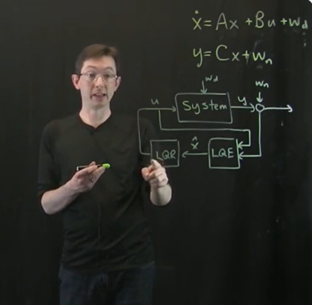
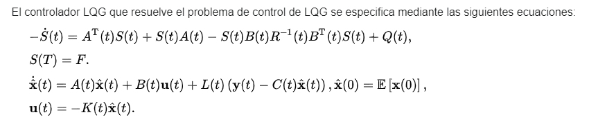

  
```{r setup, include=FALSE}
knitr::opts_chunk$set(echo = FALSE)
```

# Temario

Los temas del curso principales son los siguientes:

1- Sistemas de ecuaciones lineales y soluciones

2- Espacios vectoriales 

3- Transformaciones lineales

4- Valores y vectores propios

5- Formas canónicas y diagonalización

# Objetivos

Los objetivos _formativos_ en esta materia:
  
- Desarrollo de habilidades de pensamiento abstracto, lógico-matemático, reflexivo y crítico para la solución de problemas usando álgebra lineal.

- Fomenta las habilidades transversales de trabajo en equipo, comunicación efectiva, disciplina y creatividad.

- Capacidad de resolver problemas.

- Capacidad de usar matrices y transformaciones lineales en la solución de problemas

# Objetivos temáticos

- Conocer los conceptos básicos del álgebra lineal y entender como se aplican en diversos contextos.

- Evidencia de uso del álgebra lineal en aplicaciones geométricas, físicas y en otras áreas.

- Evidencia de comprensión de conceptos en la solución de lista de ejercicios y tareas.

- Capacidad de uso y manejo de MATLAB para resolver problemas solucionables aplicando álgebra lineal


# Evaluación 

Se evaluará el curso de la siguiente forma:

1. En el primer parcial

  - Examen parcial: 80%
  
  - Tareas y prácticas: 20%

2. En el segundo y tercer parcial parcial
  
  - Examen parcial: 75%
  
  - Tarea: 10% 
  
  - Prácticas en MATLAB 15% (tipo proyecto)
  
## Interacción y material para estudio

Las notas y asignación de tareas se subirán en un google classroom, se recomienda darse de alta.

### Classroom: https://classroom.google.com/c/NzA4NzQ3NjkwOTE1?cjc=upzqrxf code: upzqrxf

Página: 


# Bibliografía

Las principales referencias del curso son los siguientes libros

* <h4> Poole, D. Álgebra lineal. Una introducción moderna. </h4>

* <h4> Maltsev, I. Fundamentos de Álgebra lineal. </h4>


Algunos otros libros de referencia y apoyo son los siguientes:

* Lipschutz, S. Álgebra lineal.

* Kolman, B. Álgebra lineal: Fundamentos y aplicaciones

* Anton H. Introducción al álgebra lineal.

* Grossman. Álgebra lineal y aplicaiones


## Tareas y Prácticas

Consisten en :
  
* Ejercicios de reforzamiento en clase.

* Problemas, demostraciones de teoremas o aplicaciones 


**No** habrá tolerancia ni modificación en fecha de entrega de ejercicios.

Son guía para el examen escrito.

# Horarios

Grupo 2CV5 

Horario: lunes, miércoles y jueves: 20:00 a 21:30 hrs. Salón 2006.

Grupo 2BV1

Horario: martes, miércoles y viernes: 18:30 a 20:00 hrs. Salón 4008.


# Aplicaciones

El álgebra lineal tiene una enorme importancia en otras ciencias. Algunos ejemplos en donde se aplica de manera indirecta son los siguientes:

En otras áreas de la ingeniería:
Como en el análisis matricial de estructuras

```{r echo=FALSE, fig.align='center', out.width='65%'}

```

Aplicaciones en la física

# Aplicaciones II

## Física.

En física varias transformaciones se expresan sucintamente por medio de transformaciones lineales.
```{r echo=FALSE, fig.align='center', out.width='50%'}

```


# Aplicaciones III

## En teoría de circuitos

Las leyes de Kichoff tienen una enunciación en términos de sistemas de ecuaciones
```{r echo=FALSE, fig.align='center', out.width='40%'}

```
La teoría de redes y grafos usa de manera natural a las matrices 
```{r echo=FALSE, fig.align='center', out.width='30%'}

```

En problemas de control automático, los modelos de control *LQG*
```{r echo=FALSE, fig.align='center', out.width='40%'}

```

El problema de obtener el "mejor" control se llama un problema de _control_ _óptimo_, que se puede calcular analiticamente bajo ciertas condiciones

```{r echo=FALSE, fig.align='center', out.width='60%'}

```


# Aplicaciones IV

Muchos objetos en otras áreas se expresan concretamente con ayuda de las mátrices y transformaciones lineales.

Por ejemplo:

### Correlación

Cuando se modela una variable $Y$ en función de otras variables $X_1,X_2,\ldots,X_n$ se busca calcula la correlación entre dichas variables sea baja, para medir tal efecto

```{r echo=FALSE, message = FALSE, warning = FALSE, results='asis'}
library(tidyverse)
library(ggplot2)

ggplot(data= diamonds) + geom_point(aes(x = carat, y = price, color=cut))


```

Podemos visualizar la dependencia entre las variables, peso, profundidad y table
```{r echo=FALSE, message = FALSE, warning = FALSE, results='markup'} 
library(corrplot)

mat_corr<- as.matrix(cor(select(diamonds,"carat","depth","table")))
mat_corr

corrplot(mat_corr)

```

La estructura de la correlación de varias variables es una matriz, la cual es llamada **la** **matriz** **de** **correlaciones**.

# Cadenas de Markov y evoluciones aleatorias

Cuando tenemos un proceso estocástico cuyas distribuciones cumplen la llamada __propiedad__ __de__ **Markov**, la evolución probabilistica y la distribución se puede entender por medio de la matriz de transición de la cadena $P$.

Ver https://setosa.io/ev/markov-chains/

# Programas lineales

Muchos problemas en investigación de operaciones se pueden usar gracias a las técnicas de programación lineal

Un programa lineal es de la forma $c^{T}x$. sujeto a $Ax\leq b$, $x\geq 0$


