

# Vectores en $\mathbb{R}^{2}$ y $\mathbb{R}^3$ 

Desde un punto de vista intuitivo, un <strong>vector</strong>  es un objeto con magnitud, dirección y sentido bien definidos. En ese sentido, los vectores en la figura representan a un mismo vector. 
En física y en varias aplicaciones, esta definición es suficiente para trabajar con los vectores, sin embargo, en álgebra lineal el concepto de vector requiere definir a los _espacios_ de vectores, más que a los vectores.

En esta parte del curso veremos a los vectores de manera intuitiva, usaremos las ideas vistas en física y consideramos a los vectores como un objeto que tiene magnitud, dirección y sentido. Además definiremos a los _espacios_ _vectoriales_ $\mathbb{R}^{2}$, $\mathbb{R}^{3}$  y $\mathbb{R}^{n}$ (para $n$ un natural). Inicialmente definidos simplemente como conjuntos.

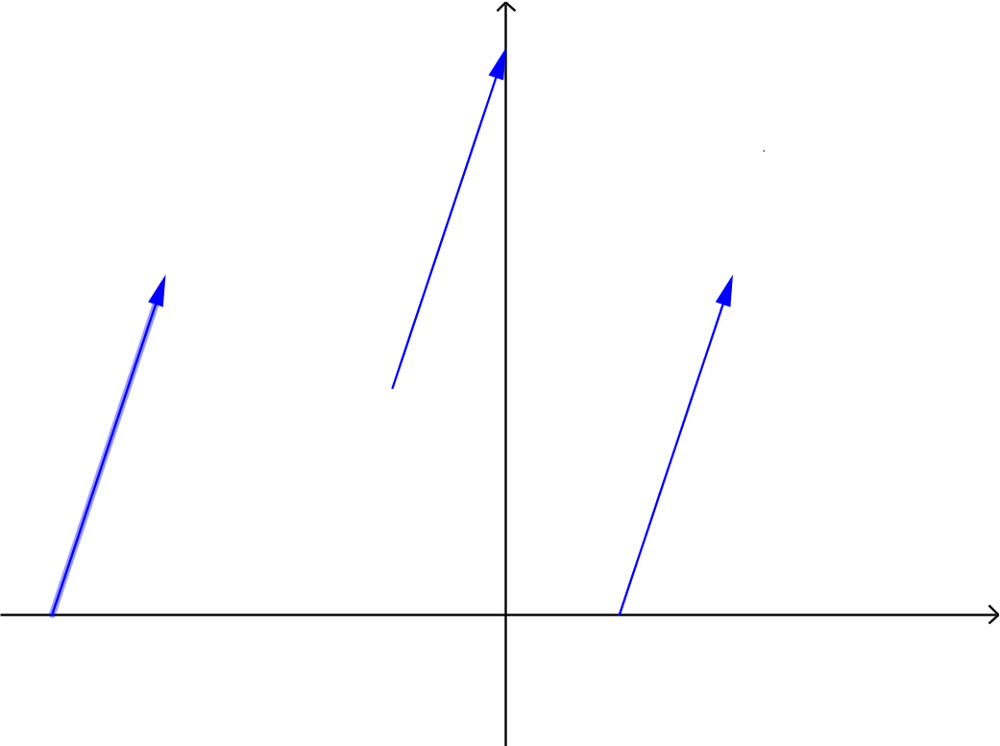{ width=50% }

Desde el punto de vista teórico, un vector es un elemento de un **espacio** **vectorial**. Esta definición se verá más adelante a detalle, pero podemos dar una definición simplificada en este momento:  un vector en el espacio puede ser pensado como una terna ordenada de números reales o una $n$-tupla de números reales.

### Ejemplo.

Suponga que se quiere analizar una reacción química
\[
H_3PO_4 + Ca(OH)_2 \rightarrow Ca_{3}(PO_4)_2+H_2O
\]

Se busca cuantas moléculas intervienen en la reacción química, entonces $\mathbf{v} = (\alpha, \beta,\gamma, \delta)$ con 

 * $\alpha$ - \# de moléculas de $H_3PO_4$.
 * $\beta$  - \# de moléculas de $Ca(OH)_2$.
 * $\gamma$ - \# de moléculas de $Ca_3(PO_4)_2$.
 * $\delta$ - \# de moléculas de $H_2O$

En este caso, la cantidad de interés se representa como un vector en $4$ dimensiones.

_Balancear_ la reacción, significa encontrar los números de moléculas que hacen que se conserve la _materia_, que no se 'pierdan' moleculas en la reacción.

# Los espacios $\mathbb{R}^{2}$ y $\mathbb{R}^{3}$

## 1. Definición

La recta real $\mathbb{R}$ es el conjunto de números reales.  También es un campo de escalares.

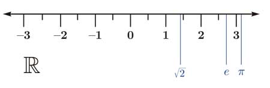{ width=40% }		

## Campo de escalares

Un **campo** **de** **escalares** es un conjunto $\mathbb{K}$ de elementos con las siguientes propiedades. Existen dos operaciones $+$ y $\cdot$
Para $\alpha,\beta\in \mathbb{K}$

1) $\alpha$ + $\beta$ = $\beta$ + $\alpha$

2) $(\alpha+\beta)+\gamma$ = $\alpha$+$(\beta+\gamma)$

3)Existe un elemento llamado el **elemento** **nulo**, $0$ tal que para todo $x\in K$ $x+0=x$

4) Para todo elemento $x\in \mathbb{K}$ existe $y\in\mathbb{K}$ tal que $x+y=0$.

5) $\alpha \cdot \beta = \beta\cdot \alpha$

6) $(\alpha\beta)\gamma = \alpha(\beta\gamma)$

7) Existe un número $1$ que llamamos la unidad tal que $1\cdot x = x$

8) Para todo elemento $x\in \mathbb{K}$ existe su inverso bajo la multiplicación, es decir $x^{-1}$ tal que
\[
x\cdot x^{-1} = 1
\]

9) Se cumple la propiedad distributiva
\[
\alpha(\beta+\gamma) = \alpha \beta + \alpha \gamma
\]

### Ejemplos de campos

1. **Los racionales** $\mathbb{Q}$.

2. **Los números reales** $\mathbb{R}$.

3 **Los números complejos** $\mathbb{C}$.

## 2. Definición

Sea $n$ un número entero positivo. Denotamos por $\mathbb{R}^n$ al conjunto de todas las $n-$tuplas de números reales. En estas secciones nos centraremos en las definiciones para $\mathbb{R}^{2}$ y $\mathbb{R}^{3}$.

## 3. Definición $\mathbb{R}^2$

**Plano** **cartesiano**

A $\mathbb{R}^2$ se le suele llamar el **plano** **cartesiano**

\[
\mathbb{R}^{2} = \{ (x,y)\,|\,\, x,y\in \mathbb{R}\}
\]

A cada elemento $(x,y)$ de $\mathbb{R}^2$ se dice ser un _par_ _ordenado_. Es decir, es una pareja de números reales.

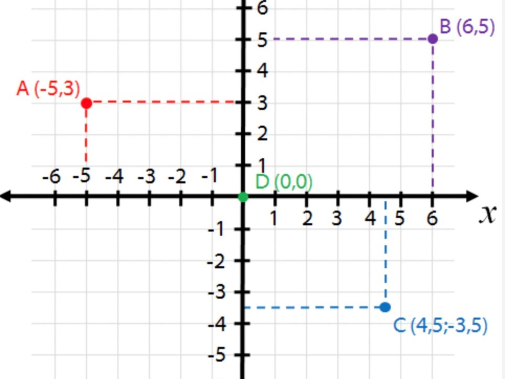{ width=40% }		
Cada elemento del plano cartesiano se representa con un punto $(x,y)$

Similarmente

## 3. Definición $\mathbb{R}^3$

A $\mathbb{R}^2$ se le suele llamar el **espacio** **cartesiano**

\[
\mathbb{R}^{3} = \{ (x,y,z)\,|\,\, x,y,z\in \mathbb{R}\}
\]

A cada elemento $(x,y,z)$ de $\mathbb{R}^3$ se dice ser una _terna_ _ordenado_. 

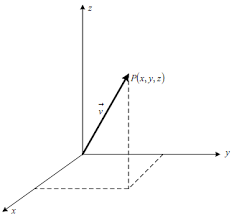{ width=40% }		

### Nota 

Para vectores se puede usar de manera indistinta otras notaciones:

\begin{equation*}
\begin{pmatrix} a_1, a_2, a_3     \end{pmatrix}\quad \quad 
\begin{pmatrix} a_1 \\ a_2 \\ a_3 \end{pmatrix}\quad \quad
\begin{bmatrix} a_1, a_2, a_3     \end{bmatrix}\quad \quad
\begin{bmatrix} a_1 \\ a_2 \\a_3  \end{bmatrix}
\end{equation*}
 
Usualmente, seguiremos la siguiente notación

\[
\mathbf{v} = \begin{pmatrix} a_1 \\ a_2 \\ a_3 \end{pmatrix}
\]
 
## 2. Definición de igualdad de vectores

Dos vectores son iguales si todas sus componentes correspondientes son iguales

$$
\begin{array}{ccc}
\begin{pmatrix} a_1 \\ a_2 \\ a_3 \end{pmatrix} = \begin{pmatrix} b_1 \\ b_2 \\ b_3 \end{pmatrix} 
& \Longleftrightarrow &
a_1 = b_1, \,\, a_2 = b_2, \,\, a_3 = b_3
\end{array}
$$

## Operaciones algebraicas en $\mathbb{R}^{3}$

En $\mathbb{R}^2$ y en $\mathbb{R}^3$ definimos operaciones entre vectores, la suma de vectores y la multiplicación por escalar.

## 3. Definición de la suma de vectores

La _adición_ de dos vectores se define como el vector resultante de sumar _componente_ _por_ _componente_ a los vectores.
Es decir
$$
\vec{a} = \begin{pmatrix} a_1\\ a_2\\ a_3\end{pmatrix} \quad \mbox{y} \quad
\vec{b} = \begin{pmatrix} b_1\\ b_2\\ b_3\end{pmatrix} \quad \vec{a+b} = \begin{pmatrix} a_1+b_1\\ a_2+b_2\\ a_3+b_3\end{pmatrix} 
$$

Una forma concisa de escribir a las entradas del vector es por medio de los índices
$$
\mbox{ Para }k\in \{1,2,3\}\quad (a+b)_k=a_k + b_k
$$

Geometricamente, la suma de vectores en $\mathbb{R}^2$ y en $\mathbb{R}^3$ se puede obtener por medio de la _regla_ _del_ _paralelogramo_.

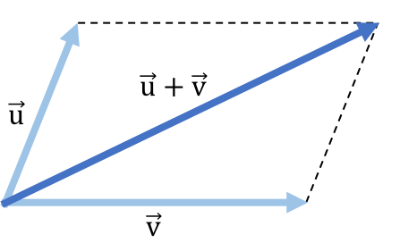{ width=40% }		

## 4. Definición de la multiplicación de un escalar y un vector

La multiplicación de un _número_ $c\in\mathbb{R}$ o $c\in\mathbb{C}$ por un vector $\vec{v}\in\mathbb{R}^{3}$ se denota como
$$
c\cdot \vec{v} = c\cdot \begin{pmatrix}a_1 \\ a_2 \\a_3 \end{pmatrix} =  \begin{pmatrix}ca_1 \\ ca_2 \\ca_3 \end{pmatrix}
$$

## Propiedades de la suma de vectores

### Propiedad conmutativa

$$
\mbox{Para todo }\vec{v}_1,\vec{v}_2  \in\mathbb{R}^{3} \quad\quad \vec{v}_1+\vec{v}_2 = \vec{v}_2+\vec{v}_1
$$

### Propiedad asociativa

$$
\mbox{Para todo }\vec{v}_1,\vec{v}_2,\vec{v}_3  \in\mathbb{R}^{3} \quad\quad \vec{v}_1+(\vec{v}_2+\vec{v}_3) = (\vec{v}_1+\vec{v}_2)+\vec{v}_3
$$

### Definición del elemento neutro. Definimos al $\vec{0}\in\mathbb{R}^{3}$ como el vector $\vec{0}=(0,0,0)$

## Existencia del elemento neutro en la suma

$$
\mbox{Para todo }\vec{v}_1  \in\mathbb{R}^{3} \quad\quad \vec{v}_1+\vec{0} = \vec{0}+\vec{v}_1 = \vec{v}_1
$$

## Existencia del elemento inverso en la suma

$$
\mbox{Para todo }\vec{v}_1  \in\mathbb{R}^{3} \mbox{ existe } -\vec{v}_1 \mbox{ tal que } \quad\quad \vec{v}_1+ -\vec{v}_1 = \vec{v}_1 + (-\vec{v}_1) = \vec{0}
$$

## Propiedades de la multiplicación

### Leyes distributivas

Las leyes distributivas combinan a la suma de vectores y a la multiplicación por escalar. En pocas palabras, la multiplicación de un vector por una suma de escalares "se reparte" en cada escalar

$$
\mbox{Para todo  }\vec{v}  \in\mathbb{R}^{3}\,\, \mbox{ y }\,\, \alpha,\beta \in\mathbb{R} \quad\quad (\alpha+\beta)\cdot \vec{v}_1 = \alpha\cdot\vec{v}_1+\beta\cdot\vec{v}_1
$$
E igualmente, la multiplicación de un escalar por la suma de vectores "se reparte" en cada vector.
$$
\mbox{Para todo  }\vec{v},\vec{u}  \in\mathbb{R}^{3}\,\, \mbox{ y }\,\, \alpha \in\mathbb{R} \quad\quad \alpha\cdot (\vec{v}+\vec{u}) = \alpha\cdot\vec{v}+\alpha\cdot\vec{u´}
$$

### Existencia del elemento neutro en la multiplicación escalar.

En $\mathbb{R}$ el elemento neutro en la multiplicación es el número $1$. Analogamente, en $\mathbb{C}$ el elemento neutro es el número complejo $1+i 0$. La siguiente propiedad simplemente se refiere a que el mismo elemento es neutro en la multiplicación por un vector

$$
\mbox{Para todo }\vec{v}_1 \in\mathbb{R}^{3} \quad\quad 1\cdot\vec{v}_1 = \vec{v}_1
$$

### Asociatividad de la multiplicación

La última propiedad de la multiplicación significa que la multiplicación es asociativa, en caso de tener dos escalares, no importa el orden en que se realice la multiplicación. Por ejemplo, multiplicar $\mu$ por $\vec{v}$ y luego multiplicarlo por $\lambda$ es igual a multiplicar primero los escalares $\mu$ y $\lambda$ y posteriormente multiplicar al vector.

$$
\mbox{Para todo }\vec{v} \in\mathbb{R}^{3} \,\,\mbox{y}\,\,  \lambda,\mu\in\mathbb{R}, \quad \,\,\lambda\cdot(\mu\cdot\vec{v}) = (\lambda\mu)\cdot\vec{v}
$$

## Producto escalar

En $\mathbb{R}^2$, $\mathbb{R}^3$ y en general, en $\mathbb{R}^n$ definimos el **producto** **punto** como
Suponga que $\vec{v},\vec{u}\in \mathbb{R}^3$

\[
\vec{v} \cdot  \vec{u} = v_1u_1 +v_2u_2 + v_3u_3
\]

y en general en $\mathbb{R}^n$

\[
\vec{v} \cdot  \vec{u} = v_1u_1 +v_2u_2 + \ldots + v_nu_n = \sum_{i=1}^n v_ku_k
\]

Algunas propiedades del producto punto

1. $\vec{v}\cdot \vec{u} = \vec{u}\cdot \vec{v}$

2. $(\vec{v}+ \vec{w})\cdot \vec{u} = \vec{v}\cdot \vec{u} + \vec{w}\cdot \vec{u}$

3. $(\alpha \vec{v})\cdot \vec{w} = \alpha (\vec{v}\cdot \vec{w})$

4. $\vec{v}\cdot \vec{v} = \sum_{i=1}^n v_i^2$. 

5. En particular, si $\vec{v}\cdot \vec{v}= 0$ entonces $\vec{v}=\vec{0}$.

## Norma euclideana

Sea $v\in \mathbb{R}^{2}$ un vector, definimos a la norma del vector $v$ como

\begin{equation}
 ||v||=\sqrt{v_1^2 + v_2^2} = \sqrt{\vec{v} \boldsymbol{\cdot} \vec{v}}
\end{equation}

En general, si $v\in\mathbb{R}^{n}$ es un vector en el espacio de $n$ dimensiones, definimos de manera análoga a su norma como
\begin{equation}
 \|v\|=\sqrt{v_1^2 + v_2^2+\ldots+ v_n^{2}} = \sqrt{\sum_{i=1}^n v_i^{2}} = \sqrt{ \vec{v} \boldsymbol{\cdot} \vec{v}}
\end{equation}

Veremos a detalle el concepto de norma en otra sección del curso. Por el momento nos contentaremos con indicar que la norma definida es _la_ _norma_ _euclidiana_ y representa la _longitud_ del vector, del origen al punto que representa el vector.

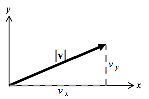{ width=40% }		

## Distancia entre dos vectores.

Si $\vec{x}$ y $\vec{y}$ son dos vectores, entonces, el vector entre ellos es igual a $\vec{y}-\vec{x}$ y por tanto la distancia entre dos vectores es igual a 

\begin{equation}
  d(\vec{y},\vec{x}) = \|\vec{y}-\vec{x}\|
\end{equation}

Ahora, considerando que los vectores $\vec{x}$ y $\vec{y}$ y $\overrightarrow{xy}$ forman un triángulo, 

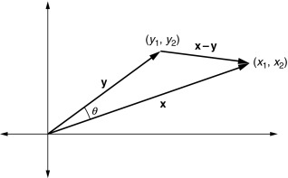{ width=40% }		
el vector que 'une' a los vectores $\vec{x}$ y $\vec{y}$ es igual a $\overrightarrow{xy} = \vec{y}-\vec{x}$. 

### Ángulo entre vectores

Realizando un cálculo con las propiedades del producto interno

\begin{equation}
\begin{array}{ccl}
  ||\vec{u}-\vec{v}||^2  = & (\vec{u}-\vec{v})\boldsymbol{\cdot}(\vec{u}-\vec{v})= & (\vec{u}\boldsymbol{\cdot} \vec{u})-(\vec{u}\boldsymbol{\cdot} \vec{v})-
  (\vec{v}\boldsymbol{\cdot} \vec{u}) + (\vec{v}\boldsymbol{\cdot} \vec{v}) \\
  ||\vec{u}-\vec{v}||^2  = & (\vec{u}-\vec{v})\boldsymbol{\cdot}(\vec{u}-\vec{v})= & ||\vec{u}||^2-2(\vec{u}\boldsymbol{\cdot} \vec{v}) + ||\vec{v}||^2
\end{array} (\eq:a)
\end{equation}

Por otro lado, usando las propiedades de los triángulos (la ley de cosenos), las normas de los vectores $||\vec{v}||$, $||\vec{u}||$ y $||\vec{v}-\vec{u}||$ cumplen la ley de los cosenos, si $\theta$ es el ángulo entre los vectores $\vec{v}$ y $\vec{u}$.

\begin{equation}
  ||\vec{v}-\vec{u}||^2 = ||\vec{v}||^2 + ||\vec{u}||^2 -2||\vec{v}||||\vec{u}||\cos \theta
\end{equation}

Comparando las ecuaciones para $||\vec{v}-\vec{u}||^2$ \ref(a) obtenemos la siguiente ecuación

\begin{equation}
  \vec{v}\boldsymbol{\cdot} \vec{u} = \|\vec{v}\|\|\vec{u}\|\cos \theta
\end{equation}

### Desigualdad de Cauchy Schwarz

Considerando que $|\cos \theta| \leq 1$ para todo $\theta$ entonces 
\[
|\vec{x} \boldsymbol{\cdot} \vec{y}| = \|\vec{x}\| \|\vec{y}\| |\cos \theta| \leq \|\vec{x}\| \|\vec{y}\|
\]

<h3>Desigualdad del triángulo</h3>

Para cualquier vector $\vec{x},\vec{y}\in\mathbb{R}^n$

  \begin{equation}
    \|\vec{x}+\vec{y}\| \leq \|\vec{x}\| + \|\vec{y}\|
  \end{equation}

<h3>Ortogonalidad en $\mathbb{R}^n$</h3>

Sean  $\vec{x},\vec{y}\in\mathbb{R}^n$ dos vectores. 

  Decimos que son **ortogonales** si
  
  \begin{equation}
  \vec{x}\boldsymbol{\cdot}\vec{y} = 0
  \end{equation}

Aplicando el mismo cálculo para $\vec{x}$ y $\vec{y}$ **ortogonales** obtenemos el siguiente resultado

<h3>Teorema de Pitágoras</h3>

Suponga que $\vec{x},\vec{y}\in\mathbb{R}^n$ son dos vectores **ortogonales** 

  \begin{equation}
    \|\vec{x}+\vec{y}\|^2 = \|\vec{x}\|^2 + \|\vec{y}\|^2
  \end{equation}

## 5. Combinaciones lineales

### Combinaciones lineales de vectores

Una <strong>combinación lineal</strong> de vectores $\vec{v}_1, \vec{v}_2, \dots, \vec{v}_k$ es el vector resultante de "combinar" los vectores por medio de la siguiente operación:
\begin{equation}
\vec{v} = c_1 \vec{v}_1 + c_2 \vec{v}_2 + \cdots + c_k \vec{v}_k = \sum_{i=1}^k c_i \vec{v}_i,
\end{equation} 
donde $c_1, c_2, \dots, c_k$ son números reales (llamados coeficientes de la combinación lineal). En otras palabras, una combinación lineal es una suma de múltiplos de los vectores $\vec{v}_1, \vec{v}_2, \dots, \vec{v}_k$.

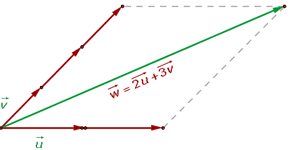{ width=50% }

### Ejemplo 

Para los vectores
	
\begin{equation}
	\vec{v}_1 = \left(
	\begin{array}{c}
	1 \\
	-1
\end{array}	\right) \quad 
\text{y} \quad
	\vec{v}_2 = \left(
	\begin{array}{c}
	1 \\
	3
	\end{array}
	\right),
\end{equation} 
	
obtener las combinaciones lineales:
	
* $\vec{v}_1 + \vec{v}_2 =$

* $4 \vec{v}_1 = 4 \vec{v}_1 + 0 \vec{v}_2 =$
* $\vec{v}_2 = 0\vec{v}_1 + 1\vec{v}_2 =$
* $\frac{1}{2}\vec{v}_1  -1 \vec{v}_2 =$

Geometricamente, _cualquier_ vector del plano puede ser representado como combinación lineal de vectores que no son colineales.

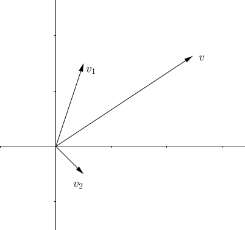{ width=40% }	

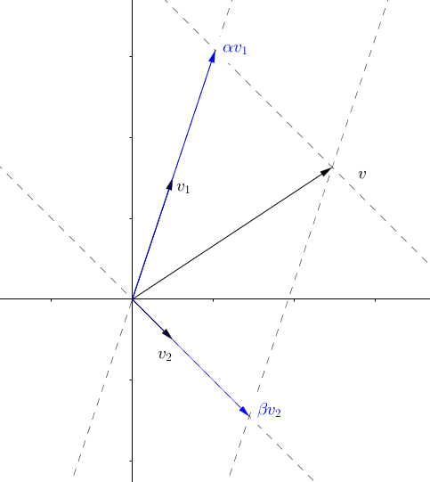{ width=40% }		
	
Por ejemplo, para representar el vector $\vec{v}$ como combinación lineal de $\vec{v}_1$ y $\vec{v}_2$, podemos trazar rectas paralelas a los vectores, pasando por el origen y por el extremo del vector $\vec{v}$ como en la figura.
	
	
De forma mas general, decimos que un vector $\vec{v} \in \mathbb{R}^n$ es una **combinación** **lineal** de los $k$ vectores $\vec{v}_1, \vec{v}_2, \dots, \vec{v}_k  \in \mathbb{R}^n$ cuando existen coeficientes $c_1, c_2, \dots, c_k$ tales que

\begin{equation}
\vec{v} = c_1 \vec{v}_1 + c_2 \vec{v}_2 + \dots + c_k \vec{v}_k.
\end{equation} 

Para decidir si un vector es combinación lineal de otros, debemos determinar si existen  números $c_1, c_2, \dots, c_k$. 
En coordenadas:
\begin{equation}
\vec{v}_1 =
\left(
\begin{array}{c}
v_{11} \\
v_{21} \\
v_{31} \\
\vdots \\
v_{m1}
\end{array}
\right), \,
\vec{v}_2 =
\left(
\begin{array}{c}
v_{12} \\
v_{22} \\
v_{32} \\
\vdots \\
v_{m2}
\end{array}
\right), \,
\vec{v}_3 =
\left(
\begin{array}{c}
v_{13} \\
v_{23} \\
v_{33} \\
\vdots \\
v_{m3}
\end{array}
\right), \, \cdots, 
\vec{v}_k =
\left(
\begin{array}{c}
v_{1k} \\
v_{2k} \\
v_{3k} \\
\vdots \\
v_{mk}
\end{array}
\right), \,
\vec{v} =
\left(
\begin{array}{c}
b_{1} \\
b_{2} \\
b_{3} \\
\vdots \\
b_{m}
\end{array}
\right),
\end{equation} vemos que encontrar los coeficientes de la combinación lineal, en caso de que estos existan, equivale a resolver una ecuación
\begin{equation}
c_1 \left(
\begin{array}{c}
v_{11} \\
v_{21} \\
v_{31} \\
\vdots \\
v_{m1}
\end{array}
\right) + c_2
\left(
\begin{array}{c}
v_{12} \\
v_{22} \\
v_{32} \\
\vdots \\
v_{m2}
\end{array}
\right) + c_3
\left(
\begin{array}{c}
v_{13} \\
v_{23} \\
v_{33} \\
\vdots \\
v_{m3}
\end{array}
\right) + \cdots + c_k
\left(
\begin{array}{c}
v_{1k} \\
v_{2k} \\
v_{3k} \\
\vdots \\
v_{mk}
\end{array}
\right) =
\left(
\begin{array}{c}
b_{1} \\
b_{2} \\
b_{3} \\
\vdots \\
b_{m}
\end{array}
\right),
\end{equation} que, a su vez, es equivalente a
\begin{equation}
\left(
\begin{array}{c}
v_{11} c_1 + v_{12} c_2 + v_{13} c_3 + \cdots + v_{1k} c_k  \\
v_{21} c_1 + v_{22} c_2 + v_{23} c_3 + \cdots + v_{2k} c_k  \\
v_{31} c_1 + v_{32} c_2 + v_{33} c_3 + \cdots + v_{3k} c_k  \\
\vdots  \\
v_{m1} c_1 + v_{m2} c_2 + v_{m3} c_3 + \cdots + v_{mk}cx_k
\end{array}
\right) =
\left(
\begin{array}{c}
b_{1} \\
b_{2} \\
b_{3} \\
\vdots \\
b_{m}
\end{array}
\right)
\end{equation}

### Ejemplo

En $\mathbb{R}^{3}$ todo vector es una combinación lineal de los vectores $\hat{i}=(1,0,0)$, $\hat{j}=(0,1,0)$ y $\hat{k}=(0,0,1)$. En efecto, si $\vec{v}=(v_x,v_y,v_z)$ entonces 

$$
\vec{v}=v_x\hat{i}+v_y\hat{j}+v_z\hat{k}
$$

A los vectores $\hat{i}=(1,0,0)$, $\hat{j}=(0,1,0)$ y $\hat{k}=(0,0,1)$ se les llama la **base** **canónica**.

### Ejemplo

Dados los vectores $\vec{v}_1=(1,2,1)$, $\vec{v}_2=(2,1,2)$, $\vec{v}_3=(3,3,2)$ y $\vec{v}_4=(1,5,-1)$ en $\mathbb{R}^3$ determinar los vectores $\vec{u}=\vec{v}_1-3\vec{v}_2+2\vec{v}_3-\vec{v}_4$, $v=\vec{v}_1+\vec{v}_2-\vec{v}_3-\vec{v}_4$, $\vec{w}=\vec{v}_3-\frac{1}{3}\vec{v}_2-\frac{4}{3}\vec{v}_1$.

Aplicando las operaciones entre vectores $u=(0,0,0)$, $v=(-1,-5,2)$, $w=(1,0,0)$.

### Ejemplo

Dados $\vec{u}=\begin{pmatrix} 1\\2\\3 \end{pmatrix}$, $\vec{v}=\begin{pmatrix} 3\\2\\0 \end{pmatrix}$ y
$\vec{w}=\begin{pmatrix} 2\\0\\0 \end{pmatrix}$ ¿es $\begin{pmatrix} 1\\1\\1 \end{pmatrix}$ una combinación lineal de los vectores $\vec{u},\vec{v},\vec{w}$?

Debemos averiguar si existen constantes $\alpha,\beta,\gamma$ tal que 

$$
\begin{pmatrix} 1\\1\\1 \end{pmatrix} = \alpha\cdot \vec{u}+ \beta\cdot \vec{v} + \gamma\cdot \vec{w}
$$

Sustituyendo a los vectores por sus coordenadas obtenemos el siguiente _sistema_ _de_ _ecuaciones_

$$
\begin{array}{ccc}
\alpha + 3\beta+2\gamma & = & 1 \\
2\alpha + 2\beta        & = & 1 \\
3\alpha & = & 1
\end{array}
$$

Resolviendo las ecuaciones obtenemos que $\alpha=\frac{1}{3}$, $\beta=\frac{1}{6}$ y $\gamma=\frac{1}{2}$.
Entonces el vector $\begin{pmatrix} 1\\1\\1 \end{pmatrix}$ es una combinación lineal de los vectores $\vec{u},\, \vec{v},\,\vec{w}$

## Base canónica

Los vectores $\mathbf{i}=(1,0,0)$, $\mathbf{j}=(0,1,0)$ y $\mathbf{k}=(0,0,1)$ son los vectores unitarios, también llamados **la** **base** **canónica**

Todo vector $\vec{v}=(x,y,z)$ es una combinación líneal de los vectores canónicos.

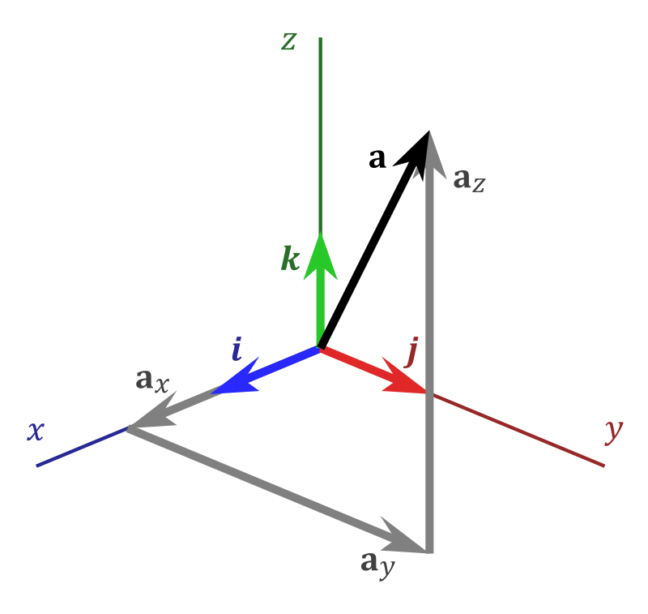{ width=40% }		

En efecto $\vec{v}=x\mathbf{i} + y\mathbf{j} + z\mathbf{k}$

Algo parecido en $\mathbb{R}^n$. En este caso $\mathbf{e}_i=(0,0,\ldots,1,0,\ldots,0)$ en la i-ésima coordenada

