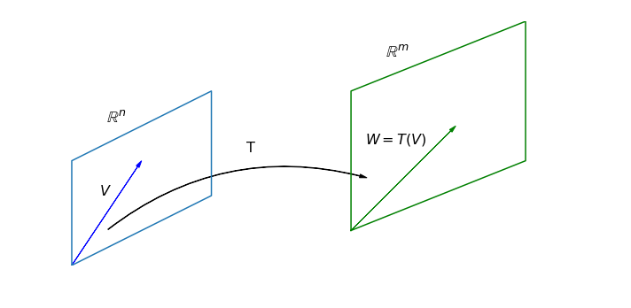

# Transformaciones lineales

## Introducción a las transformaciones lineales

### Definición

Sean $V$ y $W$ dos espacios vectoriales. Sea $T:V\rightarrow W$ una función que asigna a cada vector $v\in V$ un elemento en $W$. $T$ es una transformación lineal si para cada $\texttt{u},\texttt{v}\in V$

* $T(\texttt{u}+\texttt{v})= T(\texttt{u}) + T(\texttt{v})$.

* Para todo $\lambda$, escalar $T(\lambda\texttt{u})=\lambda T(\texttt{u})$.

{ width=50% }		

### Transformaciones especiales

Existen una variedad de transformaciones lineales, por ejemplo, la transformación $\textbf{0}$ que _recibe_ un vector $\texttt{v}\in V$ y lo manda al cero en $\textbf{0} \in W$ se le conoce como la transformación **cero**.

La transformación que recibe un vector y lo relaciona consigo mismo es la transformación identidad, en este caso $V=W$. 

La transformación $Mv=-v$ también es una transformación lineal de $M:V\rightarrow V$.

### Definición

Una transformación lineal $T:V\rightarrow V$, es decir el dominio de $T$ y el codominio de $T$ es $V$ decimos que es un _operador_ _lineal_.

### Propiedades de una transformación lineal

Si $T:V\rightarrow W$ es una transformación lineal entonces

a) $T(\mathbf{0}) = \mathbf{0}$.

b) Para todo $\texttt{v}\in V$, $T(-\texttt{v})=-T(\texttt{v})$.

c) $T(\texttt{v}-\texttt{w})=T(\texttt{v})-T(\texttt{w})$.

### Ejemplo

Estudiar si las siguientes aplicaciones de $V=\mathbb{R}^3$ en $\mathbb{R}^4$ son o no son lineales

a) $T(x,y,z)=(x+z,2x-3y-z, 3x-3y,x-3y-2z)$

b) $S\begin{pmatrix} x \\ y \\ z \end{pmatrix}=\begin{pmatrix} x+z \\ 2x-3y-z \\x-3y\\x-3y-2z+1 \end{pmatrix}$

Solución de a), notar que 
\[
T(x,y,z) = 
            \begin{pmatrix} 
                1 & 0 & 1 \\
                2 &-3 &-1 \\
                3 &-3 & 0 \\
                1 &-3 & -2
             \end{pmatrix} \begin{pmatrix} x \\ y \\ z\end{pmatrix}
\]
Es decir lo podemos ver como $T\mathtt{v} = A\cdot \mathtt{v}$ con $A$ la matriz anterior.

Por las propiedades de la multiplicación de matrices entonces tenemos $T(\mathtt{v}+\mathtt{u})= A(\mathtt{v}+\mathtt{u}) = A\mathtt{v} + A\mathtt{u}= T(\mathtt{v}) + T(\mathtt{u})$.
Similarmente si $c$ es un escalar, entonces $T(c\cdot \mathtt{v}) = A (c\cdot \mathtt{v})=c(A\mathtt{v})=cT(v)$.

Otra forma de verificar que la función es lineal, es aplicarlo a un vector "suma" $(x+u,y+v,z+w)$ es decir 
\[
\begin{matrix}
T(x+u,y+v,z+w) & = & ((x+u) +(z+w),2(x+u)-3(y+v)-(z+w), 3(x+u)-3(y+v),(x+u)-3(y+v)-2(z+w)) \\
               & = & (x+z + \mathtt{u+w}, 2x-3y-z + \mathtt{2u-3v-w} , 3x-3y + \mathtt{3u-3v}, x-3y-2z + \mathtt{u-3v-2w} )    \\
               & = & (x+z, 2x-3y-z, 3x-3y, x-3y-2z) + (\mathtt{u+w},\mathtt{2u-3v-w},\mathtt{3u-3v},\mathtt{u-3v-2w}) \\
               & = & T(x,y,z) + T(\mathtt{u,v,w})
\end{matrix}
\]

Solución de b) 
\begin{equation*}
\begin{matrix}
S\begin{pmatrix} x+u \\ y+v\\ z+w \end{pmatrix} & = & 
      \begin{pmatrix} x+u+z+w \\ 2(x+u)-3(y+v)-(z+w) \\(x+u)-3(y+v)\\(x+u)-3(y+v)-2(z+w)+1 \end{pmatrix} \\
S\begin{pmatrix} x+u \\ y+v\\ z+w \end{pmatrix} & = & 
      \begin{pmatrix} x+z + \mathtt{u+w} \\ 2x-3y-z + \mathtt{2u-3v-w} \\3x-3y + \mathtt{3u-3v} \\ x-3y-2z + \mathtt{u-3v-2w} + 1\end{pmatrix}\\
S\begin{pmatrix} x+u \\ y+v\\ z+w \end{pmatrix}  & = & 
\begin{pmatrix} x+z\\ 2x-3y-z \\ 3x-3y \\ x-3y-2z +1 \end{pmatrix} + \begin{pmatrix}\mathtt{u+w} \\ \mathtt{2u-3v-w} \\ \mathtt{3u-3v} \\ \mathtt{u-3v-2w}\end{pmatrix} \\
               & = & S \begin{pmatrix} x \\ y \\ z \end{pmatrix} + \begin{pmatrix}\mathtt{u+w} \\ \mathtt{2u-3v-w} \\ \mathtt{3u-3v} \\ \mathtt{u-3v-2w}\end{pmatrix} \\
\end{matrix}
\end{equation*}
El último término no es igual a $S\begin{pmatrix}\mathtt{u} \\ \mathtt{v} \\ \mathtt{w} \end{pmatrix}$, por tanto la función no es lineal

### Ejemplo

Sea $V=\mathbb{R}^{n}$, sea $A$ una matriz fija $n\times n$, definamos a $T_A:\mathbb{R}^n\rightarrow \mathbb{R}^m$ como

\[
T_A\mathbf{x}
      =\begin{pmatrix} 
      a_{11} & a_{12} & \ldots & a_{1n}\\ 
      a_{21} & a_{22} & \ldots & a_{2n}\\ 
      \vdots & \vdots & \vdots & \vdots \\
      a_{m1} & a_{n2} & \ldots & a_{mn} 
    \end{pmatrix} \begin{pmatrix} x_1 \\ x_2 \\ \ldots \\ x_n \end{pmatrix}
\]

Entonces $T_A$ es una transformación lineal.

### Núcleo (Espacio Nulo) e Imagen

### Definición

 Se $T:V\rightarrow W$ es una transformación lineal, entonces el conjunto de vectores en $V$ que $T$ mandan a $\mathbf{0}$ se conoce como **núcleo** **de** $T$ (**kernel** **o** **espacio** **nulo**). Se denota por $N(T)$ o $Ker(T)$.

El conjunto de todos los **vectores** **en** **W** que son envíados por $T$ desde $V$, es decir si $w\in W$ es tal que $\texttt{w}=T\texttt{v}$ para algún $\texttt{v}\in V$. Este subespacio se conoce como $Im(T)$ o $R(T)$.

## Teorema

Si $T:V\rightarrow W$ es una transformación lineal entonces:

a) El núcleo de $T$ es un subespacio de $V$.

b) La imagen de $T$ es un subespacio de $W$.

A la dimensión de la imagen de $T$ se conoce como **rango** **de** **$T$**. A la dimensión del núcloe se le denomina **nulidad** **de** **$T$**

### Definición

La **nulidad** de la transformación lineal es igual a
\[
\mbox{nulidad}(T) = \dim(N(T))
\]

El **rango** de una transformación lineal es igual a 
\[
\mbox{rango}(T)=\dim(Im(T))
\]

#### Teorema

Si $T:V\rightarrow W$ es una transformación lineal desde un espacio vectorial $V$ hacia un espacio vectorial $W$, con $\dim(V)=n$ entonces
\[
n = \dim(V) = rango(T) + nulidad(T)
\]

En particular si $A$ es una matriz $m\times n$ entonces la dimensión del espacio de soluciones de $A\texttt{x}=\texttt{0}$ es 
\[
n-rango(A)
\]

_Demostración_:
sea $U=N(T)$, por ser un subespacio de $V$ entonces existe una base de vectores $\{\mathtt{u}_1,\mathtt{u}_2,\ldots,\mathtt{u}_k\}$. Por el teorema de extensión de un conjunto de vectores linealmente independiente, sabemos que existen $\mathtt{u}_{k+1},\mathtt{u}_{k+2},\ldots, \mathtt{u}_n$ tal que se extiende a una base de $V$, es decir $\{\mathtt{u}_1,\mathtt{u}_2,\ldots,\mathtt{u}_k,\mathtt{u}_{k+1},\ldots \mathtt{u}_n\}$ es una _base_ de $V$.  

Ahora, considere a los vectores $T(\mathtt{u}_{k+1}), T(\mathtt{u}_{k+2}),\ldots, T(\mathtt{u}_{n})$, dicho conjunto es linealmente independiente. En efecto, suponga que 
\[
c_1 T(\mathtt{u}_{k+1}) + c_2T(\mathtt{u}_{k+2}) + \ldots + c_{n-k}T(\mathtt{u}_{n}) = \mathbf{0}
\]

Entonces, como $T$ es lineal
\[
T(c_1 \mathtt{u}_{k+1} + c_2\mathtt{u}_{k+2} + \ldots + c_{n-k}\mathtt{u}_{n}) = \mathbf{0}
\]

entonces
\[
\mathtt{v}^{\star} = c_1 \mathtt{u}_{k+1} + c_2\mathtt{u}_{k+2} + \ldots + c_{n-k}\mathtt{u}_{n} \in N(T)
\]
Como $\mathtt{v}^{\star}\in N(T)$ y $\mathtt{u}_1,\mathtt{u}_2,\ldots,\mathtt{u}_k$ es una base de $N(T)$ entonces es igual a una combinación lineal de la base, es decir
\[
\mathtt{v}^{\star} = \sum_{i=1}^k \beta_i \mathtt{u}_i
\]
Por tanto, 
\[
c_1 \mathtt{u}_{k+1} + c_2\mathtt{u}_{k+2} + \ldots + c_{n-k}\mathtt{u}_{n} - \sum_{i=1}^k \beta_{i} \mathtt{u}_{i} = \mathbf{0}
\]

como forman una base de $V$ entonces deben ser linealmente independiente, es decir

\[
c_1 = c_2 = c_3 =\ldots = c_{n-k} = \beta_{1} = \ldots \beta_{k} = 0
\]

Esto implica que 
\[
T(\mathtt{u}_{k+1}), T(\mathtt{u}_{k+2}),\ldots, T(\mathtt{u}_{n})
\]

es un conjunto de vectores linealmente independiente en $W$.

Y también genera a $Im(T)$, si $w\in Im(T)$ entonces existe un vector $v\in V$ tal que $w=Tv$, como $\{\mathtt{u}_1,\mathtt{u}_2,\ldots,\mathtt{u}_k,\mathtt{u}_{k+1},\ldots \mathtt{u}_n\}$ es una base, entonces $v$ es combinación lineal de los vectores, entonces
\[
w=T(\sum_{i=1}^n c_i\mathtt{u}_i) = \sum_{i=1}^n c_i T(\mathtt{u}_i) = \sum_{i=k+1}^n c_iT(\mathtt{u}_i)
\]

Además, $T\mathtt{u}_{k+1},T\mathtt{u}_{k+2},\ldots, T\mathtt{u}_n$ generan a la imagen de $T$. 

y por tanto $T\mathtt{u}_{k+1},T\mathtt{u}_{k+2},\ldots, T\mathtt{u}_n$ es una base de la imagen de $T$.

\[rango(T)=n-k = n- \dim(N(T))\]

## Ejemplos

1- Considere a $T(x,y,z,w)=(x+y,y-z,x+w)$, calcular una base para su espacio nulo y su imagen. Calcular la nulidad de $T$ y el rango de $T$.

2- Considere a $T(x,y,z)=(x+y,y+z,x+w)$, calcular una base para su espacio nulo y su imagen. Calcular la nulidad de $T$ y el rango de $T$.

3-Sea $f(x,y)=\begin{pmatrix} x+y \\ x-y \end{pmatrix}$. Calcular la nulidad y el rango de la transformación lineal.

El **núcleo** de una matriz es igual al núcleo de la transformación $T_A$.

4- Calcular el núcleo de la matriz $\begin{pmatrix} 1 & -1 \\ 1 & -1  \end{pmatrix}$-

## Otros ejemplos de transformación lineal

@. Sea $V=\mathbb{R}_n[x]$ el espacio de polinomios de grado $\leq n$.
Sea $p(t)=a_nt^n + a_{n-1}t^{n-1} + \ldots + a_1 t +a_0$.
Definimos a las transformaciones:
\[
\begin{matrix}
D:V\rightarrow V, & \mbox{ para todo t }\quad Dp(t)=a_1 + 2a_2 x + 3a_3x^2 + \ldots + n a_{n}x^{n-1}.   \\
I:V\rightarrow V, & \mbox{ para todo t }\quad Ip(t)=a_0 x + a_1 x^2 + \ldots + a_n \frac{x^{n+1}}{n+1}
\end{matrix}
\]

@. Sea $V=\mathcal{M}^{n,n}(\mathbb{R})$ el espacio vectorial de matrices $2\times 2$. Definimos a $T_B:\mathcal{M}^{n,n}(\mathbb{R}) \rightarrow \mathcal{M}^{n,n}(\mathbb{R})$ como 
\[
T_M A = M\cdot A,
\]

@. Sea $V=\mathcal{M}^{n,m}(\mathbb{R})$ el espacio vectorial de matrices $n\times m$, sean $P\in \mathcal{M}^{n,n}$ y $Q \in \mathcal{M}^{m,m}$ definimos a $T_{Q,P}$ como
\[
T_{Q,P}(A)= PAQ
\]

@. Encontrar una transformación lineal $T:\mathbb{R}^2\rightarrow \mathbb{R}^3$ tal que si $\mathtt{v}_1=(1,2)$ y $\mathtt{v}_2=(3,4)$ entonces

\[
\begin{matrix}
T\mathtt{v}_1=(3,2,1) \\
T\mathtt{v}_2=(6,5,4)
\end{matrix}
\]

Basta con calcular $T(1,0)$ y $T(0,1)$. Pues la fórmula en general estaría dada por 
\[
T(x,y) = T(x(1,0)+y(0,1))=x\cdot T(1,0) + y T(0,1)
\]
Por otro lado $\{\mathtt{v}_1,\mathtt{v}_2\}$ es base de $\mathbb{R}^2$. Entonces $(1,0)=-2(1,2)+1(3,4)$ y $(0,1)=\frac{3}{2}(1,2) + (-\frac{1}{2})(3,4)$ entonces
\[
\begin{matrix}
T(1,0) =-2T(1,2) + 1T(3,4) =-2(3,2,1) + 1(6,5,4) = (0,1,2) \\
T(0,1) =\frac{3}{2}T(1,2) + (-\frac{1}{2})T(3,4) = \frac{3}{2}(3,2,1) + (-\frac{1}{2})(6,5,4) = (\frac{3}{2},\frac{1}{2},2) \\
\end{matrix}
\]

## Matriz asociada a una transformación lineal 

Una transformación lineal $T$ de $\mathbb{R}^{n}$  a $\mathbb{R}^m$ es una transformación de la forma 
\begin{equation}
 T \texttt{v} = A \cdot \texttt{v}                    
\end{equation}

Sea $\mathcal{B}=\{\texttt{v}_1,\texttt{v}_2,\ldots,\texttt{v}_n\}$  una base de $V$ y $\mathcal{D}=\{w_1,w_2,\ldots, w_m\}$ es una base de $\mathbb{R}^{m}$, entonces
\[
\begin{array}{cc}
\texttt{v} =& \alpha_1\texttt{e}_1 + \alpha_2\texttt{e}_2+ \ldots + \alpha_n\texttt{e}_n,\\
T(\texttt{v}) =&  \alpha_1T(\texttt{e}_1) + \alpha_2T(\texttt{e}_2)+ \ldots + \alpha_nT(\texttt{e}_n)
\end{array}
\]

Ahora, como $\mathcal{D}$ es una base de $\mathbb{R}^{m}$ entonces genera a todo el espacio, en particular, todos los vectores $T(\mathtt{e}_i)$ son combinación lineal de $\mathcal{D}$, es decir, existen $a_{ij}$ tal que 
\[
T(\mathtt{e}_i)= a_{1i}\mathtt{w}_1 + a_{2i}\mathtt{w}_2 + \ldots + a_{mi}\mathtt{w}_m
\]
sustituyendo en $T(\mathtt{v})$ entonces
\[
\begin{array}{ccc}
T(\mathtt{v}) & = & \alpha_1T(\mathtt{e}_1) + \alpha_2 T(\mathtt{e}_2) + \ldots + \alpha_n T(\mathtt{e}_n) \\
T(\mathtt{v}) & = & \sum_{i=1}^n \alpha_i \sum_{j=1}^m a_{ji}\mathtt{w}_j = \sum_{j=1}^m \big( \sum_{i=1}^n a_{ji}\alpha_i \big) \mathtt{w}_j
\end{array}
\]

Dicho de otra forma **las coordenadas de $T(\mathtt{v})$ con respecto a la base $\mathcal{D}$ son iguales a**

\begin{equation}
\begin{array}{ccc}
  [T\mathtt{v}]_{\mathcal{D}} & = & (\sum_{k=1}^n a_{jk}\alpha_k)_{\mathcal{D}} \\
  [T\mathtt{v}]_{\mathcal{D}} & = & (a_{11}\alpha_1+a_{12}\alpha_2 + \ldots + a_{1n}\alpha_n, a_{21}\alpha_1+a_{22}\alpha_2 + \ldots + a_{2n}\alpha_n,\ldots,a_{m1}\alpha_1+a_{m2}\alpha_2 + \ldots + a_{mn}\alpha_n )_{\mathcal{D}}
\end{array}
\end{equation}

La última igualdad se puede expresar como una multiplicación matricial con
\[
\begin{array}{cccc}
 T(\texttt{e}_1) =  \begin{pmatrix} a_{11} \\ a_{21} \\ \vdots \\ a_{m1}  \end{pmatrix}_{\mathcal{D}}, &
 T(\texttt{e}_2) =  \begin{pmatrix} a_{12} \\ a_{22} \\ \vdots \\ a_{m2}  \end{pmatrix}_{\mathcal{D}}, &
  \ldots ,& 
T(\texttt{e}_n) =  \begin{pmatrix} a_{1n} \\ a_{2n} \\ \vdots \\ a_{mn}  \end{pmatrix}_{\mathcal{D}}  &
\end{array}
\]
 y 
 
\begin{equation}
T(\mathtt{v}) = [T](\mathtt{v})_{\mathcal{B}}
\end{equation}

y
\[
[T]= 
\begin{pmatrix} 
    a_{11} & a_{12} & \ldots & a_{1n} \\
    a_{21} & a_{22} & \ldots & a_{2n} \\
     \vdots& \vdots & \ddots & \vdots \\
     a_{m1}& a_{m2} & \ldots & a_{mn}  
\end{pmatrix}
\]

A esta matriz $A=[T]$ se le llama la matriz asociada a la transformación en la base $\mathcal{B}$ (en $V$) y $\mathcal{D}$ en $W$. Y **dejando fijas las bases** 
\[
 \Big(T(\texttt{v})\Big)_{\mathcal{D}}=\Big[T\Big]_{\mathcal{B}}^{\mathcal{D}}\Big(\texttt{v}\Big)_{\mathcal{B}}
\]

<strong>Definición</strong>
Dada una transformación lineal entre dos espacios vectoriales $T:V \rightarrow W$ y una base, $\mathcal{B}$, para $V$ y $\mathcal{D}$ para $W$ *fijas*, podemos asociar una matriz que transforma las coordenadas (c.r.a. $\mathcal{B}$) de $\mathtt{v}\in V$ a las coordenadas (c.r.a $\mathcal{D}$) de $T\mathtt{v}$. Se le llama la matriz **asociada** a la transformación lineal $T$ (con respecto a las bases $\mathcal{B}$ y $\mathcal{D}$).
  \begin{equation}
    \Big[T\Big]_{\mathcal{B}}^{\mathcal{D}} = \begin{bmatrix} T(\mathtt{e}_1) | T(\mathtt{e}_2) | \ldots | T(\mathtt{e}_n) \end{bmatrix}
  \end{equation}

### Ejemplos

#### Ejemplo 1.

Suponga que $A:\mathbb{R}^3 \rightarrow \mathbb{R}^3$ dada por $A(x,y,z) = (x+2y+z,-y,x+7z)$. Sean $\mathcal{C}=\{\mathtt{e}_1, \mathtt{e}_2, \mathtt{e}_3\}$ la base canónica de $\mathbb{R}^3$ y $\mathcal{B}'=\big\{(1,0,0),(1,1,0), (1,1,1)\big\}$

* Obtener la matriz asociada a $A$,  $\Big[A\Big]_{\mathcal{C}}^{\mathcal{C}}$ con respecto a las bases $\mathcal{C}$ $\mathcal{C}$

* Obtener la matriz asociada a $A$, con respecto a las bases $\mathcal{C}$ y $\mathcal{B}'$.

* Obtener la matriz asociada a $A$, con respecto a las bases $\mathcal{B}'$ y $\mathcal{B}'$.

#### Ejemplo 2

Considere a $T(x,y)=(y,-2x + 3y)$ en $\mathbb{R}^2$, con la base $\mathcal{C}=\{\mathtt{e}_1, \mathtt{e}_2\}$ y $\mathcal{B}'=\{(1,1),(1,2)\}$.

### Transformaciones lineales y Cambios de base

Sea $T$ una transformación lineal, $T:V\rightarrow V$ y suponga que en $V$ en el "dominio" tenemos a la base $\mathcal{B}$ y en el "contradominio" se usa la base $\mathcal{B}'$ entonces sabemos que existe una matriz cambio de base de $\mathcal{B} \rightarrow \mathcal{B}'$, $Q_{\mathcal{B}\rightarrow \mathcal{B}'}$ tal que 

\[
\big( \mathtt{v}\big)_{\mathcal{B}'} = Q_{\mathcal{B} \rightarrow \mathcal{B}'} \big(\mathtt{v}\big)_{\mathcal{B}}
\]

Similarmente, tenemos que 
\[
\big( T\mathtt{v}\big)_{\mathcal{B}} = Q_{\mathcal{B}' \rightarrow \mathcal{B}} \big(T\mathtt{v}\big)_{\mathcal{B}'} \quad\mbox{ y } \quad 
\big( T\mathtt{v}\big)_{\mathcal{B}'} = Q_{\mathcal{B} \rightarrow \mathcal{B}'} \big(T\mathtt{v}\big)_{\mathcal{B}} 
\]

por otro lado $\big(T\mathtt{v}\big)_{\mathcal{B}} = \big[ T \big]_{\mathcal{B}}^{\mathcal{B}}\big(\mathtt{v}\big)_{\mathcal{B}}$ entonces

\[
\begin{array}{ccc}
\big( T \mathtt{v}\big)_{\mathcal{B}} & = & Q_{\mathcal{B}'->\mathcal{B}} \big( T \mathtt{v}\big)_{\mathcal{B}'}\\
\big( T \mathtt{v}\big)_{\mathcal{B}} & = & Q_{\mathcal{B}'->\mathcal{B}} \big[T\big]_{\mathcal{B}'}^{\mathcal{B}'} \big( \mathtt{v}\big)_{\mathcal{B}'}\\
\end{array}
\]

Desarrollando el lado izquierdo

\[
\begin{array}{ccc}
\big( T \mathtt{v}\big)_{\mathcal{B}} & = & Q_{\mathcal{B}'->\mathcal{B}} \big[T\big]_{\mathcal{B}'}^{\mathcal{B}'} \big( \mathtt{v}\big)_{\mathcal{B}'}\\
\big[T\big]_{\mathcal{B}}^{\mathcal{B}} \big(\mathtt{v}\big)_{\mathcal{B}} & = & Q_{\mathcal{B}'->\mathcal{B}} \big[T\big]_{\mathcal{B}'}^{\mathcal{B}'} \big( \mathtt{v}\big)_{\mathcal{B}'}\\
\big[T\big]_{\mathcal{B}}^{\mathcal{B}}  Q_{\mathcal{B}' \rightarrow \mathcal{B}} \big(\mathtt{v}\big)_{\mathcal{B}'} & = & Q_{\mathcal{B}'->\mathcal{B}} \big[T\big]_{\mathcal{B}'}^{\mathcal{B}'} \big( \mathtt{v}\big)_{\mathcal{B}'}\\
\end{array}
\]

Como esto aplica para todo vector $\big( \mathtt{v}\big)_{\mathcal{B}'}$ entonces

\[
\big[T\big]_{\mathcal{B}}  Q_{\mathcal{B}' \rightarrow \mathcal{B}} =  Q_{\mathcal{B}'->\mathcal{B}} \big[T\big]_{\mathcal{B}'}
\]

entonces, despejando a $\big[T\big]_{\mathcal{B}'}$

\[
\big[T\big]_{\mathcal{B}'} = Q^{-1}_{\mathcal{B}'->\mathcal{B}} \big[T\big]_{\mathcal{B}}  Q_{\mathcal{B}' \rightarrow \mathcal{B}} 
\]

### Teorema

Si $T:V\rightarrow V$, sea $\big[ T \big]_{\mathcal{B}}= \big[ T \big]_{\mathcal{B}}^{\mathcal{B}}$ la matriz asociada a $T$ con respecto a la base $\mathcal{B}$ y $\big[ T \big]_{\mathcal{B}'}= \big[ T \big]_{\mathcal{B}'}^{\mathcal{B}'}$ entonces existe $Q$ invertible tal que 

\begin{equation}
  \big[T\big]_{\mathcal{B}'} = Q^{-1} \big[T\big]_{\mathcal{B}} Q
\end{equation}
 y además $Q=Q_{\mathcal{B}'\rightarrow \mathcal{B}}$.
 

<strong>Definición</strong>
Dos matrices $A,B\in \mathcal{M}^{n,n}$ se dice que son **similares** si existe una matriz invertible $P$ tal que
  \begin{equation}
    B = P^{-1}A P
  \end{equation}

Entonces, si dos matrices representan a la misma transformación lineal entonces son similares.

#### Dilatación. 

Si $V=\mathbb{R}^3$ $\vec{\texttt{x}}=\begin{pmatrix} x_1 \\ x_2 \\ x_3 \end{pmatrix}$, la transformación $T(\vec{\texttt{x}}) = \begin{pmatrix} 3x_1 \\ 2x_2 \\ 3x_3 \end{pmatrix}$ es una transformación lineal. Para ver que es una transformación lineal 
\[
T(\vec{\texttt{x}} +\vec{\texttt{w}} ) =
\begin{pmatrix} 3(x_1+w_1) \\ 2(x_2+w_2) \\ 3(x_3+w_3) \end{pmatrix}=
\begin{pmatrix} 3x_1 \\ 2x_2 \\ 3x_3 \end{pmatrix} +
\begin{pmatrix} 3w_1 \\ 2w_2 \\ 3w_3 \end{pmatrix} =
T(\vec{\texttt{x}}) + T(\vec{\texttt{w}} )
\]
La primer propiedad se cumple.
Si $\lambda \in \mathbb{R}$

\[
T(\lambda\vec{\texttt{x}}) =
\begin{pmatrix} 3(\lambda x_1) \\ 2(\lambda x_2) \\ 3(\lambda x_3) \end{pmatrix}=
\begin{pmatrix} \lambda 3x_1 \\ \lambda 2x_2 \\ \lambda 3x_3 \end{pmatrix} =
\lambda \begin{pmatrix} 3x_1 \\ 2x_2 
\\ 3x_3 \end{pmatrix} =
\lambda T(\vec{\texttt{x}}) 
\]

Por lo que la transformación es lineal.

Como se ha comentado, cualquier transformación lineal tiene una matriz asociada. En este caso, 

\[
[T]= \begin{bmatrix} T(\texttt{e}_1)\,\, |\,\, T(\texttt{e}_2) \,\, |\,\, T(\texttt{e}_3) \end{bmatrix}
\]

En este caso $T(\texttt{e}_1)=\begin{pmatrix} 3(1) \\ 2(0) \\ 3(0)\end{pmatrix} = \begin{pmatrix} 3  \\ 0 \\ 0\end{pmatrix}$. $T(\texttt{e}_2)=\begin{pmatrix} 3(0) \\ 2(1) \\ 3(0)\end{pmatrix} = \begin{pmatrix} 0  \\ 2 \\ 0\end{pmatrix}$. $T(\texttt{e}_3)=\begin{pmatrix} 3(0) \\ 2(0) \\ 3(1)\end{pmatrix} = \begin{pmatrix} 0  \\ 0 \\ 3\end{pmatrix}$.

\[
[T]= \begin{bmatrix} 3 & 0 & 0 \\ 0 & 2 & 0 \\ 0 & 0 &3   \end{bmatrix}
\]

En la base canónica, podemos verificar que la matriz asociada a la transformación lineal es la anterior, multiplicando la matriz por un vector $\vec{\texttt{x}}=\begin{pmatrix}  x_1 \\ x_2\\x_3\end{pmatrix}$

\[
[T]\cdot \vec{\texttt{x}} = 
\begin{bmatrix} 3 & 0 & 0 \\ 0 & 2 & 0 \\ 0 & 0 &3   \end{bmatrix} \begin{bmatrix} x_1 \\ x_2 \\ x_3\end{bmatrix} = 
\begin{bmatrix} 3x_1 \\ 2x_2 \\ 3x_3 \end{bmatrix} = T(\vec{\texttt{x}})
\]

#### Ejemplo 2

Si una de las entradas incluye a una función real no lineal, entonces la transformación no será lineal por ejemplo
$S(\vec{\texttt{x}}) = \begin{pmatrix} 3x_1^{2} \\ 2x_2 \\ 3x_3 \end{pmatrix}$
Si comparamos $S(\vec{\texttt{x}} +\vec{\texttt{w}})$ con $S(\vec{\texttt{x}}) + S(\vec{\texttt{w}})$
\[
S(\vec{\texttt{x}} +\vec{\texttt{w}}) = \begin{pmatrix} 3(x_1+w_1)^2 \\ 2(x_2+w_2) \\ 3(x_3+w_3) \end{pmatrix}
                                      = \begin{pmatrix} 3(x_1^{2}+2x_1w_1+w_1^2) \\ 2(x_2+w_2) \\ 3(x_3+w_3) \end{pmatrix} 
                                      = \begin{pmatrix} 3x_1^{2}+6x_1w_1+3w_1^2 \\ 2x_2+2w_2   \\ 3x_3+3w_3 \end{pmatrix}
\]

Por otro lado
\[
S(\vec{\texttt{x}}) +S(\vec{\texttt{w}}) = \begin{pmatrix} 3x_1^2 \\ 2x_2 \\ 3x_3 \end{pmatrix} + 
                                           \begin{pmatrix} 3w_1^2 \\ 2w_2 \\ 3w_3 \end{pmatrix} 
                                      = \begin{pmatrix} 3x_1^{2}+3w_1^2 \\ 2x_2+ 2w_2 \\ 3x_3+3w_3 \end{pmatrix} 
                                      \ne S(\vec{\texttt{x}} +\vec{\texttt{w}})
\]
pues $S(\vec{\texttt{x}} +\vec{\texttt{w}})$ tiene un término extra $6x_1w_1$.

#### Reflexión respecto al eje $x$.

Sea $V=\mathbb{R}^2$ $R_1(x,y) = (x,-y)$.  $R$ es una transformación lineal. Si $\texttt{v}_1 = \begin{pmatrix} x_1\\ y_1 \end{pmatrix}$ y $\texttt{v}_2 = \begin{pmatrix} x_2\\ y_2 \end{pmatrix}$ 
\[
R_1(\texttt{v}_1 + \texttt{v}_2) = (x_1+x_2, -(y_1+y_2)) = (x_1+x_2,-y_1-y_2) = (x_1,-y_1)+(x_2,-y_2) = R_1(\texttt{v}_1) + R_1(\texttt{v}_2)
\]

Similarmente $R(\lambda \vec{\texttt{v}}) = \lambda R(\vec{\texttt{v}})$

# Diagonalización

En esta sección trabajaremos con transformaciones lineales $T:V\rightarrow V$. Buscamos si podemos determinar una **base** $\mathcal{B}'$ de $V$ tal que $[T]_{\mathcal{B}'}$ sea una matriz diagonal. Digamos

\begin{equation}
\begin{bmatrix} 
     \alpha_1 & 0        & \ldots & 0 \\ 
      0       & \alpha_2 & \ldots & 0 \\ 
      0       &     0    & \ldots & \alpha_n  
\end{bmatrix}
\end{equation}

Esto implica que con respecto a esa base $\mathcal{B}'$, $(T\mathtt{v}_1)_{\mathcal{B}'}=\begin{pmatrix} \lambda_1 \\ 0 \vdots \\ 0 \end{pmatrix}_{\mathcal{B}'}$, $(T\mathtt{v}_2)_{\mathcal{B}'} = \begin{pmatrix} 0 \\ \lambda_2 \\ \vdots \\ 0 \end{pmatrix}_{\mathcal{B}'}$ ... $T(\mathtt{v}_n)=\begin{pmatrix} 0 \\ 0 \vdots \\ \lambda_n \end{pmatrix}_{\mathcal{B}'}$ 

Como estamos en las coordenadas con respecto a $\mathcal{B}'$ esto significa que 
\begin{equation*}
\begin{array}{cccc}
 T\mathtt{v}_1 = \lambda_1 \mathtt{v}_1 & T\mathtt{v}_2 = \lambda_2 \mathtt{v}_2 & \ldots &T\mathtt{v}_n = \lambda_n \mathtt{v}_n
\end{array}
\end{equation*}

<strong>Definición</strong>
Dada una transformación lineal  $T:V \rightarrow V$ decimos que $\lambda$ es un **valor propio** de $T$ si 
  \begin{equation}
    T\mathtt{v} = \lambda \mathtt{v}
  \end{equation}
Al vector $\mathtt{v}$ que cumple con la igualdad anterior decimos que es un **vector propio** de $T$.

Suponga que $A=[T]_{\mathcal{C}}$ en la base canónica, entonces buscamos a una base $\mathcal{B}'$ tal que $[T]_{\mathcal{B}'}$ sea una matriz diagonal. 

## Espectro de $T$

Al conjunto de valores propios distintos de una transformación lineal, $\sigma(T)$, lo llamamos **el espectro de $A$**.

Tenemos la siguiente equivalencia.

* El escalar $\lambda$ es un valor propio de $T$ si y sólo si $[A-\lambda I| \vec{\mathbf{0}}]$ tiene soluciones no triviales.

* El escalar $\lambda$ es un valor propio de $T$ si y sólo si $\big(A-\lambda I\big) \mathtt{x}=\mathbf{0}$ tiene más de una solución $\leftrightarrow \det(A-\lambda I)=0$

* $\lambda$ es un valor propio de $T$ si y sólo si $Ker(T-\lambda I)\ne \{\mathbf{0}\}$

<strong>Definición</strong>
Si $T$ es una transformación y $A$ su matriz en la base canónica, suponga que $\lambda$ es un valor propio de $A$, entonces a $Ker\big(T-\lambda I\big)$ se le llama **un espacio propio de A**

<strong>Definición</strong>
Si $T$ es una transformación y $A$ su matriz en la base canónica, suponga que $\lambda$ es un valor propio de $A$, entonces a $\dim(Ker\big(T-\lambda I\big))$ se le llama  la _multiplicidad_ _geométrica_ de $T$.

Un término crucial para el cálculo de valores propios es el **polinomio** **característico**, $p(\lambda)=\det(A-\lambda I)$. Y como mencionamos anteriormente, $\lambda$ es un valor propio de $T$ (o de $A$) si y sólo si $p(t)=\det(A-t I)=0$ se anula cuando $t=\lambda$.

### Ejemplo 

Sea $\begin{pmatrix} 7 & -4 \\ 5 & -2 \end{pmatrix}$ y $T_A\mathtt{v}=A\mathtt{v}$. Calcular los vectores propios de $A$. Buscamos los valores de $\lambda$ tal que $\det(A-\lambda I)=0$.
Entonces calculamos el **polinomio** **característico** de $A$. 
\[
p_A(\lambda)=\begin{vmatrix} 7 -\lambda & -4 \\ 5 & -2-\lambda  \end{vmatrix} = (7-\lambda)(-2-\lambda) -(-4)(5) = (\lambda +7)(\lambda+2) + 20 = \lambda^2-5\lambda +6
\]

Para buscar los valores propios de $A$ o equivalentemente de $T_A$ buscamos las raíces de $p_A(\lambda)$, factorizando al polinomio, tenemos que $p_A(\lambda)=(\lambda-3)(\lambda-2)$

Si factorizamos el polinomio característico $p(\lambda)$ entonces podemos obtener los **valores propios** de $A$. En este caso $\lambda=3$ y $\lambda=2$.

Para encontrar los **vectores** **propios** de $A$, calculamos una base para cada de los espacios propios

\[
\mbox{ Para }\lambda=3
N_3=Ker(A-3I)=\Bigg\{ \begin{pmatrix} x \\ y \end{pmatrix} \in \mathbb{R}^2 \,:\, A\vec{v}-3I\vec{v}=\vec{\mathbf{0}}  \Bigg\} 
             =\Bigg\{ \begin{pmatrix} x \\ y \end{pmatrix} \in \mathbb{R}^2 \,:\, \begin{matrix} 7x - 4y = 3x\\
                                                                                                 5x-2y = 3y \end{matrix}  \Bigg\}
\]
\[
Ker(A-3I)=\Bigg\{ \begin{pmatrix} x \\ y \end{pmatrix} \in \mathbb{R}^2 \,:\, \begin{matrix} 4x - 4y = 3x\\
                                                                                               2x-2y = 3y \end{matrix}  \Bigg\}
\]
\[
\begin{bmatrix} 
  4 & -4 & | & 0  \\
  2 & -2 & | & 0
\end{bmatrix} \rightarrow 
\begin{bmatrix} 
  1 & -1 & | & 0  \\
  0 &  0 & | & 0
\end{bmatrix} \Rightarrow 
\begin{matrix}
x-y=0 \Leftrightarrow x= y
\end{matrix}
\]

Luego, una base para $N_3=\Bigg\{ \begin{pmatrix} x \\ y  \end{pmatrix} \in \mathbb{R}^2 \,\,:\, \begin{pmatrix} x \\ y  \end{pmatrix} =  x\begin{pmatrix} 1\\ 1 \end{pmatrix},\,x\in \mathbb{R} \Bigg\}$. Por tanto, una base de $N_3$ es $\mathcal{B}_3=\Big\{\begin{pmatrix} 1\\ 1 \end{pmatrix}\Bigg\}$.

Ahora calculemos los valores propios de $\lambda =2$, por medio de una base para $N_2=Ker(A-2I)$.
\[
N_2=Ker(A-2I) = \Bigg\{ \begin{pmatrix} x \\ y \end{pmatrix} \in \mathbb{R}^2 \,:\, A\vec{v}-2I\vec{v}=\vec{\mathbf{0}}  \Bigg\} 
             =\Bigg\{ \begin{pmatrix} x \\ y \end{pmatrix} \in \mathbb{R}^2 \,:\, \begin{matrix} 7x - 4y = 2x\\
                                                                                                 5x-2y = 2y \end{matrix}  \Bigg\}
\]
\[
Ker(A-3I)=\Bigg\{ \begin{pmatrix} x \\ y \end{pmatrix} \in \mathbb{R}^2 \,:\, \begin{matrix} 5x - 4y = 0\\
                                                                                             5x - 4y = 0 \end{matrix}  \Bigg\}
\]
\[
\begin{bmatrix} 
  5 & -4 & | & 0  \\
  5 & -4 & | & 0
\end{bmatrix} \rightarrow 
\begin{bmatrix} 
  5 & -4 & | & 0  \\
  0 &  0 & | & 0
\end{bmatrix} \Rightarrow 
\begin{matrix}
5x-4y=0 \Leftrightarrow x=\frac{4}{5} y
\end{matrix}
\]

Luego, una base para $N_2=\Bigg\{ \begin{pmatrix} x \\ y  \end{pmatrix} \in \mathbb{R}^2 \,\,:\, \begin{pmatrix} x \\ y  \end{pmatrix} =  y\begin{pmatrix} \frac{4}{5}\\ 1 \end{pmatrix},\,y\in \mathbb{R} \Bigg\}$. Por tanto, una base de $N_2$ es $\mathcal{B}_2=\Big\{\begin{pmatrix} 4/5\\ 1 \end{pmatrix}\Bigg\}$.

### Teorema

_Vectores propios asociados a valores propios diferentes son linealmente independientes_

Por lo que en este caso de hecho tenemos una **Base** de vectores propios.

#### Diagonalización.

Consideremos esta base de vectores propios $\mathcal{B}'=\Bigg\{ \begin{pmatrix} 1\\ 1 \end{pmatrix}, \begin{pmatrix} 4/5 \\ 1 \end{pmatrix}\Bigg\}$.
Calculamos la matriz cambio de base $Q_{\mathcal{B}'\righarrow \mathcal{B}}$ en este caso
\[
\begin{bmatrix} 
  1 & 0 & | & 1 & 4/5  \\
  0 & 1 & | & 1 & 1
\end{bmatrix} 
\]
Y en este caso en particular (por tomar a la nueva base como la canónica) $Q=\begin{pmatrix} 1 & 4/5 \\ 1 & 1 \end{pmatrix}$, ahora calculamos $Q_{\mathcal{B}\rightarrow \mathcal{B}'}$
\[
\begin{bmatrix} 
  1 & 4/5 & | & 1 & 0 \\
  1 &  1  & | & 0 & 1
\end{bmatrix} \rightarrow 
\begin{bmatrix} 
  1 &  0  & | & 5  &  -4   \\
  0 &  1/5 & | & -1 & 1
\end{bmatrix} \rightarrow 
\begin{bmatrix} 
  1 &  0  & | & 5  & -4   \\
  0 &  1 & | & -5 & 5
\end{bmatrix} 
\]
Por tanto $Q_{\mathcal{B}\rightarrow \mathcal{B}'}=\begin{pmatrix} 5 & -4 \\ -5 & -5 \end{pmatrix}$. Si calculamos la matriz asociada a la transformación $A$, según el teorema de cambio de base

\begin{equation}
\begin{matrix}
\Big[ T \Big] =&  Q^{-1}\cdot A\cdot Q \\
\Big[ T \Big]              =&  \begin{pmatrix} 5 & -4 \\ -5 & 5 \end{pmatrix}\begin{pmatrix} 7 & -4 \\ 5 & -2 \end{pmatrix} \begin{pmatrix} 1 & 4/5 \\ 1 & 1 \end{pmatrix}\\
\Big[ T \Big] =& \begin{pmatrix} 3 & 0 \\ 0 & 2 \end{pmatrix}
\end{matrix}
\end{equation}

## Ejemplo 2

Determinar los valores propios y vectores propios de 
\[
\begin{bmatrix} 
 -3 & 1 & -3  \\
  20& 3 & 10  \\
  2 &-2 & 4
\end{bmatrix} 
\]

Calculamos el polinomio característico de $A$, $p(\lambda) = \det(A-\lambda I)$.
\[
p(\lambda)=|A-\lambda I| = \begin{vmatrix} 
                  -3-\lambda & 1       & -3 \\
                  20        &3-\lambda & 10 \\
                  2         & -2       & 4-\lambda
\end{vmatrix}
\]
$p(\lambda)=\lambda^3-4\lambda^2-3\lambda+18=(\lambda-3)^2(\lambda+2)$.
Entonces **los valores propios de** $A$ son $\lambda=3$ y $\lambda=-2$.
Para encontrar la factorización, tenemos que evaluar un valor de $\lambda$ que elimine a $p(\lambda)$. Los divisores de $p(0)$ son posibles candidatos a ser raíces enteras de $p(\lambda)$.
Si $\lambda=3$ entonces $p(3)=(3)^3-4(3)^2-3(3)+18=27-36-9+18=0$ Entonces $\lambda=3$ es raíz. Esto significa que $\lambda-3$ **divide** a $p(\lambda)$, si hacemos la división obtenemos que $\frac{p(\lambda)}{\lambda-3}=\lambda^2-\lambda-6=(\lambda-3)(\lambda+2)$. Factorizando dichho resultado. 
Entonces $p(\lambda)=(\lambda-3)^2(\lambda+2)$ y los valores propios de la matriz (y de la transformación asociada a la matriz) son $\lambda=3,\lambda=-2$.

Calculamos una base de sus subespacios propios $N_{-2}=Ker(A+2I)$ y $N_3=Ker(A-3I)$. 
Para el primer subespacio propio
\[
Ker(A+2I) = \Bigg\{ \begin{pmatrix} x\\ y\\ z\end{pmatrix} \in \mathbb{R}^3 : \,\,\begin{pmatrix} -3 +2 & 1 & -3 \\ 20 & 3 +2 & 10 \\ 2 & -2 & 4+2  \end{pmatrix} \begin{pmatrix} x\\ y \\ z\end{pmatrix} = \begin{pmatrix} 0\\ 0 \\ 0\end{pmatrix}\Bigg\}
\]

\[
\begin{bmatrix} 
  -1 & 1 & -3| & 0 \\
  20 & 5 & 10| & 0  \\
  2  &-2 & 6 | & 0
\end{bmatrix} \rightarrow 
\begin{bmatrix} 
  1 &  0   & 1 &| & 0   \\
  0 &  1   &-2 &| & 0 \\
  0 &  0   & 0 &| & 0
\end{bmatrix} 
\Rightarrow 
\begin{matrix}
x+z=0  \Leftrightarrow x=-z\\
y-2z=0 \Leftrightarrow y=2z
\end{matrix}
\]
Una base de dicho espacio propio, $N_{-2}$ es $\begin{pmatrix} -1 \\ 2 \\ 1 \end{pmatrix}$. Simiarmente una base para $N_3$ es$\begin{pmatrix} 1\\ 0 \\-2 \end{pmatrix}$.
Si juntamos en este caso los vectores propios no formamos una base, entonces $A$ **no es diagonalizable**.
Este es un ejemplo de una matriz que no es diagonalizable, pues no podemos encontrar una base de vectores. 
Existe otro criterio para determinar si una matriz será o no será diagonalizable, para entender dicho criterio requerimos el concepto de multiplicidad.

### Multiplicidad algebraica

Sea $T$ una transformación lineal y $\lambda_1,\lambda_2,\ldots,\lambda_n$ valores propios y $\mathtt{v}_1,\mathtt{v}_2,\ldots, \mathtt{v}_n$ vectores  propios asociados cada valor propio.
Si $p(\lambda)=(\lambda-\lambda_1)^{k_1}(\lambda-\lambda_2)^{k_2}\ldots (\lambda - \lambda_n)^{k_n}$, al grado del $(\lambda-\lambda_i)$ le llamamos la multiplicidad **algebraica** del valor propio.

### Multiplicidad geométrica

Sea $T$ una transformación lineal y $\lambda_1,\lambda_2,\ldots,\lambda_n$ valores propios y $\mathtt{v}_1,\mathtt{v}_2,\ldots, \mathtt{v}_n$ vectores  propios asociados cada valor propio.
A la dimensión del espacio propio $N_{\lambda_i}$ lo llamamos la multiplicidad geométrica.

<strong>Teorema</strong>
Sea $T$ una transformación lineal y $\lambda_1,\lambda_2,\ldots,\lambda_n$ valores propios y $\mathtt{v}_1,\mathtt{v}_2,\ldots, \mathtt{v}_n$ vectores  propios asociados cada valor propio.
Si para todo valor propio $\lambda_i$ la multiplicidad geométrica = multiplicidad algebraica entonces $T$ es **diagonalizable**.

En el último ejemplo, el polinomio característico de $A$ esta dado por $p(\lambda)=(\lambda-3)^2(\lambda+2)$ entonces la multiplicidad algebraica de $\lambda=3$ es 2 pero  $dim(Ker(A-3I))=1$ por que sólo encontramos un vector en la base de $Ker(A-3I)$ entonces no es diagonalizable. 

### Ejemplo 3
Determinar si la siguiente matriz es diagonalizable, encontrar una base de vectores que diagonaliza a la matriz $A$ si es el caso.

\[
A=\begin{pmatrix} 1 & -4 & -4 \\ 8 & -11 & -8 \\ -8 & 8 & 5 \end{pmatrix}
\]
Entonces 
\[
A-\lambda I = \begin{pmatrix} 1-\lambda & -4 & -4 \\ 8 & -11-\lambda & -8 \\ -8 & 8 & 5-\lambda \end{pmatrix}
\]

**Polinomio característico**:
\[
p(\lambda) = \begin{vmatrix} 1-\lambda & -4 & -4 \\ 8 & -11-\lambda & -8 \\ -8 & 8 & 5-\lambda \end{vmatrix}
\]
$p(\lambda)=(1-\lambda)[(-11-\lambda)(5-\lambda)-(-8)8]-(-4)(8(5-\lambda)-(-8)(-8))-4(8(8)-(-8)(-11-\lambda))$ desarrollando los términos 
\[
p(\lambda)=(1-\lambda)(\lambda^2+6\lambda + 9) = -(\lambda-1)(\lambda+3)^2
\]
por tanto los valores propios son $\lambda=1$ y $\lambda=-3$, en este caso decimos que $\lambda=-3$ tiene multiplicidad 2 y $\lambda=1$ tiene multiplicidad 1.
Calculamos los espacios propios
\[
N_1=\Bigg\{\begin{pmatrix} x\\ y \\z\end{pmatrix}\in \mathbb{R}^3 :\,\, \begin{pmatrix} 1-1 & -4 & -4 \\ 8 & -11-1 & -8 \\ -8 & 8 & 5-1 \end{pmatrix}\begin{pmatrix} x \\ y \\ z \end{pmatrix} = \begin{pmatrix} 0\\ 0\\ 0 \end{pmatrix}\Bigg\}
\]

\[
\begin{bmatrix} 
  0 & -4 & -4| & 0 \\
  8 &-12 & 8 | & 0  \\
  -8&  8 & 4 | & 0
\end{bmatrix} \rightarrow 
\begin{bmatrix} 
  0 &  1   & 1 &| & 0   \\
  2 &  -3  &-2 &| & 0 \\
  -2&  2   & 1 &| & 0
\end{bmatrix} 
\rightarrow 
\begin{bmatrix} 
  2 &  0   & 1 &| & 0   \\
  0 &  1   & 1 &| & 0 \\
  0 &  0   & 0 &| & 0
\end{bmatrix} 
\rightarrow 
\begin{matrix}
2x+z=0   \Leftrightarrow x=-z\\
y + z =0 \Leftrightarrow y=2z
\end{matrix}
\]

Entonces un vector propio de $\lambda=1$ es $\begin{pmatrix} 1 \\ -2 \\ 2\end{pmatrix}$ o $\begin{pmatrix} 1/2 \\ -1 \\ 1\end{pmatrix}$.

Similarmente una base del espacio propio asociado a $\lambda=-3$ es igual a $\Bigg\{ \begin{pmatrix} 1\\ 1 \\0 \end{pmatrix} , \begin{pmatrix} 1\\ 0 \\1 \end{pmatrix} \Bigg\}$. 
Por tanto 
\[
Q=\begin{pmatrix} 1 & 1 & 1 \\ -2 & 1 & 0 \\ 2 & 0 & 1 \end{pmatrix},\quad\quad Q^{-1}=\begin{pmatrix} 1 & -1 & -1 \\ 2 & -1 & -2 \\ -2 & 2 & 3 \end{pmatrix}\quad \mbox{y}
\]
\[
\begin{pmatrix}1 & 0 & 0 \\ 0 & -3 & 0 \\ 0 & 0 & 3  \end{pmatrix} = \begin{pmatrix} 1 & -1 & -1 \\ 2 & -1 & -2 \\ -2 & 2 & 3 \end{pmatrix}\begin{pmatrix} 1 &-4 &-4 \\ 8 &-11 &-8 \\-8 & 8 & 5 \end{pmatrix}\begin{pmatrix} 1 & 1 & 1 \\ -2 & 1 & 0 \\ 2 & 0 & 1 \end{pmatrix}
\]

Una forma de verificar, sin realizar todo el cálculo de $Q$ es por medio del Teorema sobre las multiplicidades algebraicas y geométricas de $T$.
El polinomio característico estaba dado por $p(\lambda)=-(\lambda-1)(\lambda+3)^2$ entonces, la multiplicidad algebraica de $\lambda=1$ es 1, y la multiplicidad algebraica de $\lambda=-3$ es 2, por que es aparece como raíz 2 veces.
Por otro lado $dim(Ker(A-I)=1$ pues su base solo tiene 1 vector y $dim(Ker(A+3I))=2$ debido a que una base es $\Bigg\{ \begin{pmatrix} 1\\ 1 \\0 \end{pmatrix} , \begin{pmatrix} 1\\ 0 \\1 \end{pmatrix} \Bigg\}$. En este caso las dimensiones de los espacios propios, coinciden con las _potencias_ de cada valor propio en  el polinomio. El teorema implica que si se cumple esta condición la transformación es diagonalizable.

## Diagonalización Ortogonal

Si $A$ es una matriz simétrica y la matriz es diagonalizable, es posible obtener la factorización
\[
D=Q^{t}AQ
\]
Con $Q$ una matriz **ortogonal**, dicha descomposición facilita el cálculo de la diagonalización, sin embargo para obtener dicha descomposición, se requiere obtener una base de valores propios **ortonormales**. Aplicando el proceso de ortogonalización de Gram Schmidt a la base de vectores propios de $A$. La matriz cambio de base $Q$ en este caso será una matriz ortogonal, es decir $Q^{-1}=Q^{t}$