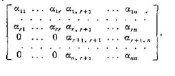
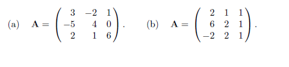
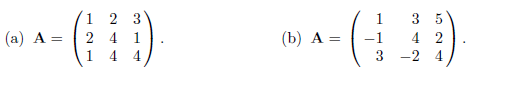

<script type="text/x-mathjax-config">
MathJax.Hub.Config({
  TeX: { equationNumbers: { autoNumber: "AMS" } }
});
</script>

# Determinante
\small
El concepto de determinante surgió con relación al problema de solución de sistemas de ecuaciones lineales.
A cada sistema de ecuaciones se le puede asociar un número asociado, llamado _el_ _determinante_ del sistema. 

## Caso en dos dimensiones

Cuando tenemos el sistema de ecuaciones en dos dimensiones, supongamos que las ecuaciones no son rectas horizontales
$$
 \begin{array}{ccc}
 a x_1 + b x_2  & = & e\\
 c x_1 + d x_2  & = & f
 \end{array}
$$

Se tiene que el sistema no tiene solución única ssi las rectas son paralelas o bien, las ecuaciones representan a la misma recta. En cualquier caso, obtenemos que las rectas son paralelas si : $-\frac{a}{b} = -\frac{c}{d}$ o bien, debido a que las rectas no son horizontales, $ad-bc=0$.

# Determinante en 2 dimensiones
\tiny
Si consideramos la matriz asociada del sistema y reescribimos en términos de sus subíndices,
$$
 \begin{array}{ccc}
 a_{11} x_1 + a_{12} x_2  & = & b_1\\
 a_{21} x_1 + a_{22} x_2  & = & b_2
 \end{array}
$$
La condición sobre las pendientes paralelas se escribe como $a_{11}a_{22}-a_{12}a_{21}=0$. A dicho término $a_{11}a_{22}-a_{12}a_{21}$ se le llama el determinante del sistema. 

\begin{equation}
 \begin{array}{ccc}
 |\mathbf{A}|=\det(A) & = &
  \begin{vmatrix}
    a  &  b \\
    c  & d 
 \end{vmatrix}
 \end{array}
\end{equation}

## Ejemplo
Calcular el determinante de la matriz

\begin{equation*}
 \begin{array}{cc}
  \begin{vmatrix}
    -1  &  5 \\
     4  &  -2 
 \end{vmatrix} & = -18
 \end{array}
\end{equation*}


# Permutaciones
\small
Para definir de manera general a los determinantes en varias dimensiones, se usan a las permutaciones. Una permutación es una función $\pi:\{1,2,\ldots,n\}\rightarrow \{1,2,\ldots,n\}$ es decir, una permutación es una función que asigna o reordena a $n$ números enteros.

## Ejemplo
\smallsize
\begin{equation*}
\begin{array}{ccc}
\pi &= & \begin{pmatrix} 1 & 2 & 3 & 4 & 5 \\ 2 & 4 & 1 & 5 & 3 \end{pmatrix}
\end{array}
\end{equation*}

Decimos que $\pi$ tiene una inversión si $\pi$ cambia el orden es decir, si $i<j$ pero $\pi(j) < \pi(i)$.

**Definición** Una permutación $\pi$ es _par_ o _impar_ de acuerdo a si su número de inversiones es par ó impar.


Para la permutación $\pi$, y para cada entero, analizamos el número de inversiones (o de cambios de orden).
\begin{itemize}
\item Para $i=1$, existen 2 inversiones pues $2$ y $4$ están a la izquierda de $1$.
\item Para $i=2$, existen 0 inversiones.
\item Para $i=3$, existen 2 inversiones pues 4 y 5 están a la izquierda de $3$.
\item Para $i=4$, existen 0 inersiones, pues 5 está a la derecha de 4.
\end{itemize}

Por tanto la permutación

\begin{equation*}
\begin{array}{ccc}
\pi &= & \begin{pmatrix} 1 & 2 & 3 & 4 & 5 \\ 2 & 4 & 1 & 5 & 3 \end{pmatrix}
\end{array}
\end{equation*}
es par  pues tiene $4$ inversiones

# Determinantes

La definición general del determinante está dada en términos de las permutaciones de los índices de filas y columnas de una matriz.

## Definición

El **determinante** de la matriz $\mathbf{A}=(a_{ij})$ $n\times n$,  es el número real

\begin{equation*}
\begin{array}{ccc}
\left| A \right| = det(\mathbf{A}) &= & \sum_{\pi\in S_n} (-1)^{\mbox{sign}(\pi)} a_{1\pi(1)}a_{2\pi(2)}\cdots a_{n\pi(n)}
\end{array}
\end{equation*}

En donde la s
uma es sobre todas las permutaciones del conjunto $\{1,2,\ldots,n\}$.

## Definición
Suponga que $\alpha$ es una permutación $\alpha(k)=i_{k}$ con $[i_1,i_2,\ldots,i_n]$ denotamos al signo de la permutación.

### Ejemplo 
Calcular el determinante, de acuerdo a la definición
\[
\begin{vmatrix}
 1 & 2 & 3 \\
 4 & 5 & 6 \\
 7 & 8 & 9 
\end{vmatrix}
\]

Consideramos a las permutaciones, en este caso $3!= 6$

\begin{array}{cccc}
\sigma_1 &= & 
\begin{pmatrix} 
1 & 2 & 3  \\ 1 & 2 & 3  \end{pmatrix} & sgn(\sigma_1)=1
\end{array}

\begin{array}{cccc}
\sigma_2 &= & 
\begin{pmatrix} 
1 & 2 & 3  \\ 1 & 3 & 2  \end{pmatrix} & sgn(\sigma_2)=-1
\end{array}


\begin{array}{cccc}
\sigma_3 &= & 
\begin{pmatrix} 
1 & 2 & 3  \\ 2 & 3 & 1  \end{pmatrix} & sgn(\sigma_3)=(-1)^{2}
\end{array}

\begin{array}{cccc}
\sigma_4 &= & 
\begin{pmatrix} 
1 & 2 & 3  \\ 2 & 1 & 3  \end{pmatrix} & sgn(\sigma_4)=(-1)^{3}
\end{array}

\begin{array}{cccc}
\sigma_5 &= & 
\begin{pmatrix} 
1 & 2 & 3  \\ 3 & 1 & 2  \end{pmatrix} & sgn(\sigma_5)=(-1)^{4}
\end{array}

\begin{array}{cccc}
\sigma_6 &= & 
\begin{pmatrix} 
1 & 2 & 3  \\ 3 & 2 & 1  \end{pmatrix} & sgn(\sigma_6)=(-1)^{6}
\end{array}

Por tanto el determinante será la siguiente suma

\[
\det(A) = a_{11}a_{22}a_{33} -a_{11}a_{23}a_{32}+a_{12}a_{23}a_{31}-a_{12}a_{21}a_{33}+a_{13}a_{21}a_{32}-a_{13}a_{22}a_{31}
\]


### Ejemplo 
Calcular el determinante, de acuerdo a la definición
\[
\begin{vmatrix}
 2  & 1 & 1 \\
 6  & 2 & 1 \\
 -2 & 2 & 1 
\end{vmatrix}
\]

# Cálculo de un determinante

Si $A$ es una matriz de orden n, sea $A[i,j]$ la matriz de orden $n-1$ que se obtiene eliminando la $i-$ésima fila y la $j$-ésima columna de $A$. A dichas matrices se les llama _menor_ de orden $n-1$

## Teorema de Laplace 

Considere un elemento de la matriz de orden $n$,  $a_{ij}$, con $i\in\{1,2,\ldots n\}$, $j\in\{1,2,\ldots n\}$, llamamos **cofactor** al determinante $(-1)^{i+j}\det(A[i,j])$ que se obtiene del menor de eliminar la fila $i$ y la columna $j$. 

El cofactor se puede obtener factorizando el término $a_{ij}$ del desarrollo

$$
\sum_{\pi\in S_n, \pi(i)=j} (-1)^{\mbox{sign}(\pi)} a_{1\pi(1)}\cdots a_{i-1,\pi(i-1)}a_{i+1,\pi(i+1)}\cdots a_{n\pi(n)}
$$

### Teorema de Laplace 

Sea $\mathbf{A}$ de orden $n$. Para $i\in \{1,2\ldots,n\}$ se tiene que 

\begin{equation}
\begin{array}{ccc}
\left| A \right| = det(\mathbf{A}) &= & (-1)^{i+1}a_{i1}A_{i1} +(-1)^{i+2} a_{i2}A_{i2} + \ldots +(-1)^{i+n} a_{in}A_{in}
\end{array}
\end{equation}
Y para $j \in \{1,2,\ldots, n\}$
\begin{equation}
\begin{array}{ccc}
\left| A \right| = det(\mathbf{A}) &= & (-1)^{1+j}a_{1j}A_{1j} +(-1)^{2+i} a_{2j}A_{2j} + \ldots +(-1)^{n+j} a_{nj}A_{nj}
\end{array}
\end{equation}

# Ejemplo

Evaluar el determinante de cada una de las matrices

\begin{equation*}
\begin{array}{ccc}
A &= & \begin{pmatrix} 
  -3 & 2 & 5 \\
   1 & 0 &-1 \\
   4 &-6 & 7 
        \end{pmatrix}
\end{array}
\end{equation*}

 \begin{equation*}
\begin{array}{ccc}
B &= & \begin{pmatrix} 
   8 &-4 & 0 \\
   0 & 6 &-3 \\
  -1 & 5 & 3 
        \end{pmatrix}
\end{array}
\end{equation*}


# Propiedades de los determinantes

El determinante tiene las siguientes propiedades

@. El producto de $a_{i_11}a_{i_22}\cdots a_{i_nn}$ aparece en el determinante de orden $n$ con el signo igual a $signo(\sigma)$, con $\sigma = \begin{pmatrix} 1 & 2 & 3 & \dots & n \\ i_1 & i_2 & i_3 & \dots & i_n \end{pmatrix}$

@. Si una fila o una columna esta compuesta por 0's entonces su determinante es igual a cero.

### Matrices en bloques

Una muestra cuadrada se dice que es una matriz en bloques _semidescompuesta_ si sus elementos pueden ser divididos en cuatro matrices de manera que a lo largo de la diagonal figuren matrices cuadradas y una de las otras dos matrices esté compuesta integramente por ceros.

```{r echo=FALSE, fig.align='center', out.width='30%'}

```

@. El determinante de una matriz en bloques _semidescompuesta_ es igual al producto de sus determiantes de sus bloques diagonales.

\begin{equation*}
 \begin{vmatrix} B & D \\ O & C   \end{vmatrix} = |B||C| - O|D| = \det(B)\det(C)
\end{equation*}

Para $n=2$ se sabe que se cumple. Suponga que es cierta para cualquier matriz de tamaño $n-1$, entonces, ahora suponga que $A = \begin{bmatrix} B & D \\ \mathbf{0}_{sr} & C \end{bmatrix}$ entonces aplicando el desarrollo por cofactores obtenemos
\[
|A|=a_{11}\det(A_{11})-a_{12}\det(A_{12}) + \ldots + (-1)^{n+1}\det(A_{1,n})
\]
Pero todas las matrices $A_{1,j}$ son de tamaño $n-1$ y en bloques semidescompuesta, por lo que la hipótesis de inducción implica que se pueden descomponer como producto de determinantes. Paara las matrices $A_{11}\ldots A_{1r}$ se pueden dividir de manera que el cuadrado sea un cuadrado de orden $r$, para estas matrices $\det(A_{1j})=\det(B_{1j})\det(C)$, para el resto de submatrices $A_{1,r+1},\ldots A_{1,n}$ se pueden separar de forma que tenemos un renglón con $0's$ por tanto
\[
\det(A)=a_{11}\det(B_{11})\det(C) - a_{12}\det(B_{12})\det(C) + \ldots + (-1)^{r+1}\det(B_{1,r})\det(C) = \det(B)\det(C).
\]


@. Si se cambian dos filas o dos columnas de un determinante, el determinante sólo cambia de signo.

@. El valor de un determinante no cambia si la matriz se traspone. 

$$
\det(A) = \det(A^{T})
$$

@. Si dos columnas del determinante son iguales, entonces $|A| = 0$.

@. Si dos filas del determinante son iguales, entonces $|A| = 0$

# Propiedades de los determinantes (II)

6. Si se tiene que una columna de $A$ tienen un mismo factor común constante entonces

\begin{equation*}
\begin{array}{cc}
 &  \begin{vmatrix} 
     a_{11}     & a_{21}      & ca_{1,i}     & \cdots     & a_{1,n}      \\ 
     a_{21}     & a_{22}      & ca_{2,i}     & \cdots     & a_{2,n}      \\
     a_{31}     &  a_{32}     & ca_{3,i}     &  \cdots    & a_{3,n}      \\
    \vdots      & \vdots      & \vdots       & \vdots     & \vdots \\
     a_{n-1,1}  & a_{n-1,2}   & ca_{n-1,i}   & \cdots     & a_{n-1,n}      \\
     a_{n,1}     &  a_{n-1,2} & ca_{n,i}     & \cdots     & a_{n,n}
  \end{vmatrix}
\end{array}
\end{equation*}
es igual a


\begin{equation}
\begin{array}{cc}
c \cdot &  &  \begin{vmatrix} 
     a_{11}     & a_{21}      & a_{1,i}     & \cdots     & a_{1,n}      \\ 
     a_{21}     & a_{22}      & a_{2,i}     & \cdots     & a_{2,n}      \\
     a_{31}     &  a_{32}     & a_{3,i}     &  \cdots    & a_{3,n}      \\
    \vdots      & \vdots      & \vdots       & \vdots     & \vdots \\
     a_{n-1,1}  & a_{n-1,2}   & a_{n-1,i}   & \cdots     & a_{n-1,n}      \\
     a_{n,1}    &  a_{n-1,2}  & a_{n,i}     & \cdots     & a_{n,n}
  \end{vmatrix}
\end{array}
\end{equation}


# Propiedades de los determinantes (III)

@. Si todo elemento de la $k-$esima columna de un determinante viene dado como la suma de dos vectores columna $a_{ik}=b_{ik}+c_{ik}$ entonces

\begin{equation}
\begin{array}{ccccc}
 &  \begin{vmatrix} 
     a_{11}     & a_{21}      & b_{1,i}  + c_{1,i}     & \cdots     & a_{1,n}      \\ 
     a_{21}     & a_{22}      & b_{2,i}  + c_{2,i}     & \cdots     & a_{2,n}      \\
     a_{31}     &  a_{32}     & b_{3,i}  + c_{3,i}     &  \cdots    & a_{3,n}      \\
    \vdots      & \vdots      & \vdots                 & \vdots     & \vdots \\
     a_{n-1,1}  & a_{n-1,2}   & b_{n-1,i}+ c_{n-1,i}   & \cdots     & a_{n-1,n}      \\
     a_{n,1}    &  a_{n-1,2}  & b_{n,i}  + c_{n,i}     & \cdots     & a_{n,n}
  \end{vmatrix} & = &
  \begin{vmatrix} 
     a_{11}     & a_{21}      & b_{1,i}      & \cdots     & a_{1,n}      \\ 
     a_{21}     & a_{22}      & b_{2,i}      & \cdots     & a_{2,n}      \\
     a_{31}     &  a_{32}     & b_{3,i}      &  \cdots    & a_{3,n}      \\
    \vdots      & \vdots      & \vdots       & \vdots     & \vdots \\
     a_{n-1,1}  & a_{n-1,2}   & b_{n-1,i}    & \cdots     & a_{n-1,n}      \\
     a_{n,1}    &  a_{n-1,2}  & b_{n,i}      & \cdots     & a_{n,n}
  \end{vmatrix} +
  \begin{vmatrix} 
     a_{11}     & a_{21}      & c_{1,i}       & \cdots     & a_{1,n}      \\ 
     a_{21}     & a_{22}      & c_{2,i}       & \cdots     & a_{2,n}      \\
     a_{31}     &  a_{32}     & c_{3,i}       &  \cdots    & a_{3,n}      \\
    \vdots      & \vdots      & \vdots        & \vdots     & \vdots \\
     a_{n-1,1}  & a_{n-1,2}   & c_{n-1,i}     & \cdots     & a_{n-1,n}      \\
     a_{n,1}    &  a_{n-1,2}  & c_{n,i}       & \cdots     & a_{n,n}
  \end{vmatrix}
\end{array}
\end{equation}

@. El valor de un determinante no varía si a todos los elementos de una de sus columnas se suman los elementos de otra 
columna multiplicada por un escalar.

\begin{equation}
\begin{array}{cccc}
 &  \begin{vmatrix} 
     a_{11}     & a_{21}      & a_{1,i}  + ca_{1,j}     & \cdots  &  a_{1,j}   & a_{1,n}      \\ 
     a_{21}     & a_{22}      & a_{2,i}  + ca_{2,j}     & \cdots  &  a_{2,j}   & a_{2,n}      \\
    \vdots      & \vdots      &  \vdots                  & \vdots &  \vdots    &  \vdots      \\
     a_{n-1,1}  & a_{n-1,2}   & a_{n-1,i}+ ca_{n-1,j}    & \cdots &  a_{n-1,j} & a_{n-1,n}    \\
     a_{n,1}    &  a_{n-1,2}  & a_{n,i}  + ca_{n,j}      & \cdots &  a_{n,j}   & a_{n,n}
  \end{vmatrix} & = &
  \begin{vmatrix} 
     a_{11}     & a_{21}      & a_{1,i}      & \cdots   &  a_{1,j}    & a_{1,n}      \\ 
     a_{21}     & a_{22}      & a_{2,i}      & \cdots   &  a_{2,j}    & a_{2,n}      \\
    \vdots      & \vdots      &  \vdots      & \vdots   &  \vdots     & \vdots       \\
     a_{n-1,1}  & a_{n-1,2}   & a_{n-1,i}    & \cdots   &  a_{n-1,j}  & a_{n-1,n}    \\
     a_{n,1}    & a_{n-1,2}   & a_{n,i}      & \cdots   &  a_{n,j}    & a_{n,n}
  \end{vmatrix} 
\end{array}
\end{equation}

La explicación de ésta propiedad se deriva de la aplicación de la propiedad 7
\begin{equation}
\begin{array}{cccccc}
 &  \begin{vmatrix} 
     a_{11}     & a_{21}      & a_{1,i}  + ca_{1,j}     & \cdots  &  a_{1,j}   & a_{1,n}      \\ 
     a_{21}     & a_{22}      & a_{2,i}  + ca_{2,j}     & \cdots  &  a_{2,j}   & a_{2,n}      \\
    \vdots      & \vdots      &  \vdots                  & \vdots  &  \vdots    &  \vdots      \\
     a_{n-1,1}  & a_{n-1,2}   & a_{n-1,i}+ ca_{n-1,j}    & \cdots  &  a_{n-1,j} & a_{n-1,n}      \\
     a_{n,1}    &  a_{n-1,2}  & a_{n,i}  + ca_{n,j}      & \cdots  &  a_{n,j}   & a_{n,n}
  \end{vmatrix} & = &
  \begin{vmatrix} 
     a_{11}     & a_{21}      & a_{1,i}      & \cdots     & a_{1,n}      \\ 
     a_{21}     & a_{22}      & a_{2,i}      & \cdots     & a_{2,n}      \\
    \vdots      & \vdots      &  \vdots       & \vdots     & \vdots \\
     a_{n-1,1}  & a_{n-1,2}   & a_{n-1,i}    & \cdots     & a_{n-1,n}      \\
     a_{n,1}    &  a_{n-1,2}  & a_{n,i}      & \cdots     & a_{n,n}
  \end{vmatrix} + & 
   &
  \begin{vmatrix} 
     a_{11}     & a_{21}      & ca_{1,j}       & \cdots     & a_{1,n}      \\ 
     a_{21}     & a_{22}      & ca_{2,j}       & \cdots     & a_{2,n}      \\
    \vdots      & \vdots      &  \vdots        & \vdots     & \vdots \\
     a_{n-1,1}  & a_{n-1,2}   & ca_{n-1,j}     & \cdots     & a_{n-1,n}      \\
     a_{n,1}    &  a_{n-1,2}  & ca_{n,j}       & \cdots     & a_{n,n}
  \end{vmatrix}
\end{array}
\end{equation}

Ahora aplicando la propiedad 6

\begin{equation}
\begin{array}{cccccc}
 &  \begin{vmatrix} 
     a_{11}     & a_{21}      & a_{1,i}  + ca_{1,j}     & \cdots  &  a_{1,j}    & \cdots  & a_{1,n}      \\ 
     a_{21}     & a_{22}      & a_{2,i}  + ca_{2,j}     & \cdots  &  a_{2,j}    & \cdots  & a_{2,n}      \\
    \vdots      & \vdots      &  \vdots                  & \vdots  &  \vdots    & \vdots  &  \vdots      \\
     a_{n-1,1}  & a_{n-1,2}   & a_{n-1,i}+ ca_{n-1,j}    & \cdots  &  a_{n-1,j} & \cdots  & a_{n-1,n}      \\
     a_{n,1}    &  a_{n-1,2}  & a_{n,i}  + ca_{n,j}      & \cdots  &  a_{n,j}   & \cdots  & a_{n,n}
  \end{vmatrix} & = &
  \begin{vmatrix} 
     a_{11}     & a_{21}      & a_{1,i}      & \cdots     & a_{1,n}      \\ 
     a_{21}     & a_{22}      & a_{2,i}      & \cdots     & a_{2,n}      \\
    \vdots      & \vdots      &  \vdots       & \vdots     & \vdots \\
     a_{n-1,1}  & a_{n-1,2}   & a_{n-1,i}    & \cdots     & a_{n-1,n}      \\
     a_{n,1}    &  a_{n-1,2}  & a_{n,i}      & \cdots     & a_{n,n}
  \end{vmatrix} + & 
   c\cdot &
  \begin{vmatrix} 
     a_{11}     & a_{21}      & a_{1,j}       & \cdots    &  a_{1,j}    & \cdots    & a_{1,n}      \\ 
     a_{21}     & a_{22}      & a_{2,j}       & \cdots    &  a_{2,j}    & \cdots    & a_{2,n}      \\
    \vdots      & \vdots      &  \vdots        & \vdots   &  \vdots     & \cdots    & \vdots \\
     a_{n-1,1}  & a_{n-1,2}   & a_{n-1,j}     & \cdots    &  a_{n-1,j}    & \cdots    & a_{n-1,n}      \\
     a_{n,1}    &  a_{n-1,2}  & a_{n,j}       & \cdots    &  a_{n,j}    & \cdots    & a_{n,n}
  \end{vmatrix}
\end{array}
\end{equation}

Aplicando ahora la propiedad 5 en el último determinante, por tener la columna $i$ y $j$ iguales, dicho sumando es 0.

\begin{equation}
\begin{array}{cccc}
 &  \begin{vmatrix} 
     a_{11}     & a_{21}      & a_{1,i}  + ca_{1,j}     & \cdots  &  a_{1,j}    & \cdots  & a_{1,n}      \\ 
     a_{21}     & a_{22}      & a_{2,i}  + ca_{2,j}     & \cdots  &  a_{2,j}    & \cdots  & a_{2,n}      \\
    \vdots      & \vdots      &  \vdots                  & \vdots  &  \vdots    & \vdots  &  \vdots      \\
     a_{n-1,1}  & a_{n-1,2}   & a_{n-1,i}+ ca_{n-1,j}    & \cdots  &  a_{n-1,j} & \cdots  & a_{n-1,n}      \\
     a_{n,1}    &  a_{n-1,2}  & a_{n,i}  + ca_{n,j}      & \cdots  &  a_{n,j}   & \cdots  & a_{n,n}
  \end{vmatrix} & = &
  \begin{vmatrix} 
     a_{11}     & a_{21}      & a_{1,i}      & \cdots     & a_{1,n}      \\ 
     a_{21}     & a_{22}      & a_{2,i}      & \cdots     & a_{2,n}      \\
    \vdots      & \vdots      &  \vdots       & \vdots     & \vdots \\
     a_{n-1,1}  & a_{n-1,2}   & a_{n-1,i}    & \cdots     & a_{n-1,n}      \\
     a_{n,1}    &  a_{n-1,2}  & a_{n,i}      & \cdots     & a_{n,n}
  \end{vmatrix} 
\end{array}
\end{equation}

# Propiedades de los determinantes (IV)
\small 
@. Si a la propiedad 8 la combinamos con la propiedad 3, obtenemos 
_El_ _valor_ _de_ _un_ _determinante_ _no_ _varía_ _si_ _a_ _todos_ _los_ _elementos_ _de_ _una_ _de_ _sus_ _filas_  _se_ _suman_ _los_ _elementos_ _de_ _otra_ _fila_  _multiplicada_ _por_ _un_ _escalar_

\begin{equation}
\begin{array}{ccccc}
  \begin{vmatrix}
     a_{11}        & a_{21}   & \cdots     & a_{1i}       & \cdots     & a_{1n}      \\ 
     a_{21}        & a_{22}   & \cdots     & a_{2i}       & \cdots     & a_{2n}      \\
     \vdots        & \vdots   & \vdots     &  \vdots      & \vdots     & \vdots \\  
     a_{i1}+ca_{j1}&a_{i2}+ca_{j2}&\cdots&a_{ii}+ca_{ji} & \cdots     & a_{in}+ca_{jn}\\
     \vdots        & \vdots   & \vdots     &  \vdots      & \vdots     & \vdots \\  
     a_{j1}        & a_{j2}   & \cdots     & a_{ji}       & \cdots     & a_{jn}      \\
      \vdots       & \vdots   & \vdots     &  \vdots      & \vdots     & \vdots \\
      a_{n1}        & a_{n2}   & \cdots     & a_{ni}       & \cdots     & a_{nn} 
  \end{vmatrix} & = &
  \begin{vmatrix}
     a_{11}        & a_{21}   & \cdots     & a_{1i}       & \cdots     & a_{1n}      \\ 
     a_{21}        & a_{22}   & \cdots     & a_{2i}       & \cdots     & a_{2n}      \\
     \vdots        & \vdots   & \vdots     &  \vdots      & \vdots     & \vdots      \\  
     a_{i1}        &a_{i2}    &\cdots      &a_{ii}        & \cdots     & a_{in}      \\
     \vdots        & \vdots   & \vdots     &  \vdots      & \vdots     & \vdots      \\  
     a_{j1}        & a_{j2}   & \cdots     & a_{ji}       & \cdots     & a_{jn}      \\
      \vdots       & \vdots   & \vdots     &  \vdots      & \vdots     & \vdots      \\
      a_{n1}        & a_{n2}   & \cdots     & a_{ni}       & \cdots     & a_{nn} 
  \end{vmatrix}
   & + &
  \begin{vmatrix}
     a_{11}        & a_{21}   & \cdots     & a_{1i}       & \cdots     & a_{1n}      \\ 
     a_{21}        & a_{22}   & \cdots     & a_{2i}       & \cdots     & a_{2n}      \\
     \vdots        & \vdots   & \vdots     &  \vdots      & \vdots     & \vdots      \\  
    ca_{j1}        &ca_{j2}   &\cdots      &ca_{ji}       & \cdots     &ca_{jn}      \\
     \vdots        & \vdots   & \vdots     &  \vdots      & \vdots     & \vdots      \\  
     a_{j1}        & a_{j2}   & \cdots     & a_{ji}       & \cdots     & a_{jn}      \\
      \vdots       & \vdots   & \vdots     &  \vdots      & \vdots     & \vdots      \\
      a_{n1}        & a_{n2}   & \cdots     & a_{ni}       & \cdots     & a_{nn} 
  \end{vmatrix}
\end{array}
\end{equation}

Aplicando las propiedades 6 y 5 de los determinantes
\begin{equation}
\begin{array}{ccccc}
  \begin{vmatrix}
     a_{11}        & a_{21}   & \cdots     & a_{1i}       & \cdots     & a_{1n}      \\ 
     a_{21}        & a_{22}   & \cdots     & a_{2i}       & \cdots     & a_{2n}      \\
     \vdots        & \vdots   & \vdots     &  \vdots      & \vdots     & \vdots \\  
     a_{i1}+ca_{j1}&a_{i2}+ca_{j2}&\cdots&a_{ii}+ca_{ji} & \cdots     & a_{in}+ca_{jn}\\
     \vdots        & \vdots   & \vdots     &  \vdots      & \vdots     & \vdots \\  
     a_{j1}        & a_{j2}   & \cdots     & a_{ji}       & \cdots     & a_{jn}      \\
      \vdots       & \vdots   & \vdots     &  \vdots      & \vdots     & \vdots \\
      a_{n1}        & a_{n2}   & \cdots     & a_{ni}       & \cdots     & a_{nn} 
  \end{vmatrix} & = &
  \begin{vmatrix}
     a_{11}        & a_{21}   & \cdots     & a_{1i}       & \cdots     & a_{1n}      \\ 
     a_{21}        & a_{22}   & \cdots     & a_{2i}       & \cdots     & a_{2n}      \\
     \vdots        & \vdots   & \vdots     &  \vdots      & \vdots     & \vdots      \\  
     a_{i1}        &a_{i2}    &\cdots      &a_{ii}        & \cdots     & a_{in}      \\
     \vdots        & \vdots   & \vdots     &  \vdots      & \vdots     & \vdots      \\  
     a_{j1}        & a_{j2}   & \cdots     & a_{ji}       & \cdots     & a_{jn}      \\
      \vdots       & \vdots   & \vdots     &  \vdots      & \vdots     & \vdots      \\
      a_{n1}        & a_{n2}   & \cdots     & a_{ni}       & \cdots     & a_{nn} 
  \end{vmatrix}
   & + &c \cdot
  \begin{vmatrix}
     a_{11}        & a_{21}   & \cdots     & a_{1i}       & \cdots     & a_{1n}      \\ 
     a_{21}        & a_{22}   & \cdots     & a_{2i}       & \cdots     & a_{2n}      \\
     \vdots        & \vdots   & \vdots     &  \vdots      & \vdots     & \vdots      \\  
     a_{j1}        & a_{j2}   &\cdots      & a_{ji}       & \cdots     & a_{jn}      \\
     \vdots        & \vdots   & \vdots     &  \vdots      & \vdots     & \vdots      \\  
     a_{j1}        & a_{j2}   & \cdots     & a_{ji}       & \cdots     & a_{jn}      \\
      \vdots       & \vdots   & \vdots     &  \vdots      & \vdots     & \vdots      \\
      a_{n1}        & a_{n2}   & \cdots     & a_{ni}       & \cdots     & a_{nn} 
  \end{vmatrix}
\end{array}
\end{equation}

Se obtiene que el último sumando es 0, y por tanto 
\begin{equation}
\begin{array}{ccc}
  \begin{vmatrix}
     a_{11}        & a_{21}   & \cdots     & a_{1i}       & \cdots     & a_{1n}      \\ 
     a_{21}        & a_{22}   & \cdots     & a_{2i}       & \cdots     & a_{2n}      \\
     \vdots        & \vdots   & \vdots     &  \vdots      & \vdots     & \vdots \\  
     a_{i1}+ca_{j1}&a_{i2}+ca_{j2}&\cdots&a_{ii}+ca_{ji} & \cdots     & a_{in}+ca_{jn}\\
     \vdots        & \vdots   & \vdots     &  \vdots      & \vdots     & \vdots \\  
     a_{j1}        & a_{j2}   & \cdots     & a_{ji}       & \cdots     & a_{jn}      \\
      \vdots       & \vdots   & \vdots     &  \vdots      & \vdots     & \vdots \\
      a_{n1}        & a_{n2}   & \cdots     & a_{ni}       & \cdots     & a_{nn} 
  \end{vmatrix} & = &
  \begin{vmatrix}
     a_{11}        & a_{21}   & \cdots     & a_{1i}       & \cdots     & a_{1n}      \\ 
     a_{21}        & a_{22}   & \cdots     & a_{2i}       & \cdots     & a_{2n}      \\
     \vdots        & \vdots   & \vdots     &  \vdots      & \vdots     & \vdots      \\  
     a_{i1}        &a_{i2}    &\cdots      &a_{ii}        & \cdots     & a_{in}      \\
     \vdots        & \vdots   & \vdots     &  \vdots      & \vdots     & \vdots      \\  
     a_{j1}        & a_{j2}   & \cdots     & a_{ji}       & \cdots     & a_{jn}      \\
      \vdots       & \vdots   & \vdots     &  \vdots      & \vdots     & \vdots      \\
      a_{n1}        & a_{n2}   & \cdots     & a_{ni}       & \cdots     & a_{nn} 
  \end{vmatrix}
\end{array}
\end{equation}

# Propiedades de los determinantes (V)

11.- Si $\mathbf{A}$ y $\mathbf{B}$ son matrices de orden $n$ entonces

\begin{equation}
  \left| \mathbf{A}\mathbf{B} \right| =   \left| \mathbf{A}  \right| \cdot   \left| \mathbf{B} \right|
\end{equation}

En particular, la propiedad 11 implica que para matrices cuadradas
\begin{equation}
  \left| \mathbf{A}_1\mathbf{A}_2\cdots\mathbf{A}_n \right| =   \left| \mathbf{A}_1  \right| \cdot      \left| \mathbf{A}_2 \right|\cdots\left| \mathbf{A}_n\right|
\end{equation}

En particular $|A^{k}| = \left| \mathbf{A} \right|^{k}$


### Ejercicio
Determinar el valor de los determinantes de las siguientes matrices

```{r echo=FALSE, fig.align='center', out.width='60%'}

```

Aplicando las propiedades de los determinantes, calcular

```{r echo=FALSE, fig.align='center', out.width='60%'}

```

# Propiedades de los determinantes (VI)

Sea $\mathbf{A}$ una matriz cuadrada de orden $n$. Denotemos por $|A|_{i,j} = (-1)^{i+j}\det(A[i,j])$. 
Con $|A|_{i,j}$ el cofactor asociado al elemento $a_{ij}$.
Entonces el desarrollo por cofactores, del Teorema de Laplace, se puede escribir como 

\begin{equation}
\begin{array}{cc}
\left| A \right| = det(\mathbf{A}) &=  (-1)^{1+i}a_{i1}|A[i,1]| +(-1)^{i+2} a_{i2}|A[i,2]| + \ldots +(-1)^{i+n} a_{in}|A[i,n]| \\
                                   & = a_{i1}|A|_{i,1}+a_{i2}|A|_{i,2}+ \cdots + a_{in}|A|_{i,n}
\end{array}
\end{equation}

Definimos a la matriz *adjunta* (clásica) como la transpuesta de la matriz formada por los cofactores (con su signo asociado), Es decir
\begin{equation}
\begin{array}{cc}
  A^{\star} =& \begin{bmatrix}
            |A|_{1,1}      &|A|_{2,1}    & \cdots     & |A|_{n,1}      \\ 
            |A|_{1,2}      &|A|_{2,2}    & \cdots     & |A|_{n,2}      \\
            \vdots         & \vdots      & \vdots     & \vdots \\  
            |A|_{1,n}      &|A|_{2,n}    & \cdots     & |A|_{n,n} 
   \end{bmatrix}
\end{array}
\end{equation}

Se puede ver que el Teorema de Laplace implica la siguiente identidad importante 
\begin{equation}\label{eq:adj}
A\cdot A^{\star} = |A|\cdot \mathbf{I} =\det(A)\cdot \mathbf{I} 
\end{equation}

Esta identidad tiene como resultado el siguiente teorema

**Teorema**
Si $\mathbf{A}$ es una matriz cuadrada de orden $n$, si el determinante de $A$ no es nulo, es decir $|\mathbf{A}|=\det(A) \ne 0$ entonces $A$ es _invertible_  y además la identidad $\eqref{eq:adj}$ implica
\begin{equation}
A^{-1} = \frac{1}{|A|} A^{\star}
\end{equation}

Además si $A$ es invertible entonces $|A|\ne 0$ y en particular
\begin{equation}
|A^{-1}| = \frac{1}{|A|} 
\end{equation}

**Teorema:** **Solubilidad** **de** **los** **sistemas** **de** **ecuaciones**
Si $\mathbf{A}$ es una matriz cuadrada de orden $n$, si el determinante de $A$ no es nulo, es decir 
$|\mathbf{A}|=\det(A) \ne 0$ entonces el sistema
\begin{equation}
\mathbf{A}x = \mathbf{b}
\end{equation}
tiene una única solución.
En particular el sistema homogéneo
\begin{equation}
\mathbf{A}x = \mathbf{0}
\end{equation}
tiene como única solución a la solución trivial $x=(0,0,..,0)$.

# Regla de Cramer

Recordemos el siguiente resultado que es consecuencia del Teorema de Laplace. 

\begin{equation}
\begin{array}{cc}
det(\mathbf{A}) &=  (-1)^{1+i}a_{i1}\det(A[i,1]) +(-1)^{i+2} a_{i2}\det(A[i,2]) + \ldots +(-1)^{i+n} a_{in}\det(A[i,n]) \\
                & = a_{i1}|A|_{i,1}+a_{i2}|A|_{i,2}+ \cdots + a_{in}|A|_{i,n}                         \\
det(\mathbf{A}) &=   a_{1j}|A|_{1,j}+a_{2j}|A|_{2,j}+ \cdots + a_{nj}|A|_{n,j}                         \\
                                   
\end{array}
\end{equation}
Aquí, $|A|_{1,j} = (-1)^{i+j}\det(A[i,j])$.
Pero por otra parte,  si $i\ne k$ entonces

\begin{equation}
\begin{array}{cc}
   &=  a_{i1}|A|_{k,1}+a_{i2}|A|_{k,2}+ \cdots + a_{in}|A|_{k,n}                         
\end{array}
\end{equation}

sería igual al desarrollo de un determinante con la siguiente estructura, en las filas $i$ y $k$ tendríamos elementos repetidos 

\begin{equation}
\begin{array}{cc}
   & \begin{vmatrix}
            a_{1,1}      &a_{1,2}    & \cdots     & a_{1,n}      \\ 
            a_{2,1}      &a_{2,2}    & \cdots     & a_{2,n}      \\
            \vdots       & \vdots    & \vdots     & \vdots       \\
            a_{i,1}      &a_{i,2}    & \cdots     & a_{i,2}      \\  
            \vdots       & \vdots    & \vdots    & \vdots         \\
            a_{i,1}      &a_{i,2}    & \cdots     & a_{i,2}      \\  
            a_{n,1}      &a_{n,2}    & \cdots     & a_{n,n} 
   \end{vmatrix}
\end{array}
\end{equation}

Por tanto

\begin{equation}
\begin{array}{cc}
     a_{i1}|A|_{k,1}+a_{i2}|A|_{k,2}+ \cdots + a_{in}|A|_{k,n} & = 0                         
\end{array}
\end{equation}
Igualmente, 

\begin{equation}
\begin{array}{cc}
     a_{1j}|A|_{1,k}+a_{2j}|A|_{2,k}+ \cdots + a_{nj}|A|_{n,k} & = 0                         
\end{array}
\end{equation}

Pues representa al determinante con dos columnas repetidas en $k$ y en $j$.

# Regla de Cramer II

Estos resultados nos sirven para obtener otro método para resolver un sistema de ecuaciones de orden $n$, es decir, de $n$ incógnitas y $n$ ecuaciones.

## Regla de Cramer

Suponga que $\mathbf{A}$ de tamaño $n\times n$ es la matriz asociada al sistema de ecuaciones

\begin{equation}
\begin{array}{cccccc}
     a_{11}x_{1}        & +a_{12}x_{2}    & \cdots  &+ a_{1n}x_{n}    & =       & b_1       \\ 
     a_{21}x_{1}        & +a_{22}x_{2}    & \cdots  &+ a_{2n}x_{n}    & =       & b_2       \\
    \vdots              & \vdots          & \vdots  & \vdots          & \vdots  &  \vdots      \\
     a_{n-1,1x_{1}}     & +a_{n-1,2}x_{2} & \cdots  &+ a_{n-1,n}x_{n} & =       & b_{n-1}      \\
     a_{n,1}x_{1}       & +a_{n,2}x_{2}   & \cdots  &+ a_{n,j}x_n     & =       & b_{n}
\end{array}
\end{equation}
Si $\det(A)\ne 0$ entonces el sistema tiene una solución única. Y además

\begin{equation}\label{eq:Cramer}
\begin{array}{ccc}
x_i &=& \frac{D_i(b)}{\det(A)}
\end{array}
\end{equation}

Con 
\begin{equation}
\begin{array}{ccc}
D_{i}(b) = &  \begin{vmatrix} 
                  a_{11}     & a_{21}    & \cdots   & b_{1}      &  a_{1,i+1} &\cdots    & a_{1,n}      \\ 
                  a_{21}     & a_{22}    & \cdots   & b_{2}      & a_{2,i+1}  &\cdots    & a_{2,n}      \\
                  \vdots     & \vdots    & \vdots   &  \vdots    & \vdots     &\vdots    &  \vdots      \\
                  a_{n-1,1}  & a_{n-1,2} & \cdots   & b_{n-1}    & a_{n-1,i+1}&\cdots    & a_{n-1,n}    \\
                  a_{n,1}    &  a_{n-1,2}& \cdots   & a_{n,i}    & a_{n,i+1}  &\cdots    & a_{n,n}
  \end{vmatrix} 
\end{array}
\end{equation}

## Ejemplo

Encontrar  $x,y$ y $z$ mediante la regla de Cramer

\begin{equation}
\begin{array}{cccccc}
     x & +4y   &-z  & = & 1       \\ 
     x & +y    &+z  & = & 0       \\
     2x&       &+3z & = & 0
\end{array}
\end{equation}

Verificamos la primera condición de la Regla de Cramer.

\begin{equation*}
\begin{array}{ccc}
\det(\mathbf{A})     = &  \begin{vmatrix} 
                        1     & 4        & -1      \\ 
                        1     & 1        &  1       \\
                        2     & 0        & 3
  \end{vmatrix} 
\end{array}
\end{equation*}
Desarrollando por cofactores en la tercera fila: $\det(\mathbf{A})=(-1)^{3+1}2\cdot \begin{vmatrix} 4 & -1 \\ 1 & 1  \end{vmatrix} + (-1)^{3+3}3\cdot  \begin{vmatrix} 1 & 4 \\ 1 & 1  \end{vmatrix}$ $=2\cdot(4\cdot 1 - (-1)\cdot 1) + 3\cdot (1\cdot 1 - 4\cdot 1)=10 - 9=1$.

Calculamos las soluciones usando $\eqref{eq:Cramer}$


  \begin{equation*}
    \begin{array}{cc}
      x=& \frac{\begin{vmatrix} 1 & 4 & -1 \\ 0 & 1 & 1 \\ 0 & 0 & 3  \end{vmatrix}}{\det(A)} = \frac{3}{1} 
    \end{array}
  \end{equation*}

  \begin{equation*}  
    \begin{array}{cc}
      y=& \frac{\begin{vmatrix} 1 & 1 & -1 \\ 1 & 0 & 1 \\ 2 & 0 & 3  \end{vmatrix}}{\det(A)} = \frac{(-1)^{1+2}\cdot (1)}{1}=-1 
    \end{array}
  \end{equation*}

  \begin{equation*}
    \begin{array}{cc}
      z=& \frac{\begin{vmatrix} 1 & 4 & 1 \\ 1 & 1 & 0 \\ 2 & 0 & 0  \end{vmatrix}}{\det(A)} = \frac{(-1)^{1+3}\cdot(-2)}{1} = -2
    \end{array}
  \end{equation*}


# Métodos de evaluación de determinantes

## **Simplificación** **por** **operaciones** **elementales** 

La fórmula del Teorema de Laplace (desarrollo por cofactores) nos sirve para calcular de manera recursiva un determinante. En caso de que haya una fila $i$ con todos los elementos de dicha fila, salvo uno, igual a cero, el determinante es igual a 

$$
D = a_{ij}|A|_{ij}
$$

Para poder aplicar esta fórmula, puede ser necesario operaciones elementales de manera similar a las aplicadas en eliminación gaussiana. A diferencia de eliminación gaussiana las operaciones pueden ser aplicadas por fila o por renglón

## Ejemplo

\begin{equation*}
\begin{array}{ccc}
D &= & \begin{vmatrix} 
          -2 & 5 & 0 & -1 & 3 \\ 
           1 & 0 & 3 & 7 & -2 \\
           3 & -1& 0 & 5 & -5 \\
           2 & 6 &-4 & 1 & 2  \\
           0 &-3 &-1 & 2 & 3
        \end{vmatrix}
\end{array}
\end{equation*}
 Aplicando operaciones elementales, eliminamos los elementos de la tercer columna salvo el último renglón
$-4R_1 + R_4 ->  R_4$ y $3R_1+R_2 -> R_2$. 
 
\begin{equation*}
\begin{array}{ccccc}
D & = & \begin{vmatrix} 
              -2 & 5 & 0 & -1 & 3 \\ 
               1 & -9& 0 & 13 & 7 \\
               3 & -1& 0 & 5 & -5 \\
               2 & 18& 0 & -7&-10 \\
               0 &-3 &-1 & 2 & 3
        \end{vmatrix}
         & = & (-1)^{3+5}(-1) \cdot
        \begin{vmatrix} 
              -2 & 5  & -1 & 3 \\ 
               1 & -9 & 13 & 7 \\
               3 & -1 & 5  & -5 \\
               2 & 18 & -7 &-10 \\
        \end{vmatrix} 
\end{array}
\end{equation*}

Ahora aplicamos eliminación gaussiana para simplificar la primer columna $2R_2 + R_1 -> R_1$, $-3R_2 + R_3 -> R_3$ y $-2R_2 + R_4 -> R_4$

\begin{equation*}
\begin{array}{ccccc}
D &= &  -\begin{vmatrix} 
               0 &-13 & 25 & 17 \\ 
               1 & -9 & 13 & 7 \\
               0 & 26 &-34 &-26 \\
               0 & 36 &-33 &-24 \\
        \end{vmatrix}
         & = & (-1)(-1)^{2+1}
        \begin{vmatrix} 
              -13 & 25 & 17  \\ 
               26 &-34 &-26  \\
               36 &-33 &-24  
        \end{vmatrix}=
\end{array}
\end{equation*}

\begin{equation*}
\begin{array}{ccccc}
D &= &  2\begin{vmatrix} 
              -13 & 25 & 17 \\ 
               13 &-17 &-13 \\
               36 &-33 &-24 
        \end{vmatrix}
         & = & (-1)(-1)^{2+1}
        \begin{vmatrix} 
              -13 & 25 & 17  \\ 
               26 &-34 &-26  \\
               36 &-33 &-24  
        \end{vmatrix}=
\end{array}
\end{equation*}

\begin{equation*}
\begin{array}{ccccc}
D &= &  2\begin{vmatrix} 
               0  &  8 & 4 \\ 
               13 &-17 &-13 \\
               10 &  1 & 2 
        \end{vmatrix}
         & = & 2\cdot 4\cdot
        \begin{vmatrix} 
               0  & 2  & 1  \\ 
               13 &-17 &-13  \\
               10 & 1  & 2  
        \end{vmatrix}=
\end{array}
\end{equation*}

\begin{equation*}
\begin{array}{ccccc}
D &= & 2\cdot 4 \begin{vmatrix} 
               0  & 0  & 1  \\ 
               13 & 9  &-13  \\
               10 &-3  & 2  
        \end{vmatrix}
         & = & 8\cdot
        \begin{vmatrix} 
               13 & 9    \\ 
               10 &-3 
        \end{vmatrix}= 8\cdot(-129)=-1032
\end{array}
\end{equation*}

# Ejemplo 
Calcular el determinante aplicando sus propiedades

\begin{equation*}
\begin{array}{ccc}
|A| &= & \begin{vmatrix} 
           3 & 1 &-1 & 2  \\ 
          -5 & 1 & 3 &-4   \\
           2 & 0 & 1 &-1  \\
           1 &-5 & 3 &-3   
      \end{vmatrix}
\end{array}
\end{equation*}
\begin{equation*}
\begin{array}{ccc}
|A| &= &(-1)^{3+1}\cdot 2\cdot \begin{vmatrix} 1 & -1 & 2 \\ 1 & 3 &-4 \\ -5 & 3 & -3 \end{vmatrix} \\
    &  &+ (-1)^{3+3}\cdot 1\cdot       \begin{vmatrix} 3 & 1 & 2  \\ -5 & 1 &-4 \\ 1 & -5 & -3 \end{vmatrix}\\
    &  & + (-1)^{3+4}\cdot(-1)\cdot     \begin{vmatrix} 3 & 1 &-1  \\ -5 & 1 &3  \\ 1 & -5 & 3 \end{vmatrix}
\end{array}
\end{equation*}

\begin{equation*}
\begin{array}{ccc}
|A| &= & 2\cdot 16 - 40 + 48 = 40
\end{array}
\end{equation*}                                               

# Determinante de matrices triangulares
Aplicando la definición, calcular el determinante


\begin{equation*}
\begin{array}{cc}
D_n = &  \begin{vmatrix} 
          a_{11}     & 0           & 0            & \cdots     & 0      \\ 
          a_{21}     & a_{22}      & 0            & \cdots     & 0      \\
          a_{31}     &  a_{32}     & a_{3,3}      &  \cdots    & 0      \\
          \vdots      & \vdots      & \vdots       & \vdots     & \vdots \\
          a_{n-1,1}  & a_{n-1,2}   & a_{n-1,3}    & \cdots     & 0      \\
          a_{n,1}     &  a_{n-1,2} & a_{n,3}      & \cdots     & a_{n,n}
  \end{vmatrix}
\end{array}
\end{equation*}

Desarrollando por cofactores en la primera fila, 

\begin{equation*}
\begin{array}{ccccc}
D_n =& a_{11}\cdot D_{n-1} &\mbox{ con } & D_{n-1}  = & \begin{vmatrix} 
                                                    a_{22}     & 0           & 0            & \cdots     & 0      \\ 
                                                    a_{32}     & a_{33}      & 0            & \cdots     & 0      \\
                                                    \vdots     & \vdots      & \vdots       & \vdots     & \vdots \\
                                                    a_{n-1,2}  & a_{n-1,3}   & a_{n-1,3}    & \cdots     & 0      \\
                                                    a_{n,2}    &  a_{n-1,3}  & a_{n,3}      & \cdots     & a_{n,n}
                                                  \end{vmatrix}
\end{array}
\end{equation*}
Desarrollando por cofactores en la primera fila de $D_{n-1}$, obtenemos la siguiente forma recursiva, notar que $D_{n-2}$, $D_{n-3},\ldots,D_2$ son triangulares

\begin{equation*}
D_{n} =a_{11}\cdot a_{22}\cdot D_{n-2} = a_{11}\cdot a_{22}\cdot a_{33}\cdot D_{n-3} = a_{11}\cdot a_{22}\cdot a_{33}\cdot a_{44} \cdot D_{n-4}=...  
\end{equation*}

\begin{equation}\label{eq:triang}
D_{n} =a_{11}\cdot a_{22}\cdot  a_{33}\cdot a_{44} \cdot ... \cdot a_{nn}  
\end{equation}


## Ejemplo

Resolver la ecuación 
\begin{equation}
  \begin{vmatrix}
     1        &x          & x^{2}       &   \cdots & x^n          \\
     1        &a_1        & a_1^{2}     &   \cdots & a_1^{n}      \\ 
     1        &a_{2}      & a_2^{2}     &   \cdots & a_2^{n}      \\
     1        &a_{3}      & a_3^{2}     &   \cdots & a_3^{n}      \\
     \vdots   & \vdots    & \vdots      &   \cdots &  \vdots      \\
     1        &a_{n}      & a_n^{2}     &   \cdots & a_n^{n}    
  \end{vmatrix}
\end{equation}

## Ejemplo

Resolver la ecuación

\begin{equation}
\begin{array}{cc}
  \begin{vmatrix}
     1        & 1       & 1     &   \cdots & 1      \\
     1        & 1-x     & 1     &   \cdots & 1      \\ 
     1        & 1       & 2-x   &   \cdots & 1      \\
     1        & 1       & 1     &   \cdots & 1      \\
     \vdots   & \vdots  & \vdots&   \cdots &\vdots  \\
     1        & 1       & 1     &   \cdots & n-x    
  \end{vmatrix} & = 0
\end{array}
\end{equation}

# Relaciones recursivas

Esté método consiste en desarrollar o transformar por medio de operaciones elementales o bien por medio del desarrollo por cofactores, expresándolo mediante determinantes de la misma forma pero de orden inferior. La igualdad de dicha relación se llama _relación_ _de_ _recurrencia_.

1) Hallar una relación de recurrencia entre el determinante original y los de orden menor.
2) Se calculan directamente tantos determinantes de orden inferior como haya en el 2do miembro de la relación de recurrencia.
3) Los determinantes de orden superior y su fórmula general se calculan usando la relación de recurrencia.

## Ejemplo particular

Supongamos que la relación de recurrencia tiene la forma 

\begin{equation*}
  D_{n} = p D_{n-1} + q D_{n-2}
\end{equation*}
Supongamos que $q\ne 0$ y $\alpha$ y $\beta$ son las raíces de $x^2-px-q=0$ entonces $p = \alpha  + \beta$ y $q=-\alpha\beta$. Entonces

\begin{equation*}
D_{n} = (\alpha + \beta)D_{n-1} - \alpha\beta D_{n-2} 
\end{equation*}

Es decir, 

\begin{equation*}
\begin{array}{cc}
D_{n} - \alpha D_{n-1}= & \beta (D_{n-1} - \alpha D_{n-2}) \\
D_{n} - \beta D_{n-1}=  & \alpha (D_{n-1} - \beta D_{n-2}) 
\end{array}
\end{equation*}

Aplicando la relación de recurrencia obtenemos
\begin{equation*}
\begin{array}{cc}
D_{n} - \alpha D_{n-1}= & \beta^{n-2}  (D_{n-1} - \alpha D_{n-2}) \\
D_{n} - \beta D_{n-1}=  & \alpha^{n-2} (D_{n-1} - \beta D_{n-2}) 
\end{array}
\end{equation*}

\begin{equation*}
\begin{array}{cc}   |
D_{n} = & \frac{\alpha^{n-1}  (D_{n-1} - \beta D_{n-2}) - \beta^{n-1} (D_{n-1} - \alpha D_{n-2})}{\alpha-\beta}  
\end{array}
\end{equation*}

Simplificando

\begin{equation*}
\begin{array}{cc}
D_{n} = & \alpha^{n} C_1  +  \beta^{n} C_2   
\end{array}
\end{equation*}

con $C_1 = \frac{D_2-\beta D_1}{\alpha(\alpha -\beta)}$ y $C_2 = \frac{D_2-\alpha D_1}{\beta(\beta - \alpha)}$

## Calcular el siguiente determinante


\begin{equation}
  \begin{vmatrix}
     5        & 3       & 0     &   \cdots & 0      \\
     2        & 5       & 3     &   \cdots & 0      \\ 
     0        & 2       & 5     &   \cdots & 0      \\
     0        & 0       & 2     &   \cdots & 0      \\
     \vdots   & \vdots  & \vdots&   \cdots &\vdots  \\
     0        & 0       & 0     &   \cdots & 3      \\
     0        & 0       & 0     &   \cdots & 5    
  \end{vmatrix} 
\end{equation}

Si $D_n$ es el determinante con la estructura anterior y con $n$ elementos y  $D_{n-1} $ es el determinante  con la misma estructura pero con $n-1$ elementos, notemos que $D_n = 5 D_{n-1} -6 D_{n-2}$. Resolvemos la ecuación $x^{2}-5x+6=0$ con raíces $x=3,2$
Por tanto $D_n=3^{n-1}(D_2-2D_1)-2^{n-1}(D_2-3D_1)$, calculando los determinantes $D_2=19$ y $D_1=5$, por tanto $D_n =3^{n-1}\cdot 9 - 2^{n-1}\cdot 4 = 3^{n+1}- 2^{n+1}$  

# Método de variación de elementos del determinante

Si a todos los elementos se les agrega un mismo número $x$, el determinante aumenta en el producto del número $x$ por la suma de sus cofactores algebraicos de todos los elementos del determinante.

Es decir 
\begin{equation*}
\begin{array}{cc}
D^{+x} = &  \begin{vmatrix} 
          a_{1,1}+x     & a_{1,2}+x     & a_{1,3}+x      & \cdots     & a_{1,n}+x      \\ 
          a_{2,1}+x     & a_{2,2}+x     & a_{2,3}+x      & \cdots     & a_{2,n}+x      \\
          a_{3,1}+x     & a_{3,2}+x     & a_{33}+x       &  \cdots    & a_{3,n}+x      \\
          \vdots        & \vdots        & \vdots         & \vdots     & \vdots \\
          a_{n-1,1}+x   & a_{n-1,2}+x   & a_{n-1,3}+x    & \cdots     & a_{n-1,n}+x      \\
          a_{n,1}+x     & a_{n-1,2}+x   & a_{n,3}+x      & \cdots     & a_{n,n}+x
  \end{vmatrix}
\end{array}
\end{equation*}

y 

\begin{equation*}
\begin{array}{cc}
D = &  \begin{vmatrix} 
          a_{1,1}    & a_{1,2}     & a_{1,3}      & \cdots     & a_{1,n}      \\ 
          a_{2,1}    & a_{2,2}     & a_{2,3}      & \cdots     & a_{2,n}      \\
          a_{3,1}    & a_{3,2}     & a_{33}       &  \cdots    & a_{3,n}      \\
          \vdots     & \vdots      & \vdots       & \vdots     & \vdots \\
          a_{n-1,1}  & a_{n-1,2}   & a_{n-1,3}    & \cdots     & a_{n-1,n}      \\
          a_{n,1}    & a_{n-1,2}   & a_{n,3}      & \cdots     & a_{n,n}
  \end{vmatrix}
\end{array}
\end{equation*}

Entonces 

\begin{equation}{label:eq:}
\begin{array}{cc}
  D^{+x} = &  D + x \sum_{i,j=1}^{n} A_{i,j} 
\end{array}
\end{equation}

# Ejemplo
Calcular el determinate


\begin{equation*}
\begin{array}{cc}
D^{+x} = &  \begin{vmatrix} 
          a_{1}    & x     & x      & \cdots     & x      \\ 
          x        & a_{2} & x      & \cdots     & x      \\
          x        & x     & a_{3}  &  \cdots    & x      \\
          \vdots   & \vdots& \vdots & \vdots     & \vdots \\
          x        & x     & x      & \cdots     & x      \\
          x        & x     & x      & \cdots     & a_{n}
  \end{vmatrix}
\end{array}
\end{equation*}
Este determinante se puede ver como $D^{+x}$ con $D$ igual a 


\begin{equation*}
\begin{array}{cc}
D = &  \begin{vmatrix} 
          a_{1}-x     & 0       & 0         & \cdots     & 0      \\ 
          0           & a_{2}-x & 0         & \cdots     & 0      \\
          0           & 0       & a_{3}-x   &  \cdots    & 0      \\
          \vdots      & \vdots  & \vdots    & \vdots     & \vdots \\
          0           & 0       & 0         & \cdots     & 0      \\
          0           & 0       & 0         & \cdots     & a_{n}-x
  \end{vmatrix}
\end{array}
\end{equation*}

Entonces, de acuerdo a la fórmula 

\begin{equation*}
  D^{+x} = (a_1-x)(a_2-x)\cdot(a_n-x) + x\sum_{i=1}^{n}(a_1-x)(a_2-x)\cdots(a_{i-1}-x)(a_{i+1}-x)\cdots(a_n-x)
\end{equation*}
Factorizando
\begin{equation*}
  D^{+x} = (a_1-x)(a_2-x)\cdot(a_n-x)(1+\frac{x}{a_1-x}+\frac{x}{a_2-x}+\cdots+\frac{x}{a_n-x}) 
\end{equation*}

