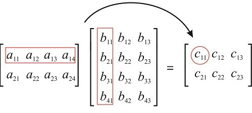
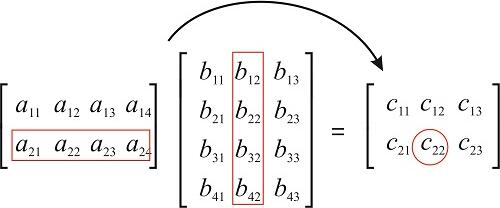

# Sistemas de ecuaciones. Eliminación gaussiana 

\small
En esta sección daremos una introducción a uno de los métodos más usados para resolver un sustema de ecuaciones lineales, el método recibe el nombre de _eliminación_ _gaussiana_, en honor a Carl Gauss.

Analizamos a fondo el método de eliminación gaussiana. Considere el sistema de ecuaciones

\begin{equation}
  \begin{matrix}
     a_{11} x_1 & +a_{12} x_2 + & \cdots   & +a_{1n} x_n  &= b_1  \\
     a_{21} x_1 & +a_{22} x_2 + & \cdots   & +a_{2n} x_n  &= b_2\\
    \vdots    & \vdots  & \vdots   & \vdots \\
     a_{n1} x_1 & +a_{n2} x_2 + & \cdots   & +a_{nn} x_n  & =b_n
  \end{matrix}
\end{equation}

Suponga que $a_{11}\ne 0$ entonces podemos aplicar la operación elemental $3$ para eliminar $x_1$ de las ecuaciones $i=2,\ldots,n$. Por ejemplo para la $i-$ésima ecuación, tenemos que multiplicar la primer ecuación por

\begin{equation*}
m_{i1}=\frac{a_{i1}}{a_{11}}, \mbox{para }i=2,\ldots,n
\end{equation*}
y sumarla a la ecuación $i$. Cabe resaltar que para no alterar la igualdad, debemos multiplicar _todos_ los términos de la primera ecuación .

Obtenemos el siguiente sistema

\begin{equation}
  \begin{matrix}
     a_{11} x_1 & +a_{12} x_2      + & \cdots   & +a_{1n} x_n  &= b_1  \\
                & a^{(2)}_{22} x_2 + & \cdots   & +a^{(2)}_{2n} x_n  &= b^{(2)}_2\\
               & \vdots  & \vdots   & \vdots \\
               & +a^{(2)}_{n2} x_2 + & \cdots   & +a^{(2)}_{nn} x_n  & =b^{(2)}_n
  \end{matrix}
\end{equation}
 
Con $a^{(2)}_{ij} = a_{ij}- m_{i1}a_{1j}$ y $b^{(2)}_i=b_i-m_{i1}b_1$ los nuevos coeficientes del bloque de ecuaciones inferior de tamaño $(n-1)\times(n-1)$.
En este paso hemos reducido la primer columna del sistema (salvo el pivote) a $0$.

Ahora aplicamos el mismo proceso al sistema de ecuaciones  $(n-1)x(n-1)$, 

Si $a^{(2)}_{22}\ne 0$ entonces podemos eliminar $x_2$ de las ecuaciones $i=3,\ldots,n$ multiplicando la segunda ecuación por

\begin{equation*}
m_{i2}=\frac{a^{(2)}_{i2}}{a^{(2)}_{22}}, \mbox{para }i=3,\ldots,n
\end{equation*}

y restarla a la ecuación $i$.


Obtenemos el siguiente sistema

\begin{equation}
  \begin{matrix}
     a_{11} x_1 & +a_{12} x_2      + & a_{13}x_3 +      & \cdots   & +a_{1n} x_n  &= b_1  \\
                & a^{(2)}_{22} x_2 + & a^{(2)}_{23}x_3 +& \cdots   & +a^{(2)}_{2n} x_n  &= b^{(2)}_2\\
                &                  +& a^{(3)}_{33}x_3 +& \cdots   & +a^{(3)}_{2n} x_n  &= b^{(3)}_3\\
                & \vdots           & \vdots&          & \vdots   &    \vdots          & \vdots\\
                &                  +& a^{(3)}_{n3}x_3 +& \cdots   & +a^{(3)}_{nn} x_n  & =b^{(3)}_n
  \end{matrix}
\end{equation}

Procedemos, si es posible, de la misma forma con el sistema formado por los renglones 2 a $n$.

Después de $k-1$ pasos  si $a^{(k-1)}_{kk}\ne 0$ entonces podemos eliminar $x_k$ de las ecuaciones $i=k+1,\ldots,n$ multiplicando la  ecuación $k-ésima$ por

\begin{equation*}
m_{ik}=\frac{a^{(k-1)}_{ik}}{a^{(k-1)}_{kk}}, \mbox{para }i=k+1,\ldots,n
\end{equation*}
y sumarla a la ecuación $i$, para $i\geqslant k+1$. Procedemos así hasta obtener el sistema triangular o bien, hasta que no sea posible eliminar variables.

\begin{equation}
  \begin{matrix}
     a_{11} x_1 & +a_{12} x_2      + & a_{13}x_3 +      & \cdots   & +a_{1n} x_n        &= b_1  \\
                & a^{(2)}_{22} x_2 + & a^{(2)}_{23}x_3 +& \cdots   & +a^{(2)}_{2n} x_n  &= b^{(2)}_2\\
                &                  +& a^{(3)}_{33}x_3 +& \cdots    & +a^{(3)}_{2n} x_n  &= b^{(3)}_3\\
                & \vdots             & \vdots           & \vdots   &    \vdots          & \vdots\\
                &                    &                  & \cdots   & +a^{(n-1)}_{n-1n} x_n  & =b^{(n-1)}_{n-1}\\
                &                    &                  & \cdots   & +a^{(n-1)}_{nn} x_n  & =b^{(n-1)}_n
  \end{matrix}
\end{equation}

Si tenemos un sistema triangular, como el de la ecuación, anterior, procedemos a calcular la solución. Primero encontramos el valor de $x_n$ usando la última ecuación, posteriormente, usando la ecuación $n-1$ y el valor obtenido, despejamos $x_{n-1}$ y así sucesivamente.

## Sustitución hacia atrás

Para $k =n$
$$
x_n = \frac{b^{(n-1)}_n}{a^{(n-1)}_{nn}}
$$

Para $k=n-1$

$$
x_{n-1} = \frac{b^{(n-1)}_{n-1} - a^{(n-1)}_{n-1,n}x_n}{a^{(n-1)}_{n-1,n-1}}
$$

Y
$$
x_{n-2} = \frac{b^{(n-2)}_{n-2}- a^{(n-2)}_{n-2,n-1}x_{n-1} - a^{(n-2)}_{n-2,n}x_n}{a^{(n-2)}_{n-2,n-2}}
$$

Y en general

\[x_{k}=\frac{b^{(k)}_k-\sum_{i=k+1}^{n}a^{(k)}_{kj}x_j}{a^{(k)}_{kk}}\]


## Algoritmo de eliminación gaussiana
El algoritmo en pseudocódigo:

```{verbatim}
for k= 1, ..., n-1:{

  If A(k,k)=0:  
    proc: "intercambiar renglones"
    # A(k,k,) es el pivote
    for i=k+1,...,n:{
      m(i,k) = A(i,k)/A(k,k)            #Calculamos el multiplicador del rengĺón pivotal
      for j=k+1,...,n:{                 #Modifcamos a las columnas del renglón i
        A(i,j)  = A(i,j)-m(i,k)*A(k,j)
        b(i)    = b(i)-m(i,k)b(k)
      }
    }
}
```

Si es posible obtener un sistema triangular entonces, realizamos la sustitución hacia atrás:

## Algoritmo de sustitución hacia atrás

```{verbatim}
If a(n,n)=0:
    no existe solución única
Else:
  for k=n-1,n-1,...,1
    suma = b(k)
    for j=k+1,...,n
      suma = suma - a(k,j)*x(j)
    x(k) = suma/a(k,k)
```

## Ejemplo

Aplicar el método de eliminación gaussiana al sistema

\begin{equation*}
  \begin{matrix}
           4x  & -9 y  & +2z & = 2  \\
           2x & -4 y  & +4z & = 3  \\
           -x & +2 y  & +2z  & = 1´
  \end{matrix}
\end{equation*}

Primero, obtenemos la matriz extendida del sistema

\begin{equation*}
 \begin{array}{ccc}
    \begin{pmatrix}
                  4   & -9  &   2  &\biggm|& 2   \\
                  2   & -4  &   4  &\biggm|& 3   \\
                  -1  &  2  &   2  &\biggm|& 1
                     \end{pmatrix} & 
    \begin{matrix} 
      (E_3 \leftrightarrow E_1   ) \\
    \end{matrix}
    & 
    \begin{pmatrix}
                 -1   &  2  &  2  &\biggm|& 1   \\
                  2   & -4  &  4  &\biggm|& 3   \\
                  4   & -9  &  2  &\biggm|& 2
    \end{pmatrix}
 \end{array}
\end{equation*}


# Reducción y uso de matrices

\small
Como el procedimiento de eliminación gaussiana sólo involucra a los coeficientes, una forma de simplificar los cálculos es por medio de un arreglo que llamaremos **Matriz**.
La matriz asociada al sistema de ecuaciones:
\begin{equation*}
  \begin{matrix}
        w   & - x  & - y  & +2z & = 1  \\
     2 w    & - 2x & - y  & +3z & = 3   \\
      -w    & + x  &  -y  &     &=-3
  \end{matrix}
\end{equation*}

Es igual a

\begin{equation*}
  \begin{pmatrix}
        1   & - 1 & - 1  & 2   \\
        2   & - 2 & - 1  & 3    \\
      - 1   &   1 &  -1  & 0 
  \end{pmatrix}
\end{equation*}
 
Existe otra matriz asociada, la **matriz** **extendida**

\begin{equation*}
 \begin{array}{cc}
  [\mathbf{A}| \mathbf{b}] & = \begin{pmatrix}
                                  1   & - 1 & - 1  & 2 &\biggm| & 1  \\
                                  2   & - 2 & - 1  & 3 &\biggm| & 3   \\
                                 -1   &   1 &  -1  & 0 &\biggm| &-3
                                \end{pmatrix}
 \end{array}
\end{equation*}


# Sistemas consistentes e inconsistentes

## Definición 

Un sistema de ecuaciones es **consistente** si tiene al menos una solución. Si no es consistente entonces se dice ser **inconsistente**.

Dos sistemas son **equivalentes** si tienen exactamente al mismo conjunto solución. 
Un sistema de ecuaciones puede ser consistente sin tener una única solución.

## Ejemplo 1

Considere el  sistema de ecuaciones

\begin{equation*}
  \begin{matrix}
           x  & +2 y  & +3z & = 1  \\
           3x & +5 y  & -2z & = 2   \\
           4x & +7 y  & +z  & = 3
  \end{matrix}
\end{equation*}

Aplicamos eliminación gaussiana, 
$$
\begin{array}{ccc}
  R_2 \rightarrow -3R_1 + R_2 & & \\
  x + 2y +3z  & = &  1 \\
  0x  -y -11z & = & -1 \\
  4x +7y +z   & = & 3
\end{array}
$$

$$
\begin{array}{ccc}
  R_3 \rightarrow -4R_1 + R_3 & & \\
  x + 2y +3z  & = &  1 \\
  0x  -y -11z & = & -1 \\
  0x -y +-11  & = & -1\end{array}
$$

Ahora, podemos hacer otra operación elemental, sumando $2R_2 + R_1$ a la primera

$$
\begin{array}{ccc}
  R_1 \rightarrow -2R_2 + R_1 & & \\
  x + 0y -19z  & = &  -1 \\
  0x + y +11z  & = &  1 \\
  0x -y  +-11  & = & -1\end{array}
$$

Ahora sumamos el segundo renglón al tercero, $R_2+R_3\rightarrow R_3$  


$$
\begin{array}{ccc}
  R_1 \rightarrow -2R_2 + R_1 & & \\
  x + 0y -19z  & = &  -1 \\
  0x + y +11z  & = &  1 \\
  0x + 0y +0z  & = & 0
\end{array}
$$
No es posible obtener el valor de $z$ de la tercer ecuación. Pero se puede proceder a resolver la segunda ecuación, en función de $z$

$$
\begin{array}{ccc}
  \quad\quad  x & = &  -1 + 19z \\
  \quad\quad  y & = &  1 - 11z
  \end{array}
$$

El conjunto solución se puede expresar de la forma
$$
\mathcal{X}= \Bigg\{\vec{\mathbf{v}}\in\mathbb{R}^{3}:\,\,
                    \vec{\mathbf{v}}=\begin{pmatrix}
                                          x \\ y \\z
                                      \end{pmatrix} = \begin{pmatrix}
                                                        -1 \\ 1 \\0
                                                        \end{pmatrix} + z 
                                                        \begin{pmatrix}
                                                          19 \\ -11 \\1
                                                        \end{pmatrix}, \quad z\in\mathbb{R}    
              \Bigg\}
$$

Por lo que, en caso de no poder obtener una matriz triangular superior en el proceso de eliminación gaussiana,  el sistema no tiene una solución **única**.
Y de hecho, en éste caso, el sistema tiene una infinidad de soluciones. El conjunto solución es una línea recta.

Este es un ejemplo en el que el sistema es _consistente_ aunque no tiene una única solución.

## Ejemplo 2

Considere el  sistema de ecuaciones

\begin{equation*}
  \begin{matrix}
           -x  & +3 y  & -2z & = 1  \\
           -x & +4 y  & -3z & = 0   \\
           -x & +5 y  & -4z  & = 0
  \end{matrix}
\end{equation*}


Aplicar eliminación gaussiana, se puede ver que el sistema es _inconsistente_. En efecto, aplicando eliminación gaussiana

\begin{equation*}
  \begin{matrix}
           -x  & +3 y  & -2z & = 1  \\
           -x & +4 y  & -3z & = 0   \\
           -x & +5 y  & -4z  & = 0
  \end{matrix}
\end{equation*}


### Definición 
<div>
Una matriz de _orden_ $m\times n$ es una función $\mathbf{A}:\{1,2,\ldots,m\}\times\{1,2,\ldots,n\} \rightarrow\mathbb{R}$. Que se representa como un arreglo rectangular

\begin{equation}
\begin{array}{cc}
\mathbf{A}  =&  \begin{bmatrix}
        a_{11}  & a_{12}  & \cdots   & a_{1n}   \\
        a_{21}  & a_{22}  & \cdots   & a_{2n} \\
        \vdots   & \vdots  & \vdots   & \vdots \\
        a_{m1}  & a_{m2}  & \cdots   & a_{mn} 
  \end{bmatrix}
\end{array}
\end{equation}
</div>

En ocasiones, nos referimos al _orden_ de la matriz como su _tamaño_. Si el _orden_ de una matriz es $m\times n$ decimos también que la matriz tiene $m$ filas y $n$ columnas. También decimos que la entrada de la matriz en la fila $i$ y coulmna $j$ es el número $a_{ij}$.


- Al número de la fila $i$ y columna $j$ es el número $a_{ij}$ se le llama elemento ${(i,j)}$ de la matriz.


- Una matriz es _cuadrada_ si $m=n$, es decir si el número de renglones es igual al número de columnas. En cualquier otro caso, decimos que la matriz es rectangular.

- Todo vector fila o vector columna se puede interpretar como una matriz $1\times n$ o $n\times 1$.

- La _diagonal_ _principal_ de la matriz es el arreglo $\{a_{11}, a_{22},\ldots, a_{nn} \}$. Toda matriz _cuadrada_ tiene una diagonal principal.


- Una matriz _diagonal_ es una matriz cuadrada tal que todos los elementos que no están en la diagonal principal son iguales a cero. Podemos referirnos a la matriz diagonal como $\mbox{diag}(d_1,d_2,\ldots, d_n)$.

La condición de que una matriz sea _diagonal_ se puede expresar de la siguiente forma
\[
a_{i,j}=\begin{cases} 
                  d_i   &    \mbox{ si }i = j\\
                  0     &    \mbox{ si }i\ne j\\
        \end{cases}
\]

- Una matriz es una matriz _triangular_ _inferior_ $\mathbf{L}$ de tamaño $m\times n$ si se cumple $L_{ij}=0$ si $i<j$, para $1\leq i\leq m$ y $1\leq j\leq n$. 

\begin{equation}
\begin{array}{cc}
\mathbf{A}  =&  \begin{bmatrix}
        l_{11}  & 0      & 0       & \cdots &  0       & \cdots & 0      \\
        l_{21}  & l_{22} & 0       & \cdots &  0       & \cdots & 0      \\
        \vdots  & \vdots & \vdots  & \ddots &  \vdots  & \vdots & \vdots \\
        l_{i1}  & l_{i2} & l_{i3}  & \cdots &  l_{ii}  & \cdots & 0 \\
        \vdots  & \vdots & \vdots  & \vdots &  \vdots  & \ddots & \vdots \\
        l_{n1}  & l_{n2} & l_{n3}  & \cdots &  l_{ni}  & \cdots & l_{nn} 
  \end{bmatrix}
\end{array}
\end{equation}

Es decir, todas las entradas arriba de la diagonal son nulos

- Una matriz es una matriz _triangular_ _superior_ $\mathbf{U}$ de tamaño $m\times n$ si se cumple $U_{ij}=0$ si $i>j$, para $1\leq i\leq m$ y $1\leq j\leq n$. Es decir, todas las entradas por debajo de la diagonal son nulas 

\begin{equation}
\begin{array}{cc}
\mathbf{A}  =&  \begin{bmatrix}
        u_{11}  & u_{12} & u_{13}  & \cdots &  u_{1i}  & \cdots & u_{1n} \\
          0     & u_{22} & u_{23}  & \cdots &  u_{2i}  & \cdots & u_{2n} \\
          0     &   0    & u_{33}  & \cdots &  u_{3i}  & \cdots & u_{3n} \\
        \vdots  & \vdots & \vdots  & \ddots &  \vdots  & \vdots & \vdots \\
          0     &   0    &  0      & \vdots &  u_{ii}  & \cdots & u_{in} \\
        \vdots  & \vdots & \vdots  & \vdots &  \vdots  & \ddots & \vdots \\
          0   ´  &   0    &    0    & \cdots &    0     & \cdots & u_{nn} 
  \end{bmatrix}
\end{array}
\end{equation}

- La matriz _identidad_ $I_n$ es la matriz _diagonal_ cuya diagonal principal es $\{1,\ldots,1\}$ y sus otras entradas son $0$.
\pause
\begin{equation}
\begin{array}{cc}
\mathbf{I}_n  =&  \begin{bmatrix}
        1  & 0  & \ldots   & 0   \\
        0  & 1  & \ldots   & 0 \\
        \vdots  & \vdots   & \ddots   & \vdots \\
        0  & 0  & \ldots   & 1 
  \end{bmatrix}
\end{array}
\end{equation}


- La matriz _cero_ $\Big[0\Big]_{mn}$ es la matriz con $a_{ij}=0$, para $i=1,2,\ldots,n$, $j=1,2,\ldots,n$ 

- Dos matrices $\textbf{A}$ y $\textbf{B}$ son _iguales_ si y solo si:

  * $\textbf{A}$ y $\textbf{B}$ tienen el mismo número de renglones y el mismo número de columnas
  * Todos los elementos correspondientes $(i,j)$ son iguales, es decir
  $a_{ij}=b_{ij}$ para $i=1,2,\ldots,m$ y $j=1,2,\ldots,m$.

Toda matriz se puede interpretar como un arreglo de vectores renglón o bien, un arreglo de vectores columna

\begin{equation*}
  \mathbf{A} = 
    \begin{bmatrix} \mathbf{a_{\cdot,1}}|\mathbf{a_{\cdot,2}}|\ldots |\mathbf{a_{\cdot,n}} \end{bmatrix}
\end{equation*}

En este caso los vectores $\mathbf{a_{\cdot,i}}$ son vectores columna de tamaño $m\times 1$.

# **Matrices**

## Ejercicios
\small
Obtener la expresión matricial de los sistemas de ecuaciones lineales en los ejemplos de la clase.

Para el siguiente sistema
\begin{equation*}
  \begin{matrix}
     -2 x_1 & -4 x_2 & +2 x_3 &-6x_4     & = 0  \\
      3 x_1 &  6 x_2  & -2 x_3& +13 x_4  &= 6\\
     2 x_1 &  + 4x_2  &      &  +14 x_4  &=12\\
     4 x_1 & + 8x_2  &-7x_3 &            &= -10
  \end{matrix}
\end{equation*}

La matriz extendida asociada al sistema es 

\begin{equation*}
  \begin{pmatrix}
      - 2   & - 4 &   2  & -6 & \bigm| & 0   \\
        3   &   6 & - 2  & 1  & \bigm| & 6    \\
        2   &   4 &   0  & 14 & \bigm| & 12  \\
        4   &   8 &  -7  & 0  & \bigm| & -10
  \end{pmatrix}
\end{equation*}


# **Matrices** II
\small
## Operaciones con matrices
Al igual que en el caso de los números, se puede definir operaciones aritméticas para las matrices. En ese sentido, las matrices son una generalización de los números y de los vectores

### Suma y resta de matrices

En esta sección suponga que $\mathbf{A}$ y $\mathbf{B}$ son matrices del mismo orden.

La **suma** de matrices $A$ y $B$ se define como $A+B$ es la matriz con entradas 

\begin{equation*}
\begin{array}{cc}
\mathbf{A} + \mathbf{B}   = & 
      \begin{bmatrix}
              a_{11}+b_{11}  & a_{12}+b_{12}  & \cdots   & a_{1n}+b_{1n}   \\
              a_{21}+b_{21}  & a_{22}+b_{22}  & \cdots   & a_{2n}+b_{2n} \\
              \vdots   & \vdots  & \vdots   & \vdots \\
              a_{m1}+b_{m1}  & a_{m2}+b_{m2}  & \cdots   & a_{mn}+b_{mn} 
        \end{bmatrix}
\end{array}
\end{equation*}

La **multiplicación** **por** **escalar** $\lambda \in\mathbb{R}$ o $\lambda\in\mathbb{C}$.

\begin{equation*}
\begin{array}{cc}
\lambda \mathbf{A}    = & 
      \begin{bmatrix}
              \lambda a_{11}  & \lambda a_{12}  & \cdots   & \lambda a_{1n}   \\
              \lambda a_{21}  & \lambda a_{22}  & \cdots   & \lambda a_{2n} \\
              \vdots  & \vdots  & \vdots   & \vdots \\
              \lambda a_{m1}  & \lambda a_{m2}  & \cdots   & \lambda a_{mn} 
        \end{bmatrix}
\end{array}
\end{equation*}


## **Multiplicación** **de** **Matrices** 
\small

### Operaciones con matrices

La multiplicación de una matriz difiere de la suma y resta de matrices.

Para que la multiplicación de dos matrices $A$ y $B$ esté definida, _el_ _número_ _de_ _columnas_ _de_ $A$ _debe_ _ser_ _igual_ _al_ _número_ _de_ _renglones_ _de_ $B$. Supongamos que  el orden de $A$ es $n\times m$ y $B$ tiene el orden $m\times p$. Entonces la multiplicación de $A\cdot B$ es la matriz con entradas:

\begin{equation}
\begin{array}{cc}
\mathbf{A} \cdot \mathbf{B}   = & 
      \begin{bmatrix}
              \sum_{k=1}^{m}a_{1k}b_{k1}  & \sum_{k=1}^{m}a_{1k}b_{k2}  & \cdots   & \sum_{k=1}^{m}a_{1k}b_{kn}   \\
              \sum_{k=1}^{m}a_{2k}b_{k1} & \sum_{k=1}^{m}a_{2k}b_{k2}  & \cdots   & \sum_{k=1}^{m}a_{2k}b_{kn} \\
              \vdots   & \vdots  & \vdots   & \vdots \\
              \sum_{k=1}^{m}a_{mk}b_{k1}  & \sum_{k=1}^{m}a_{mk}b_{k2}  & \cdots   & \sum_{k=1}^{m}a_{mk}b_{kn} 
        \end{bmatrix}
\end{array}
\end{equation}

Dicho de otra forma, las entradas de la multiplicación da una matriz con entradas $\big( A\cdot B\big)_{ij} = \sum_{k=1}^{m}a_{ik}b_{kj}$ $=a_{i1}b_{1j}+a_{i2}b_{2j}+\ldots+a_{im}b_{mj}$ con $i=1,\,2,\,\ldots,n$ y $j=1,2,\ldots,p$. El producto de matrices tendrá $n-$ filas y $p-$ columnas.


### Ejemplo 1

Si

\begin{equation*}
  \begin{array}{ccccc}
    A = & \begin{pmatrix} 1 & 2 & -1 & 0  \\ 2 & 0 & -2 & 3 \\ 5 & -2 & 3 & -4 \end{pmatrix} &\,\,\,\, &  
    C = & \begin{pmatrix} 2 & 1 & 0  \\ 3 & 4 & 2 \end{pmatrix}  \\
    D = &  \begin{pmatrix} 1 & 0 \\ 2 & -3 \\ -1 & -6 \end{pmatrix}  
  \end{array}
\end{equation*}
 
 Calcular
 $C\cdot A$, $D\cdot C$ y $C\cdot D$.
 
\begin{equation*}
  \begin{array}{ccc}
    C\cdot A = & \begin{pmatrix} 2\cdot 1 + 1\cdot 2 + 0\cdot 5 & 2\cdot 2 + 1\cdot 0 + 0\cdot(-2) & 2\cdot(-1) + 1\cdot(-2) + 0\cdot 3 & 2\cdot 0 + 1\cdot 3 + 0\cdot(-4)  \\ 3\cdot 1 + 4\cdot 2 + 2\cdot 5 & 3\cdot 2 + 4\cdot 0 + 2\cdot(-2) & 3\cdot(-1) + 4\cdot(-2) + 2\cdot 3 & 3\cdot 0 + 4\cdot 3 + 2\cdot(-4) \end{pmatrix} &    
  \end{array}
\end{equation*}
  
 
\begin{equation*}
  \begin{array}{ccc}
    C\cdot A = & \begin{pmatrix} 
                          4 & 4 & -4 & 3  \\
                         21 & 2 & -5 & 4 
                  \end{pmatrix} &    
  \end{array}
\end{equation*}
 
 
 
\begin{equation*}
  \begin{array}{ccc}
    D\cdot C = & \begin{pmatrix} 
                          1\cdot 2 + 0\cdot 3 & 1\cdot 1 + 0\cdot 4 & 1\cdot 0 + 0\cdot 2   \\
                          2\cdot 2 + (-3)\cdot 3 & 2\cdot 1 + (-3)\cdot 4 & 2\cdot 0 + (-3)\cdot 2   \\
                          (-1)\cdot 2 + (-6)\cdot 3 & (-1)\cdot 1 + (-6)\cdot 4 & (-1)\cdot 0 + (-6)\cdot 2   \\
                  \end{pmatrix} &    
  \end{array}
\end{equation*},


\begin{equation*}
  \begin{array}{ccc}
    D\cdot C = & \begin{pmatrix} 
                          2   & 1    & 0   \\
                          -5  & -10 &-6   \\
                          -20 & -25 & -12   \\
                  \end{pmatrix} &    
  \end{array}
\end{equation*}
 
 
 
\begin{equation*}
  \begin{array}{ccc}
C\cdot D = & \begin{pmatrix} 
            2\cdot 1 + 1\cdot 2 + 0\cdot(-1) &   2\cdot 0 + 1\cdot(-3) + 0\cdot(-6)   \\
            3\cdot 1 + 4\cdot 2 + 2\cdot(-1) &   3\cdot 0 + 4\cdot(-3) + 2\cdot(-6)
            \end{pmatrix} &    
  \end{array}
\end{equation*},


\begin{equation*}
  \begin{array}{ccc}
    C\cdot D = & \begin{pmatrix} 
                           4   & -3    \\
                           9   & -24    
                  \end{pmatrix} &    
  \end{array}
\end{equation*}
 
### Observación

El producto de dos matrices **no** es conmutativo, es decir, el orden de los factores **sí** altera el producto. Los productos $C\cdot D$ y $D\cdot C$ ¡ni siquiera tienen el mismo tamaño!

Esquematicamente podemos definir al producto de la siguiente forma

La entrada $c_{11}$ de la matriz $C=AB$ resultante es el producto punto del renglón 1 de $\mathbf{A}$ $\mathbf{a}_{1\cdot}$ y la columna 1 de $\mathbf{B}$, $\mathbf{b}_{\cdot1}$.

```{r echo=FALSE, fig.align='center', out.width='50%'}

```

La entrada $c_{22}$ de la matriz $C=AB$ resultante es el producto punto del renglón 2 de $\mathbf{A}$ $\mathbf{a}_{2\cdot}$ y la columna 2 de $\mathbf{B}$, $\mathbf{b}_{\cdot 2}$.

```{r echo=FALSE, fig.align='center', out.width='50%'}

```

La multiplicación matricial se puede aplicar para los casos en que uno de los elementos es un vector (interpretando a dicho vector como una matriz de tamaño $1\times n$ o $m\times 1$).

### Ejemplo 2

 a) Sea $A=\begin{pmatrix} 1 & -1 & 1 \end{pmatrix}$  y $B=\begin{pmatrix} 7 \\ 0 \\ 5 \end{pmatrix}$. Determinar que productos son posibles $A\cdot B$ y/o $B\cdot A$.
 b) Determinar el producto de las matrices
 
\begin{equation*}
  \begin{array}{cccc}
   & \begin{bmatrix} 3 & -1 & 4 & 0  \end{bmatrix} &\cdot &  
     \begin{bmatrix} 1 \\-2 \\ 3\\ 1 \end{bmatrix}  \\  
  \end{array},
\end{equation*}


\begin{equation*}
  \begin{array}{cccc}
   & \begin{bmatrix} 
        1 & -1 & 0 & 2 \\
        0 &  1 & 3 & 4 \\
        2 &  0 &-1 & 3
      \end{bmatrix} &\cdot &  
     \begin{bmatrix} 2 \\-1 \\ 0\\ 3 \end{bmatrix}  \\  
  \end{array},
\end{equation*}

#### _Respuesta_

a)$A$ es una matriz $1\times 4$ y $B$ es una matriz $4\times 1$. Entonces, $A\cdot B$ esta definido pues las columnas de $A$ = los renglones de $B$ y el resultado será una matriz de tamaño $1\times 1$ es decir un escalar.

En este caso $A\cdot B = 1\cdot 7 + (-1) \cdot 0 + 1\cdot 5$ = (12) = 12.
Por otro lado $B\cdot A$ también esta definido y el resultado será una matriz de tamaño $4\times 4$.


\begin{equation*}
  \begin{array}{cccc}
   & \begin{bmatrix} 
        7\cdot 1 & 7\cdot(-1) & 7\cdot 1  \\
        0\cdot 1 & 0\cdot(-1) & 0\cdot 1  \\
        5\cdot 1 & 5\cdot(-1) & 5\cdot 1 
      \end{bmatrix} & = & 
      \begin{bmatrix} 
        7 & -7 & 7  \\
        0 & 0  & 0  \\
        5 & -5 & 5 
      \end{bmatrix}
  \end{array} ,
\end{equation*}

# Matrices

## Propiedades de las operaciones on Matrices
\small
1.- Para toda matriz $A$ y $\alpha,\beta\in \mathbb{R}$.

* $1 \cdot \textbf{A}$ = $\textbf{A} \cdot 1$ =  $\textbf{A}$.
 
* $0\cdot  \mathbf{A}$ =$\mathbf{A}\cdot 0$ =  $\mathbf{0}$.
 
* $\alpha \cdot (\beta\cdot A) = (\alpha \beta)\mathbf{A}$.


2.- Si $A$, $B$ y $C$ tienen el mismo orden.

* $\mathbf{A} + (\mathbf{B} + \mathbf{C}) = (\mathbf{A} + \mathbf{B}) + \mathbf{C}$.
* $\mathbf{A} + \mathbf{B} = \mathbf{B} + \mathbf{A}$.
* $(\alpha+\beta)\cdot A = \alpha\cdot \mathbf{A} + \beta \cdot \mathbf{B}$.
* $\alpha \cdot (\mathbf{A}+ \mathbf{B}) = \alpha\cdot \mathbf{A} + \alpha \cdot \mathbf{B}$.
* $\mathbf{A}+\mathbf{0} = \mathbf{0}+\mathbf{A}=\mathbf{A}$


## Multiplicacion de Matrices
\small

3.- Si $A$, $B$ y $C$ tienen el orden adecuado.

 a) $(A+B)C = AC + BC$.
 b) $C(A+B) = CA + CB$.
 c) $A(BC) = (AB)C$.

Para ver la _asociatividad_, sea $M=AB$ y $N=BC$ queremos verificar que $AN = MC$.
Por definición de la multiplicación de matrices 
$$
\begin{array}{cc}
m_{ij} = & \sum_{k=1}^{n}a_{ik}b_{kj}. \\
n_{ij} = & \sum_{r=1}^{p}b_{ir}b_{rj}.
\end{array}
$$
Entonces 
$$
\big( MC \big)_{ij}=\sum_{l=1}^{p}m_{il}c_{lj} = \sum_{l=1}^{p} \sum_{k=1}^n a_{ik}b_{kl}c_{lj} =  \sum_{k=1}^n a_{ik} \sum_{l=1}^{p}  b_{kj}c_{lj}
$$
\[
=\sum_{k=1}^na_{ik}n_{kj}=(AN)_{ij}
\]

De la fórmula se deduce que el producto de varias matrices dispuestas en un orden determinado no dependen de qué producto se hace primero.

# Multiplicacion de Matrices
\small

Por ejemplo, por asociatividad
$$
((AB)C)D = (A(BC))D = A((BC)D)
$$

## Potencias de matrices

Sea $M$ una matriz **cuadrada** de orden $n$, por definición

\begin{equation*}
M^{0}=Id(n)\,\,M^{1} = M\,\,  M^{2} = MM\,\, M^{3} = MMM.
\end{equation*}

En general
$$
\begin{array}{cc}
M^{p}M^{q}= M^{p+q}\\
(M^{p})^{q} = M^{pq}
\end{array}
$$

_Observación_ : Las propiedades de productos notables no se conserven.

$$
\begin{array}{cccc}
(A+B)^{2} & = & (A+B)(A+B) &= A^2 + AB + BA + B^2 \\
(A+B)(A-B) &= &A(A-B) + B(A-B)& = A^2 -AB + BA -B^2
\end{array}
$$

## Matriz transpuesta

\small 
Sea $A=(a_{ij})$ una matriz de orden $m\times n$, la matriz transpuesta de $A$, $A^{T}$ es la matriz de orden $n\times m$ tal que $(A^T)_{ij}=A_{ji}$.
\begin{equation*}
\begin{array}{ccccc}
A = & \begin{pmatrix} 3 & -2  \\ -4 & 3 \end{pmatrix} &\,\,\,\, & A^{T} = & \begin{pmatrix} 3 & -4  \\ -2 & 3 \end{pmatrix}  \\
\end{array}
\end{equation*}

\begin{equation*}
\begin{array}{ccccc}
A = & \begin{pmatrix} 3 & -1 & 0 \\ -2 & 1 & 1 \\ 2 & -1 & 4 \end{pmatrix} &\,\,\,\, & A^{T} = & \begin{pmatrix}  3 & -2 & 2 \\ -1 & 1 & -1 \\ 0 & 1 & 4  \end{pmatrix}  \\
\end{array}
\end{equation*}


\begin{equation*}
\begin{array}{ccccc}
A = & \begin{pmatrix} -1 & 3 & 0 \\ -2 & 1 & 1 \\ 3 & 0 & -2 \\ 4 & 1 & 2 \end{pmatrix} &\,\,\,\, & A^{T} = & \begin{pmatrix}  -1 & -2 & 3 & 4 \\ 3 & 1 & 0 &  1 \\ 0 & 1 & -2 & 2  \end{pmatrix}  \\
\end{array}
\end{equation*}

## Propiedades de la matriz transpuesta

  1) $(\alpha A + \beta B)^{T} = \alpha A^{T} + \beta B^{T}$.
  2) $(AB)^{T} = B^{T}A^{T}$.
  3) $\big(A^{T}\big)^{T}=A$

La primer propiedad es fácil de verificar.

Si $a_{ij}$ y $b_{ij}$ son las entradas de las matrices $A$ y $B$ respectivamente, entonces las entradas de $A^{T}$ y $B^{T}$ son $a_{ji}$ y $b_{ji}$ por lo que 

\[
(A^{T} + B^{T})_{ij} = (a_{ji}+b_{ji})\quad\quad\mbox{ para }j=1,2,\ldots,m,\,\,i=1,2,\ldots,n
\]
Pero el último término corresponde con las entradas de $(A+B)^{T}$.

La segunda propiedad se cumple por la siguiente razón
\begin{equation*}
  [(AB)^T]_{ij} = \sum_{k=1}^m a_{jk}b_{ki} = \sum_{k=1}^m b^T_{ik} a^T_{kj} = [B^TA^T]_{ij}
\end{equation*}


## Definición:

Si $\mathbf{A}$ es una matriz cuadrada de orden $n$ y $\mathbf{A}=\mathbf{A}^{T}$ decimos que $\mathbf{A}$ es una matriz **simétrica**.
Si $\mathbf{A}=-\mathbf{A}^{T}$ decimos que es **antisimétrica**.

## Matriz conjugada
\small
Sea $A=(a_{ij})$ una matriz de orden $m\times n$ de números complejos, la matriz **conjugada** de $A$, $\bar{A}$ es la matriz de orden $m\times n$ tal que $(\bar{A})_{ij}=\bar{a_{ij}}$.

Sea $A=(a_{ij})$ una matriz de orden $m\times n$ de números complejos, la matriz **transpuesta** **conjugada** de $A$, $A^{*}$ es la matriz de orden $n\times m$ tal que $(A)_{ij}=(\bar{A})_{ji}$. Es decir, la adjunta de $A$ se obtiene al _conjugar_ y _transponer_ $A$.

\begin{equation*}
\begin{array}{ccccc}
A = & \begin{pmatrix} -i & 2 + 3i  \\ -4i & 5+2i \end{pmatrix} &\,\,\,\, & A^{*} = & \begin{pmatrix} i & 4i  \\ 2-3i & 5-2i \end{pmatrix}  \\
\end{array}
\end{equation*}

Si $\mathbf{A}$ es una matriz cuadrada y $A$ es igual a su adjunta, entonces se dice que $\mathbf{A}$ es una matriz **hermitiana** o **simétrica** **según** **Hermite**.

## Matriz Inversa
\small 
Si $\mathbf{A}$ es una matriz cuadrada de orden $n$, se dice que $X$ es la matriz **inversa** de $A$ si 
$$
A\cdot X = X\cdot A = \mathbf{Id}
$$

Si dicha matriz existe decimos que $A$ es **invertible**. La matriz inversa de $A$ se escribe como $A^{-1}$.

## Ejemplo 

Calcular la matriz inversa de 

\[
A =  \begin{pmatrix} 1 & 1 & 1  \\ 1 & 2 & 2 \\ 1 & 2 & 3 \end{pmatrix}
\]


\[
B =  \begin{pmatrix} 1 & 2 \\ -2 & 4  \end{pmatrix}
\]

Para calcular la inversa, se requiere resolver $n$ sistemas de ecuaciones, cada uno con $\vec{b}=\mathbf{e}_i=\begin{pmatrix} 0, \ldots,0,1,0,\ldots,0 \end{pmatrix}$

Para evitar repetir la matriz aumentada conservamos _cada_ _término_ _independiente_  en una matriz ampliada
\[
  \begin{bmatrix}
        a_{11}   & \cdots   & a_{1n}   &\bigm| & 1       & 0      & \cdots  & 0 \\
        a_{21}   & \cdots   & a_{2n}   &\bigm| & 0       & 1      & \cdots  &  0\\
    \vdots       & \vdots   & \vdots   &\bigm| & \vdots  & \ddots & \cdots  & 0 \\
      a_{n1}  & \cdots      & a_{nn}   &\bigm| & 0       & 0      & \cdots  & 1
  \end{bmatrix}
\]
Y procedemos a aplicar operaciones elementales, en vez de obtener una matriz triangular superior, y aplicar sustitución hacia atrás, aplicamos operaciones elementales para obtener una **matriz** **identidad**.

\[
  \begin{bmatrix}
        1   & 2 &\bigm| & 1       & 0     \\
        -2  & 4  &\bigm| & 0       & 1     \\

  \end{bmatrix} 
  \xrightarrow{2E_1+E_2\rightarrow E_2}
  \begin{bmatrix}
        1   & 2  &\bigm| & 1       & 0     \\
        0   & 8  &\bigm| & 2       & 1     \\
  \end{bmatrix} 
  \xrightarrow{1/8E_2\rightarrow E_2}
\]

\[
  \begin{bmatrix}
        1   & 2  &\bigm| & 1         & 0     \\
        0   & 1  &\bigm| & 1/4       & 1/8     \\
  \end{bmatrix} 
  \xrightarrow{-2E_2+E_1\rightarrow E_1}
  \begin{bmatrix}
        1   & 0  &\bigm| & 1/2         & -1/4     \\
        0   & 1  &\bigm| & 1/4       & 1/8     \\
  \end{bmatrix} 
\]

A diferencia de eliminación gaussiana, el algoritmo termina cuando podemos encontrar una diagonal en la matriz izquierda. **Si** **esto** **es** **posible**, la matriz del lado derecho será la inversa. 

Pues son las soluciones a los sistemas

\begin{equation*}
  \begin{matrix}
           x  & +2 y  & = 1  \\
           -2x & +4 y   & = 0   
  \end{matrix} \quad \mbox{ y }\quad
  \begin{matrix}
           x  & +2 y  & = 0  \\
           -2x & +4 y   & = 1   
  \end{matrix}
\end{equation*}

### Aplicar eliminación gaussiana para invertir $A$.


## Teorema
Si $A$ es invertible, para __cualquier__ $\mathbf{b}\in\mathbb{R}^{n}$, el sistema de ecuaciones: $Ax =b$
con :
\begin{equation*}
A =   \left[
  \begin{matrix}
     a_{11}   & \cdots   & a_{1n} \\
    \vdots    &          & \vdots \\
      a_{n1}  & \cdots        & a_{nn}
  \end{matrix}
  \right]
\end{equation*}

\begin{equation*}
  \mathbf{x} =
    
  \begin{pmatrix}
     x_1 \\
     x_2 \\
     \vdots \\
     x_n
  \end{pmatrix}
     \hspace{.2cm}
   \mbox{  y  }
   \hspace{.2cm}  
   \mathbf{b} =
      \begin{pmatrix}
       b_1 \\
       b_2 \\
       \vdots \\
       b_n
    \end{pmatrix}
\end{equation*}

tiene **solución** **única** y es igual a 

\begin{equation*} \label{sistema}
  x = \mathbf{A}^{-1}\mathbf{b}
\end{equation*}

Calcular la inversa para solucionar un sistema de ecuaciones es poco eficiente.
Sin embargo, es útil para solucionar una _familia_ _de_ _sistemas_ _de_ _ecuaciones_.

## Ejemplo

1. verificar que la siguiente matriz es la inversa de $A$

1. Calcular la inversa de la matriz $A$

\begin{equation*}
  A = \begin{pmatrix}
          1 & 1 & 1 \\
          1 & 2 & 2 \\
          1 & 2 & 3 
      \end{pmatrix}
\end{equation*}


1. Calcular la matriz inversa de 

\begin{equation*}
 \begin{bmatrix} 3 & -5 & 1   \\  
                 0 & 1  & -1  \\ 
                 3 & 5  & 7   
 \end{bmatrix}  
\end{equation*}


# Ejercicios

\begin{equation*}
\begin{array}{ccccc}
A = & \begin{pmatrix} 1 & -1 & 2  \\ 0 & 3 & 4 \end{pmatrix} &\,\,\,\, & 
B = & \begin{pmatrix} 4 & 0 & -3  \\ -1 & -2 & 3 \end{pmatrix}  \\
C = & \begin{pmatrix} 2 & -3 & 0 & 1  \\ 5 & -1 & -4 & 2 \\ -1 & 0 & 0 & 3 \end{pmatrix} &\,\,\,\, &
D = & \begin{pmatrix}  2  \\ -1 \\ 3 \end{pmatrix}  \\
\end{array}
\end{equation*}

* Calcular $3A - 4B$, $AC$, $BC$, $AD$, $BD$, $CD$

* Encontrar $A^{T}$ y $A^{T}B$ y $A^{T}C$.

Usando la definición de inversa, calcular $A^{-1}$ si $A=\begin{pmatrix} 1 & 1 & 1  \\ 0 & 1 & 2 \\ 1 & 2 & 4 \end{pmatrix}$

Encuentra $x,y,z$ tal que $A$ es simétrica
\[
A = \begin{pmatrix} 2 & x & 3  \\ 4 & 5 & y\\ z & 1 & 7 \end{pmatrix}
\]

Encuentra $x,y,z$ tal que $A$ es hermitiana
\[
A = \begin{pmatrix} 3 & x+2i & yi  \\ 3-2i & 0 & 1+iz\\ yi & 1-xi & -1 \end{pmatrix}
\]


## Propiedades de la matriz inversa


### Definición

Una matriz es singular si existe $\mathbf{x}\ne \mathbf{0}$ que es solución al sistema 

\begin{equation}
\mathbf{A}\cdot \mathbf{x} = \mathbf{0}
\end{equation}

Una matriz es **no** **singular** si: para todo $x\in\mathbb{R}^{n}$, si $\mathbf{x}\ne \mathbf{0}$ entonces $\mathbf{A}\mathbf{x}\ne \mathbf{0}$. 
Es decir una matriz es no singular si el conjunto solución del sistema $\mathbf{A}\mathbf{x}=\mathbf{0}$ es sólo el conjunto $\{\mathbf{0}\}$.

De los resultados previos, sabemos que si $A$ es <strong>invertible</strong> entonces $\mathbf{A}\vec{\mathbf{x}} = \vec{\mathbf{0}}$ tiene una única solución $\vec{\mathbf{x}} = \mathbf{A}^{-1}\vec{\mathbf{0}}=\vec{\mathbf{0}}$. 

Esto significa

* Si $A$ es invertible, entonces $A$ es **no** **singular**.

<strong>Propiedades </strong>

1) Si $A$ es invertible, y tanto $X_1$ como $X_2$ cumple con $X_1\cdot A=\mathbf{I}_n=A\cdot X_1$ y $X_2\cdot A=\mathbf{I}_n=A\cdot X_2$ entonces $X_1=X_2=A^{-1}$. Es decir, la inversa es única.

2) Si $A$ es invertible, entonces $A^{-1}$ también es invertible y 
\[
\Big(A^{-1}\Big)^{-1} = A 
\]

3) Si $A$ y $B$ son matrices de orden $n$ e invertibles entonces $AB$ es invertible. Además
\begin{equation}
 (AB)^{-1} = B^{-1} A^{-1}
\end{equation}

4) Si $A_1$, $A_2,\ldots,A_n$ son matrices invertibles de orden $n$, entonces el producto $A_1\cdot A_2\cdot\ldots\cdot A_n$ es 
invertible. 

\begin{equation}
 (A_1A_2\ldots A_n)^{-1} = A_n^{-1}\cdot A_{n-1}^{-1}\cdots A_1^{-1}
\end{equation}

5) Si $A\in\mathcal{M}^{n}(\mathbb{R})$ una matriz de orden $n$ entonces $A^{T}$ también es invertible y 
\begin{equation}
\big(A^{T}\big)^{-1} = \big(A^{-1}\big)^{T}
\end{equation}

<strong>Explicación</strong>

1) Si $X_1$ y $X_2$ cumplen con $X_1A = \mathbf{I}_n=X_2A$ entonces, 
\[
X_1 = X_1\cdot \mathbf{I}_n = X_1\cdot(A\cdot X_2) = (X_1\cdot A)\cdot X_2 = \mathbf{I}_n\cdot X_2 = X_2 
\]
Esto también implica que si $X_1$ es una matriz que es una inversa por la izquierda(por la derecha) entonces también es una inversa por la derecha(por la izquierda) y por tanto es la inversa de $A$.

2) Si $A$ es invertible entonces $A\cdot A^{-1} = \mathbf{I}_n$ pero entonces $A^{-1}$ también es invertible y la inversa de $A^{-1}$ es $A$. Dicho de otra forma

\begin{equation}
 \big( A^{-1} \big)^{-1}
\end{equation}


3) Suponga que $A$ y $B$ son invertibles entonces, sea $X=B^{-1}A^{-1}$. Entonces
\[
AB\cdot X=AB\cdot B^{-1}A^{-1} = A\mathbf{I}_n\cdot A^{-1} = \mathbf{I}_n 
\]


De manera similar, se tiene 4).

### Observación

Si $\mathbf{A}\in\mathcal{M}^{n}(\mathbb{R})$ es invertible entonces, para cualquier $\mathbf{b}\in\mathbb{R}^{n}$
\[
\mathbf{A}\vec{\mathbf{x}} = \vec{\mathbf{b}}
\]
Tiene una solución única. Y además $\vec{\mathbf{x}} = \mathbf{A}^{-1}\vec{\mathbf{b}}$.

En particular, el sistema homogéneo también tiene una solución única, la trivial.

Usando la última observación, resolver los siguientes sistemas 


\begin{equation*}
  \begin{matrix}
           x   & +3 y  &+2z  & = b_1  \\
           15x & +2 y &  & = b_2   \\
           4x & +2 y &  +z & = b_3
  \end{matrix}
\end{equation*}


Con $\begin{pmatrix}2 \\ 2 \\1 \end{pmatrix}$ y $\begin{pmatrix}1 \\ -2 \\0 \end{pmatrix}$ 

## Forma escalonada y forma escalonada reducida 

Estudiamos brevemente el caso en donde hay más incógnitas que ecuaciones, es decir, sistemas $m\times n$ con $m<n$.

### Ejemplo 1

Resolver el sistema definido por la matriz extendida

\begin{equation*}
 \begin{array}{cc}
  [\mathbf{A}| \mathbf{b}] & = \begin{pmatrix}
                                  1   &   3 &   3  & 2 &\biggm| & 1  \\
                                  2   &   6 &   9  & 5 &\biggm| & 2   \\
                                 -1   &  -3 &   3  & 0 &\biggm| & 0
                                \end{pmatrix}
 \end{array}
\end{equation*}

Aplicando eliminación gaussiana obtenemos 

\[
\begin{pmatrix}
                                  1   &   3 &   3  & 2 &\biggm| & 1  \\
                                  0   &   0 &   3  & 1 &\biggm| & 0   \\
                                  0   &   0 &   0  & 0 &\biggm| & 0
                                \end{pmatrix}
\]

El sistema es **consistente**. En este caso la matriz tiene forma triangular superior, pero los pivotes no están necesariamente :en_ _la_ _diagonal_ sino a la derecha de la diagonal. Decimos que la matriz tiene una forma **escalonada**.

### Definición

Una matriz está en forma escalonada si

  1) Primero vienen las filas distintas de cero (sino se intercambian) y para cada una de las filas (distinas de cero) los pivotes son las _primeras_ _entradas_ _distintas_ _de_ _cero_ en esas filas.
  
  2) Debajo de cada pivote hay una columna de ceros, obtenida de la eliminación.
  
  3) Cada pivote está a la derecha del pivote de la fila anterior.

En ocasiones el método de eliminación gaussiana no produce una forma triangular y no es posible tomar como pivote la diagonal "inmediata".

## Ejemplo 2

Aplicar eliminación gaussiana al siguiente sistema

\begin{equation*}
  \begin{matrix}
           x_1  & +2 x_2 & +x_3 & +3x_4 & +3x_5& = 5  \\
           2x_1 & +4 x_2 &      & +4x_4 & +4x_5& = 6  \\
           x_1  & +2 x_2 & +3x_3 & +5x_4 & +5x_5& = 9  \\
           2x_1  & +4 x_2 &      & +4x_4 & +7x_5& = 9  \\
  \end{matrix}
\end{equation*}

(Ver notas)


## Algoritmo modificado de eliminación gaussiana


Suponga que $U$ es la matriz aumentada asociada al sistema de ecuaciones, después de la $i-$esima iteración. 

* Moverse de izquierda a derecha en $U$, localizar la primer columna que contiene la entrada no nula en la $i-$esima fila o posterior, digamos en la entrada $(i,j)$.

* La nueva posición pivotal será la entrada $(i,j)$.

* Aplicar la eliminación a partir de dicho elemento.

* Si todas las filas posteriores al proceso de eliminación son nulas, el proceso de eliminación gaussiana concluye.


Todo sistema de ecuaciones de tamaño $m\times n$ con más incógnitas que ecuaciones ($m<n$) tendrá una matriz escalonada en forma rectangular. Al tener más variables que incógnitas, habrá $n-m$ parámetros libres.

## Teorema

_Todo_ _sistema_ _de_ _ecuaciones_ _de_ _tamaño_ $m\times n$ _con_ $m<n$ _o_ _bien_ _es_ _inconsistente_  _o_ _tiene_ _una_ _infinidad_ _de_ _soluciones_

  
## Ejemplo 3

Resolver el siguiente sistema

\begin{equation*}
  \begin{matrix}
        2x   &  +2y & +2z & = 5  \\
         x   &  +2y & -z  & = 4
  \end{matrix}
\end{equation*}

\begin{equation*}
 \begin{array}{ccccc}
   U & = \begin{pmatrix}
                                  2   &   2 &   2  & 5   \\
                                  1   &   2 &   -1 & 4    
                                \end{pmatrix} & \quad\rightarrow \quad
    & (R_1 \leftrightarrow R_2)  
        &= \begin{pmatrix}
                                  1   &   2 &   -1  & 4   \\
                                  2   &   2 &    2  & 5   
                                \end{pmatrix}
 \end{array}
\end{equation*}

$-2R_1 + R2$
\begin{equation*}
 \begin{array}{ccccc}
   \rightarrow & = \begin{pmatrix}
                           1   &   2 &   -1  & 4   \\
                           0   &   -2 &   4  & -3    
                                \end{pmatrix} & \quad\rightarrow \quad
    & (R_2/2 \leftrightarrow R_2)  
        &= \begin{pmatrix}
                                  1   &   2 &   -1  & 4   \\
                                  0   &   1 &    -2  & \frac{3}{2}   
                                \end{pmatrix}
 \end{array}
\end{equation*}


El resultado del algoritmo de eliminación gaussiana es una matriz con "ceros", si el sistema tiene solución única, el resultado final es una matriz triangular superior. En otros casos es una matriz que tiene renglones en $0'$s.

##Matriz escalonada reducida

### Definición

Una matriz esta en su **forma** (**normal**) **escalonada** **reducida** si las siguientes condiciones se cumplen

  1) Los renglones nulos están debajo de los renglones no nulos.
  
  2) La primer entrada o pivote, para cada renglón no nulo es $1$,
  
  3) La columna que contiene el primer elemento no nulo, para un renglón, tiene $0'$s en las otras filas. 

  4) El pivote de una fila debe estar más a la derecha que los pivotes de filas previas
  
### Ejemplo 4

La primera matriz está en su forma escalonada reducida

\begin{equation*}
 \begin{array}{ccccc}
   U & = \begin{pmatrix}
                                  1   &   2 &   0  & 0 & -3 &  1  & 0   \\
                                  0   &   0 &   1  & 0 &  4 & -1  & 0   \\
                                  0   &   0 &   0  & 1 &  3 & -2  & 0   \\
                                  0   &   0 &   0  & 0 &  0 &  0  & 1   \\
                                  0   &   0 &   0  & 0 &  0 &  0  & 0   
                                \end{pmatrix} & \quad\quad\quad
    & U_2 &= \begin{pmatrix}
                                  1   &   0 &   0  & 0 &  1    \\
                                  0   &   0 &   1  & 0 &  2   \\
                                  0   &   1 &   0  & 1 &  1    \\
                                  0   &   0 &   0  & 0 &  0    \\
                                  0   &   0 &   0  & 0 &  0 
                                \end{pmatrix}
 \end{array}
\end{equation*}

La matriz $U_2$ no está en su forma escalonada reducida, pues los pivotes del tercer renglón no se encuentra a la derecha del pivote del segundo renglón


### Ejemplo 5

Resolver el sistema de ecuaciones usando eliminación gaussiana. 
Obtener su forma escalonada, resolver la ecuación.
Obtener su forma escalonada reducida y resolver la ecuación resultante

\begin{equation*}
  \begin{matrix}
         x   &  -y & +z & = 7  \\
         2x   &  +y & +z  & = 5
  \end{matrix}
\end{equation*}

Aplicando operaciones elementales obtenemos


\begin{equation*}
 \begin{array}{ccccc}
   \mathbf{A}|\mathbf{b} & = \begin{pmatrix}
                                  1   & -1 &   1  &|& 7   \\
                                  2   &  2 &   1  &|& 5    
                                \end{pmatrix} & \quad\rightarrow \quad
    & (-2R_1 + R_2 \leftrightarrow R_2)  
        &= \begin{pmatrix}
                                  1   & -1 &  1  &|& 7   \\
                                  0   &  3 & -1  &|& -9   
                                \end{pmatrix}
 \end{array}
\end{equation*}
Una forma escalonada es la matriz anterior

\[
\begin{array}{ccc}
U &= & \begin{pmatrix} 
                   1   & -1 &  1  &\big|& 7   \\
                  0   &  3 & -1  &\big|& -9   
        \end{pmatrix}
\end{array} 
  \quad\quad\mbox{ otra forma es }\quad\quad
\begin{array}{ccc}
U' &= & \begin{pmatrix} 
                   1   & -1 &  1  &\big|& 7   \\
                  0   &  1 & -\frac{1}{3}  &\big|& -3   
        \end{pmatrix}
\end{array}
\]
que se obtiene dividiendo el segundo renglón entre $3$. Sin embargo, ninguna de las anteriores es la forma escalonada _reducida_.
Para obtener la forma escalonada reducida, debemos tener entradas nulas _arriba_ y _abajo_ de los pivotes y las primeras columnas no nulas en las ecuaciones pivotales deben ser 1. Es decir, para obtener la forma escalonada reducida en la segunda matriz de éste ejemplo hay que eliminar la entrada del primer renglón arriba del segundo pivote (-1).
\begin{equation*}
 \begin{array}{ccccc}
   \mathbf{A}|\mathbf{b} & = \begin{pmatrix}
                                   1   & -1 &  1            &\big|& 7   \\
                                   0   &  1 & -\frac{1}{3}  &\big|& -3   
                                \end{pmatrix} & \quad\rightarrow \quad
    & (R_2 + R_1 \leftrightarrow R_1)  
        &= \begin{pmatrix}
                                  1   &  0 &  \frac{2}{3}  &|& 7   \\
                                  0   &  1 & -\frac{1}{3}  &|& -3´    
                                \end{pmatrix}
 \end{array}
\end{equation*}


# Ejercicios
\small
Obtener la expresión matricial de la matriz escalonada reducida del sistemas de ecuaciones lineales en los ejemplos de la clase.

Para el siguiente sistema

\begin{equation*}
  \begin{matrix}
      x_1   & -2 x_2  & +2 x_3  & = 0  \\
      2 x_1 &  - x_2  & +5 x_3  & = 0 \\
      x_1   &  + x_2  & +4 x_3  & = 0 
  \end{matrix}
\end{equation*}

Encontrar la **matriz** **escalonada** **reducida** del sistema


La matriz del sistema y la matriz extendida asociada $[\mathbf{A}|\mathbf{b}]$ al sistema es 
$\mathbf{A}= ?$ y $[\mathbf{A}|b]$
\begin{equation*}
  \begin{matrix}
            &  2 x_2 &+ 3 x_3  & = 8  \\
     2 x_1  & + 3x_2 & +  x_3  & = 5   \\
      x_1   &  -x_2  &  -2 x_3  & =-5
  \end{matrix}
\end{equation*}
$[\mathbf{A} | \mathbf{b}] =?$


## Importancia de la matriz escalonada reducida.

### Teorema

Suponga que tenemos un sistema de ecuaciones lineales $n\times m$, homogéneo, con $n<m$, es decir,

\begin{equation}
  \begin{matrix}
     a_{11} x_1 & +a_{12} x_2 + & \cdots   & +a_{1m} x_m  &= 0  \\
     a_{21} x_1 & +a_{22} x_2 + & \cdots   & +a_{2m} x_m  &= 0  \\
    \vdots    & \vdots  & \vdots   & \vdots \\
     a_{n1} x_1 & +a_{n2} x_2 + & \cdots   & +a_{nm} x_m  &= 0
  \end{matrix}
\end{equation}
entonces el sistema de ecuaciones lineales tiene una _infinidad_ _de_ _soluciones_.


Suponga que tenemos un sistema de ecuaciones lineales homogéneo $n\times m$ y que la matriz asociada al sistema es la **matriz** **escalonada** **reducida**.
\[
\mathbf{U}_{r}\vec{x} = \vec{0}
\]
como $\mathbf{U}_r$ la matriz escalonada, suponga que se tienen $r\leq n$ ecuaciones no nulas, es decir, $r$ renglones no nulos. Suponga que son las filas $i=1,2\ldots,r$ filas y suponga que los pivotes están en las columnas $i_1,i_2,\ldots,i_r$, esto significa que la incógnita $x_{i_k}$ aparece solamente 1 vez, con coeficiente 1 en la ecuación $k$, y $u_1,u_2,\ldots,u_{m-r}$ son las otras variables del sistema, es decir,  $u_1,u_2,\ldots, u_{m-r} \notin\{x_{i_1},x_{i_2},\ldots,x_{i_r}\}$

por lo que las ecuaciones del sistema $R\vec{x}=\vec{0}$ se escriben como
\begin{equation}
  \begin{matrix}
      x_{i_1}         & +c_{11} u_1 &  + \cdots +     & c_{1,m-r} u_{m-r}  &= 0  \\
      \,\,x_{i_2}     & +c_{21} u_1 &  + \cdots +     & c_{2,m-r} u_{m-r}  &= 0  \\
    \vdots            & \vdots      &  \vdots        & \vdots & \vdots \\
     \,\,\,\,x_{i_r}  & +c_{r1} u_1 &  + \cdots  & +c_{r,m-r} u_{m-r}  &= 0
  \end{matrix}
\end{equation}

Por lo que tenemos variables _básicas_ $x_{i_1},x_{i_2},\ldots,x_{i_r}$ que dependen de los valores dados a $u_1,u_2,\ldots,u_{m-r}$. Es decir, la solución al sistema de ecuaciones $n\times m$ existe y no es única.

### Teorema 2

Si $A$ es una mtriz $n\times n$ y $U_r$ es su matriz escalonada reducida entonces $U_r=\mathbf{I}_n$ si y sólo si $\mathbf{A}\vec{x}=\vec{\mathbf{0}}$ tiene una única solución.

_Demostración_:

Si $\mathbf{U}_r=\mathbf{I}_n$ entonces $\mathbf{A}\vec{x}=\vec{\mathbf{0}}$ y $\mathbf{I}_n\vec{x}=\vec{\mathbf{0}}$ tienen las mismas soluciones, es decir la solución trivial.
Ahora, suponga que el sistema tiene una única solución y sea $R$ la matriz escalonada reducida y $r$ el número de renglones no nulos, entonces $r\leq n$, no es posible que $r < n$ por que entonces, por el teorema anterior, tendríamos más de una solución, luego $r=n$, pero como $r=\# $de pivotes en $\mathbf{U}_r$ entonces $\mathbf{U}'_R=\mathbf{I}_n$

<div style='background-colour:blue'>
 Para el sistema homogéneo 
  \[
  \mathbf{A}\vec{x} = \vec{\mathbf{0}}
  \]
o bien el sistema tiene solución única ($\vec{x}=\vec{\mathbf{0}}$) o bien tiene una infinidad de soluciones.
<div>


# Matrices elementales

\small
## Definición de las matrices elemental.

Una **matriz** se dice ser **elemental** de orden $n$ es una matriz que se puede obtener de la matriz identidad $\mathbf{I}_n$ por medio de una sóla operacion elemental en sus filas.        
A la operación elemental de intercambio de renglones se le asociará las siguientes matrices
 
### Intercambio de renglones:

Considere a la matriz $\mathbf{I}_n$, si le aplicamos la operación elemental de intercambio de renglones $i\leftrightarrow j$ obtenemos la matriz que tiene como entrada $a_{ii}=0,\,\, a_{ij}=1,\,\, a_{jj}=0,\,\, a_{ji}=1$

\begin{equation*}
\begin{array}{ccccc}
\mathbf{I}_n = &  \begin{bmatrix} 
                   1      & 0     & \ldots  & 0     & \cdots& 0      & 0       & 0      \\ 
                   0      & 1     & \ldots  & 0     & \cdots& 0      & 0       & 0      \\
                \vdots    & \vdots& \vdots  & \vdots& \vdots& \vdots & \vdots  & \vdots \\
                   0      &  0    & \ldots  & 1     & \cdots& 0      & 0       & 0      \\
                \vdots    & \vdots& \vdots  & \vdots& \vdots& \vdots& \vdots  & \vdots \\
                   0      &  0    & \ldots  & 0     & \cdots& 1      & 0       & 0      \\
                \vdots    & \vdots& \vdots  & \vdots& \vdots& \vdots & \vdots  & \vdots \\   
                  0       &  0    & \ldots  & 0     & \ldots& \ldots & 0      & 1
  \end{bmatrix}
 & \xrightarrow{ E_i\leftrightarrow E_j}
 &  \begin{bmatrix} 
     1      & 0     & \ldots  & 0     & \cdots  & 0      & 0       & 0      \\ 
     0      & 1     & \ldots  & 0     & \cdots  & 0      & 0       & 0      \\
  \vdots    & \vdots& \vdots  & \vdots& \vdots  & \vdots & \vdots  & \vdots \\
     0      &  0    & \ldots  & 0     & \cdots  & 1      & 0       & 0      \\
    \vdots  & \vdots& \vdots  & \vdots& \vdots  & \vdots & \vdots  & 0      \\
     0      &  0    & \ldots  & 1     & \cdots  & 0      & 0       & 0      \\
     \vdots & \vdots& \vdots  & \vdots& \vdots  & \vdots & \vdots  & \vdots \\
     0      &  0    & \ldots  & 0     & \cdots  & 0      & 0       & 1
  \end{bmatrix}
\end{array}
\end{equation*}
El primer tipo de matrices elementales son las matrices $P_{ij}$

\begin{equation*}
\begin{array}{cr}
P_{ij} = &  \begin{bmatrix} 
               1      & 0     & \ldots  & 0     & \cdots  & 0      & 0       & 0      \\ 
               0      & 1     & \ldots  & 0     & \cdots  & 0      & 0       & 0      \\
            \vdots    & \vdots& \vdots  & \vdots& \vdots  & \vdots & \vdots  & \vdots \\
               0      &  0    & \ldots  & 0     & \cdots  & 1      & 0       & 0      \\
             \vdots   & \vdots& \vdots  & \vdots& \vdots  & \vdots & \vdots  & 0      \\
              0       &  0    & \ldots  & 1     & \cdots  & 0      & 0       & 0      \\
               \vdots & \vdots& \vdots  & \vdots& \vdots  & \vdots & \vdots  & \vdots \\
              0       &  0    & \ldots  & 0     & \cdots  & 0      & 0       & 1
  \end{bmatrix}
\end{array}
\end{equation*}

### Multiplicación por escalar

Considere a la matriz $\mathbf{I}_n$, si le aplicamos la operación elemental de multiplicación de un renglón $i$ por un escalar $c$

                                                            
La segunda clase de matrices elementales se denota como $D_{i}(c)$

\begin{equation*}
\begin{array}{cc}
D_{i}(c) = &  \begin{bmatrix} 
     1     & 0      & 0     & \cdots   & 0       & 0      & 0       & 0      \\ 
     0     & 1      & 0     & \cdots   & 0       & 0      & 0       & 0      \\
 \vdots    & \vdots &\vdots & \ddots   & \vdots  & \vdots & \vdots  & \vdots \\
     0     &  0     & 0     & \cdots   & c       & \ldots & 0       & 0      \\
    \vdots & \vdots & \vdots& \cdots   & \vdots  & \ddots & \vdots  & \vdots \\
     0     &  0     & 0     & \cdots   &  \vdots & \ldots &  1      & 0 \\
     0     &  0     & 0    & \cdots    & 0       &  0     &  0      & 1
  \end{bmatrix}
\end{array}
\end{equation*}

### Multiplicación de escalar de un renglón más otro renglón

La tercera clase de matrices elementales de denota como $S_{ij}(c)$

\begin{equation*}
\begin{array}{ccccc}
\mathbf{I}_n = &  \begin{bmatrix} 
                   1      & 0     & \ldots  & 0     & \cdots& 0      & 0       & 0      \\ 
                   0      & 1     & \ldots  & 0     & \cdots& 0      & 0       & 0      \\
                \vdots    & \vdots& \vdots  & \vdots& \vdots& \vdots & \vdots  & \vdots \\
                   0      &  0    & \ldots  & 1     & \cdots& 0      & 0       & 0      \\
                \vdots    & \vdots& \vdots  & \vdots& \ddots& \vdots& \vdots  & \vdots \\
                   0      &  0    & \ldots  & 0     & \cdots& 1      & 0       & 0      \\
                \vdots    & \vdots& \vdots  & \vdots& \vdots& \vdots & \vdots  & \vdots \\   
                  0       &  0    & \ldots  & 0     & \ldots& \ldots & 0      & 1
  \end{bmatrix}
 & \xrightarrow{ cE_i+E_j\leftrightarrow E_j}
 &  \begin{bmatrix} 
                   1      & 0     & \ldots  & 0     & \cdots& 0      & 0       & 0      \\ 
                   0      & 1     & \ldots  & 0     & \cdots& 0      & 0       & 0      \\
                \vdots    & \vdots& \ddots  & \vdots& \vdots& \vdots & \vdots  & \vdots \\
                   0      &  0    & \ldots  & 1     & \cdots& 0      & 0       & 0      \\
                \vdots    & \vdots& \vdots  & \vdots& \ddots& \vdots& \vdots  & \vdots \\
                   0      &  0    & \ldots  & c     & \cdots& 1      & 0       & 0      \\
                \vdots    & \vdots& \vdots  & \vdots& \vdots& \vdots & \vdots  & \vdots \\   
                  0       &  0    & \ldots  & 0     & \ldots& \ldots & 0      & 1
  \end{bmatrix}
\end{array}
\end{equation*}


entonces la tercera clase de matrices elementales se define como 
\begin{equation*}
\begin{array}{cc}
S_{ij}(c) = &  \begin{bmatrix} 
                   1      & 0     & \ldots  & 0     & \cdots& 0      & 0       & 0      \\ 
                   0      & 1     & \ldots  & 0     & \cdots& 0      & 0       & 0      \\
                \vdots    & \vdots& \ddots  & \vdots& \vdots& \vdots & \vdots  & \vdots \\
                   0      &  0    & \ldots  & 1     & \cdots& 0      & 0       & 0      \\
                \vdots    & \vdots& \vdots  & \vdots& \ddots& \vdots& \vdots  & \vdots \\
                   0      &  0    & \ldots  & c     & \cdots& 1      & 0       & 0      \\
                \vdots    & \vdots& \vdots  & \vdots& \vdots& \vdots & \vdots  & \vdots \\   
                  0       &  0    & \ldots  & 0     & \ldots& \ldots & 0      & 1
              \end{bmatrix}
\end{array}
\end{equation*}


#### Ejemplos

Sea $A$ la matriz 
\[
A=\begin{pmatrix}
      2 & 3 & 1 & 4 \\
     -4 & 5 & 6 & 9 \\
      0 & 7 & 8 & 2 
  \end{pmatrix}
\]

* Calcular $P_{13}\cdot A$

* Calcular $D_2(2)\cdot A$

* Calcular$S_{23}(1/3)\cdot A$

### Ejemplo

Encuentre las inversas de las matrices, en $n=3$, $3\times 3$ de $P_{13}$, $D_2(k), k\ne 0$ y $S_{23}(k)$
La inversa de $P_{13}$
\[
\begin{bmatrix}
      0 & 0 & 1 \\
      0 & 1 & 0 \\
      1 & 0 & 0
  \end{bmatrix}
\begin{bmatrix}
      0 & 0 & 1 \\
      0 & 1 & 0 \\
      1 & 0 & 0
  \end{bmatrix} = 
\begin{bmatrix}
      1 & 0 & 0 \\
      0 & 1 & 0 \\
      0 & 0 & 1
  \end{bmatrix}
\]

\[
D_2(k)=\begin{bmatrix}
              1 & 0 & 0 \\
              0 & k & 0 \\
              0 & 0 & 1
        \end{bmatrix},\quad\quad, D_2(k)^{-1}\cdot \begin{bmatrix}
              1 & 0 & 0 \\
              0 & k & 0 \\
              0 & 0 & 1
        \end{bmatrix} =
        \begin{bmatrix}
            1 & 0 & 0 \\
            0 & 1 & 0 \\
            0 & 0 & 1
      \end{bmatrix}
\]

\[
D_2(k)^{-1}=\begin{bmatrix}
              1 & 0 & 0 \\
              0 & \frac{1}{k} & 0 \\
              0 & 0 & 1
        \end{bmatrix}
\]
Para la otra matriz $S_{23}(k)$
\[
S_{23}(k)^{-1} \cdot  \begin{bmatrix}
                            1 & 0 & 0 \\
                            0 & 1 & 0 \\
                            0 & k & 1
                      \end{bmatrix} = 
                      \begin{bmatrix}
                            1 & 0 & 0 \\
                            0 & 1 & 0 \\
                            0 & 0 & 1
                      \end{bmatrix}
\]
\[
  S_{23}(K)^{-1}=\begin{bmatrix}
                        1 & 0 & 0 \\
                        0 & 1 & 0 \\
                        0 & -k & 1
                  \end{bmatrix}
\]

### Proposición

Cada matriz elemental de orden $n$ tiene una inversa y es elemental del mismo tipo

Si aplicamos las matrices elementales al proceso de eliminación gaussiana

### Ejemplos

Describir el proceso de eliminación gaussiana  con las matrices elementales

\begin{equation*}
  \begin{matrix}
      2x_1  & + x_2 &  x_3  & = 1  \\
      4x_1  & + x_2 &       & =-2   \\
     -2x_1  & +2x_2 & +x_3  & =7
  \end{matrix}
\end{equation*}

Entonces 

\[
E_1=E_{21}=\begin{pmatrix} 1 & 0 & 0 \\ -2 & 1 & 0 \\ 0 & 0& 1 \end{pmatrix}
\]
\[
E_2=S_{13}(1)=\begin{pmatrix} 1 & 0 & 0 \\ 0 & 1 & 0 \\ 1 & 0& 1 \end{pmatrix}
\]
\[
E_3=S_{23}(3)=\begin{pmatrix} 1 & 0 & 0 \\ 0 & 1 & 0 \\ 0 & 3& 1 \end{pmatrix}
\]

Luego
\[
E_3\cdot E_2 \cdot E_1 \cdot A = U
\]


## Ejemplo 1
  

Si $\mathbf{A}$ es de orden 3 
\begin{equation*}
\begin{array}{cc}
\mathbf{A}  =&  \begin{bmatrix} 1 & 2 & -1 \\
                                3 & 1 &  2 \\
                                2 & -1&  1
                 \end{bmatrix}
\end{array}
\end{equation*}
Calcular $S_{12}(-3)\mathbf{A}$, $S_{12}(-2)\mathbf{A}$ y finalmente $S_{23}\big(\frac{4}{5}\big)S_{12}(-2)S_{12}(-3)\mathbf{A}$

## Ejemplo 2
Aplicar eliminación gaussiana, por medio de matrices elementales

\begin{equation*}
\begin{array}{cc}
\mathbf{A}  =&  \begin{bmatrix} 2 &  1 & 1 \\
                                1 & -1 & 1 \\
                                2 & -2 & 3
                 \end{bmatrix}
\end{array}
\end{equation*}

Descomponer a $A$ como producto de matrices elementales y una triangular superior.


## Ejemplo

@. Encontrar todas las soluciones del sistema, usando Gauss-Jordan

\begin{equation*}
  \begin{matrix}
            &  3 x_2 &- 3 x_3  & = 6  \\
      x_1  &  -x_2 & +  4x_3  & = -3   \\
      x_1   &      &  +6 x_3  & =4
  \end{matrix}
\end{equation*}

@. Comprobar que

\begin{equation}
L =\begin{bmatrix} 1 &  0 & 0 \\
                   2 & 1 & 0 \\
                   3 & 4 & 1
                 \end{bmatrix}\quad \mbox{ y } \quad
U =\begin{bmatrix} 2 &  2 & 2 \\
                   0 & 3 & 3 \\
                   0 & 0 & 4
                 \end{bmatrix}
\end{equation}
factorizan a 
\[
A =\begin{bmatrix} 2 &  2 & 2 \\
                   4 & 7 & 7 \\
                   6 & 18 & 22
                 \end{bmatrix}
\]

Usar eso para resolver el sistema
\begin{equation*}
  \begin{matrix}
      2x_1 &+2 x_2 & +2 x_3  & = 12  \\
      4x_1  &  +7x_2 & +  7x_3  & =24   \\
      6x_1   & + 18x_2      &  +22 x_3  & =12
  \end{matrix}
\end{equation*}


## Factorización $LU$

Si una matriz $A$ es tal que un pivote nulo nunca es encontrado durante eliminación Gaussiana, _aplicando_ _operaciones_ _del_ _tipo_ III (es decir, sumar al renglón $j$ un múltiplo del renglón $i$) entonces 
\[
A\mbox{ tiene una factorización }LU
\]

es decir $A=LU$ con $L$ triangular inferior y $U$ triangular superior.

#### Definición 

Sea $A$ una matriz 

\begin{equation}
\begin{array}{cc}
\mathbf{A}  =&  \begin{bmatrix}
        a_{11}  & a_{12}  & \cdots   & a_{1n}   \\
        a_{21}  & a_{22}  & \cdots   & a_{2n} \\
        \vdots   & \vdots  & \vdots   & \vdots \\
        a_{m1}  & a_{m2}  & \cdots   & a_{mn} 
  \end{bmatrix}
\end{array}
\end{equation}

las submatrices principales de $A$ son las matrices de tamaño $1$, $2,\ldots,n$ que incluyen a los elementos de la  diagonal principal. 

Es decir 

\begin{equation}
\begin{array}{cc}
\mathbf{A}_k  =&  \begin{bmatrix}
                    a_{11}  & a_{12}  & \cdots   & a_{1k}   \\
                    a_{21}  & a_{22}  & \cdots   & a_{2k} \\
                    \vdots   & \vdots  & \vdots   & \vdots \\
                    a_{k1}  & a_{k2}  & \cdots   & a_{kk} 
                  \end{bmatrix}
\end{array}
\end{equation}

### Teorema

* Si cada submatriz principal $A_k$ es no singular entonces $A$ tiene una factorización $LU$

* Si $A$ es invertible, entonces existe una matriz de permutación $P$ tal que

\[
PA = LU
\]


## El método de Dolittle

Se puede obtener de manera recursiva los términos de la factorización $LU$.

Se asume que la matriz $L$ tiene diagonal unitaria, es decir $L_{ii}= 1$. Es decir

\begin{equation}
\begin{array}{cccc}
   \begin{bmatrix} 
       1        &    0    & \cdots & 0   \\
       m_{21}   &    1    & \cdots & 0   \\
     \vdots     & \vdots  & \vdots & \vdots \\
     m_{n-1,1}     & m_{n-1,2} & \cdots & 0 \\
     m_{n1}     & m_{n,2} & \cdots & 1  
  \end{bmatrix} & 
  \begin{bmatrix} 
      u_{11}  &    u_{12}  & \cdots & u_{1n}   \\
       0      &    u_{22}  & \cdots & u_{2n}   \\
     \vdots   & \vdots     & \vdots & \vdots \\
       0      &  0         & \cdots & u_{n.1,n} \\
       0      &  0         & \cdots & u_{nn}  
  \end{bmatrix} &
  = 
  &
  \begin{bmatrix} 
     a_{11} & a_{12}      & a_{13}     & \cdots & a_{1n}       \\ 
     a_{21} & a_{22}      & a_{23}     & \cdots & a_{2n}       \\
     a_{31} & a_{32}      & a_{33}     & \cdots & a_{3n}       \\
    \vdots  & \vdots      & \vdots     & \vdots & \vdots       \\
     a_{n-1,1}& a_{n-1,2} & a{n-1,3}   & \cdots & a_{n-1,n}    \\
     a_{n1} & a_{n,2}     & a_{n,3}    & \cdots & a_{n,n}     \\
  \end{bmatrix}
\end{array}
\end{equation}

El método de Dolittle consiste en "resolver" las incógintas $u_{11},\,u_{12},\ldots,u_{n1},\ldots,u_{nn}$, $l_{21},\,l_{31},\ldots,l_{n1},l_{n,n-1}$ en un orden particular, aprovechando la estructura de las matrices $U$ y $L$.
Notar que 

\begin{equation}
\begin{array}{ccc}
l_{ij} &  = &\begin{cases}
              1,        & \text{si $j=i$}\\
              0,        & \text{si $j>i$}\\
              m_{ij}    & \text{si $j \leq i$}
            \end{cases}
\end{array}
\end{equation}

Si se realiza la multiplicación, y $j\geq i$ obtenemos una fórmula recursiva
\begin{equation}
  a_{ij} = \sum_{p=1}^{i} l_{ip}u_{pj} = \sum_{p=1}^{i-1}m_{ip}u_{pj} + u_{ij},\,\,\,\,\, 
  \mbox{ para } j=i,i+1,\ldots,n
\end{equation}

Notar que la segunda sumatoria incluye términos de las _filas_ _anteriores_ de $U$, para poder calcular $u_{ij}$. 

Entonces para $j\geq i$ 
\begin{equation}
u_{ij} = a_{ij} - \sum_{p=1}^{i-1} m_{ip}u_{pj}
\end{equation}

Para $j<i$ la matriz $U$ cancela los términos mas allá de $p=j$

Continuando con la noción de matriz elemental, podemos escribir a una matriz invertible como producto de matrices elementales.

### Teorema

Las siguientes propiedades son equivalentes

* La matriz $A$ es  _invertible_

* La matriz $A$ se puede factorizar como producto de matrices elementales.


@. Calcular la inversa de la siguiente matriz, mediante Gauss-Jordan.
\begin{equation*}
\begin{array}{cc}
\mathbf{A}  =&  \begin{bmatrix} 2 &  1 & 1 \\
                                1 & -1 & 1 \\
                                2 & -2 & 3
                 \end{bmatrix}
\end{array}
\end{equation*}

Escribir la factorización de $A$ como producto de matrices elementales


# Regla de Cramer

Recordemos el siguiente resultado que es consecuencia del Teorema de Laplace. 

\begin{equation}
\begin{array}{cc}
det(\mathbf{A}) &=  (-1)^{1+i}a_{i1}\det(A[i,1]) +(-1)^{i+2} a_{i2}\det(A[i,2]) + \ldots +(-1)^{i+n} a_{in}\det(A[i,n]) \\
                & = a_{i1}|A|_{i,1}+a_{i2}|A|_{i,2}+ \cdots + a_{in}|A|_{i,n}                         \\
det(\mathbf{A}) &=   a_{1j}|A|_{1,j}+a_{2j}|A|_{2,j}+ \cdots + a_{nj}|A|_{n,j}                         \\
                                   
\end{array}
\end{equation}
Aquí, $|A|_{1,j} = (-1)^{i+j}\det(A[i,j])$.
Pero por otra parte,  si $i\ne k$ entonces

\begin{equation}
\begin{array}{cc}
   &=  a_{i1}|A|_{k,1}+a_{i2}|A|_{k,2}+ \cdots + a_{in}|A|_{k,n}                         
\end{array}
\end{equation}

sería igual al desarrollo de un determinante con la siguiente estructura, en las filas $i$ y $k$ tendríamos elementos repetidos 

\begin{equation}
\begin{array}{cc}
   & \begin{vmatrix}
            a_{1,1}      &a_{1,2}    & \cdots     & a_{1,n}      \\ 
            a_{2,1}      &a_{2,2}    & \cdots     & a_{2,n}      \\
            \vdots       & \vdots    & \vdots     & \vdots       \\
            a_{i,1}      &a_{i,2}    & \cdots     & a_{i,2}      \\  
            \vdots       & \vdots    & \vdots    & \vdots         \\
            a_{i,1}      &a_{i,2}    & \cdots     & a_{i,2}      \\  
            a_{n,1}      &a_{n,2}    & \cdots     & a_{n,n} 
   \end{vmatrix}
\end{array}
\end{equation}

Por tanto

\begin{equation}
\begin{array}{cc}
     a_{i1}|A|_{k,1}+a_{i2}|A|_{k,2}+ \cdots + a_{in}|A|_{k,n} & = 0                         
\end{array}
\end{equation}
Igualmente, 

\begin{equation}
\begin{array}{cc}
     a_{1j}|A|_{1,k}+a_{2j}|A|_{2,k}+ \cdots + a_{nj}|A|_{n,k} & = 0                         
\end{array}
\end{equation}

Pues representa al determinante con dos columnas repetidas en $k$ y en $j$.

# Regla de Cramer II

Estos resultados nos sirven para obtener otro método para resolver un sistema de ecuaciones de orden $n$, es decir, de $n$ incógnitas y $n$ ecuaciones.

## Regla de Cramer

Suponga que $\mathbf{A}$ de tamaño $n\times n$ es la matriz asociada al sistema de ecuaciones

\begin{equation}
\begin{array}{cccccc}
     a_{11}x_{1}        & +a_{12}x_{2}    & \cdots  &+ a_{1n}x_{n}    & =       & b_1       \\ 
     a_{21}x_{1}        & +a_{22}x_{2}    & \cdots  &+ a_{2n}x_{n}    & =       & b_2       \\
    \vdots              & \vdots          & \vdots  & \vdots          & \vdots  &  \vdots      \\
     a_{n-1,1x_{1}}     & +a_{n-1,2}x_{2} & \cdots  &+ a_{n-1,n}x_{n} & =       & b_{n-1}      \\
     a_{n,1}x_{1}       & +a_{n,2}x_{2}   & \cdots  &+ a_{n,j}x_n     & =       & b_{n}
\end{array}
\end{equation}
Si $\det(A)\ne 0$ entonces el sistema tiene una solución única. Y además

\begin{equation}\label{eq:Cramer}
\begin{array}{ccc}
x_i &=& \frac{D_i(b)}{\det(A)}
\end{array}
\end{equation}

Con 
\begin{equation}
\begin{array}{ccc}
D_{i}(b) = &  \begin{vmatrix} 
                  a_{11}     & a_{21}    & \cdots   & b_{1}      &  a_{1,i+1} &\cdots    & a_{1,n}      \\ 
                  a_{21}     & a_{22}    & \cdots   & b_{2}      & a_{2,i+1}  &\cdots    & a_{2,n}      \\
                  \vdots     & \vdots    & \vdots   &  \vdots    & \vdots     &\vdots    &  \vdots      \\
                  a_{n-1,1}  & a_{n-1,2} & \cdots   & b_{n-1}    & a_{n-1,i+1}&\cdots    & a_{n-1,n}    \\
                  a_{n,1}    &  a_{n-1,2}& \cdots   & b_{n}      & a_{n,i+1}  &\cdots    & a_{n,n}
  \end{vmatrix} 
\end{array}
\end{equation}

## Ejemplo

Encontrar  $x,y$ y $z$ mediante la regla de Cramer

\begin{equation}
\begin{array}{cccccc}
     x & +4y   &-z  & = & 1       \\ 
     x & +y    &+z  & = & 0       \\
     2x&       &+3z & = & 0
\end{array}
\end{equation}

Verificamos la primera condición de la Regla de Cramer.

\begin{equation*}
\begin{array}{ccc}
\det(\mathbf{A})     = &  \begin{vmatrix} 
                        1     & 4        & -1      \\ 
                        1     & 1        &  1       \\
                        2     & 0        & 3
  \end{vmatrix} 
\end{array}
\end{equation*}
Desarrollando por cofactores en la tercera fila: $\det(\mathbf{A})=(-1)^{3+1}2\cdot \begin{vmatrix} 4 & -1 \\ 1 & 1  \end{vmatrix} + (-1)^{3+3}3\cdot  \begin{vmatrix} 1 & 4 \\ 1 & 1  \end{vmatrix}$ $=2\cdot(4\cdot 1 - (-1)\cdot 1) + 3\cdot (1\cdot 1 - 4\cdot 1)=10 - 9=1$.

Calculamos las soluciones usando $\eqref{eq:Cramer}$


  \begin{equation*}
    \begin{array}{cc}
      x=& \frac{\begin{vmatrix} 1 & 4 & -1 \\ 0 & 1 & 1 \\ 0 & 0 & 3  \end{vmatrix}}{\det(A)} = \frac{3}{1} 
    \end{array}
  \end{equation*}

  \begin{equation*}  
    \begin{array}{cc}
      y=& \frac{\begin{vmatrix} 1 & 1 & -1 \\ 1 & 0 & 1 \\ 2 & 0 & 3  \end{vmatrix}}{\det(A)} = \frac{(-1)^{1+2}\cdot (1)}{1}=-1 
    \end{array}
  \end{equation*}

  \begin{equation*}
    \begin{array}{cc}
      z=& \frac{\begin{vmatrix} 1 & 4 & 1 \\ 1 & 1 & 0 \\ 2 & 0 & 0  \end{vmatrix}}{\det(A)} = \frac{(-1)^{1+3}\cdot(-2)}{1} = -2
    \end{array}
  \end{equation*}

### Ejemplos

* Calcular el determinante de 

\[
\begin{vmatrix} 1 & -2 & 3 \\ 0 & 1 & 2 \\ 1 & 4 & -1  \end{vmatrix}
\]

* Resolver por Regla de Cramer

\begin{equation}
\begin{array}{cccccc}
     x & +2y   &+z  & = & 1       \\ 
     2x &      &+z  & = & 2       \\
     -x & + y  &+2z & = & 4
\end{array}
\end{equation}
