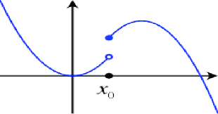
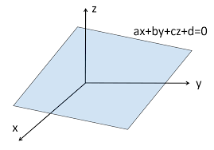
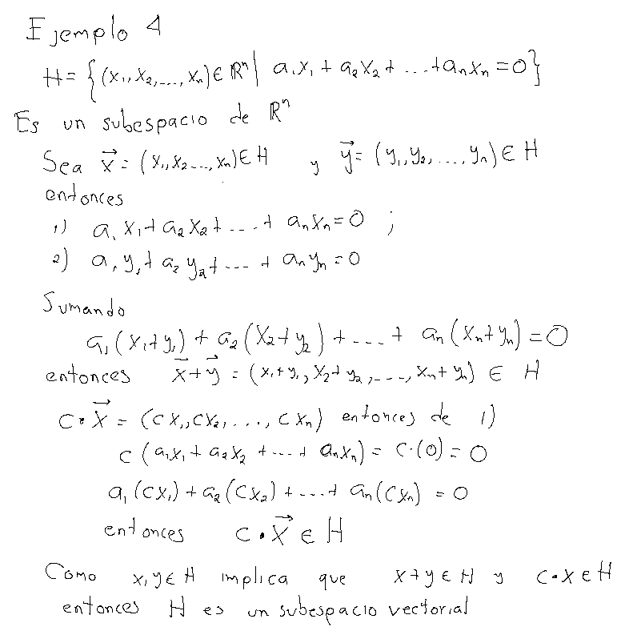

<script type="text/x-mathjax-config">
MathJax.Hub.Config({
  TeX: { equationNumbers: { autoNumber: "AMS" } }
});
</script>

# Espacios Vectoriales

## Definición

Un **espacio** **vectorial** sobre $\mathbb{K}$ también llamado un espacio vectorial real o espacio vectorial complejo, consta de lo siguiente:


1. Un conjunto $V,$ cuyos elementos se llaman vectores.
2. Una operación binaria en $V,$ llamada suma de vectores, denotada por $+$, y que cumple lo
siguiente:

 * I.1 Para todos $\mathbf{x}, \mathbf{y} \in V,$ se cumple que $\mathbf{x} + \mathbf{y} = \mathbf{y} + \mathbf{x}$ (conmutatividad).
 * I.2 Para todos $\mathbf{x},\,\mathbf{y}$ y $\mathbf{z} \in V,$ se cumple que $(\mathbf{x} + \mathbf{y}) + \mathbf{z} = \mathbf{x} + (\mathbf{y} + \mathbf{z})$ (asociatividad).
 * I.3 Existe un elemento en $V$ llamado cero y denotado por  $\vec{\mathbf{0}}$ tal que $\vec{\mathbf{0}} + \mathbf{x} = \mathbf{x}$, pata todo $\mathbf{x} \in V$ (existencia del neutro aditivo).
 * I.4 Para todo $\mathbf{x} \in V$ existe un elemento $-\mathbf{x}$ tal que $\mathbf{x} + (-\mathbf{x}) = 0$ (existencia de elementos inversos).

3. Una operación binaria en $V,$  llamada producto de un escalar por un vector, denotada por $\cdot$, y que cumple lo
siguiente:

 * II.1 Para todo $\mathbf{x} \in V$, se tiene que $1 \cdot \mathbf{x} = \mathbf{x}$, con $1 \in K.$
 * II.2 Para todo $\mathbf{x} \in V$ y para todo $\lambda$ y $\mu \in k$, se tiene que $\lambda(\mu\cdot \mathbf{x}) = (\lambda\mu)\cdot \mathbf{x}$.
 * II.3 El producto por escalar es distributivo, es decir,
 
 \begin{align*}
  (\lambda + \mu) \mathbf{x} &=\lambda\cdot \mathbf{x} + \mu\cdot \mathbf{x}, \\
  \lambda\cdot(\mathbf{x} + \mathbf{y}) &= \lambda\cdot \mathbf{x} + \lambda\cdot \mathbf{y},
\end{align*}

para todos $\lambda,\mu \in K$ y para todos $\mathbf{x}, \mathbf{y} \in V$


## Definición

Si el campo $\mathbb{K}=\mathbb{R}$  es el campo de los números reales se dice que $V$ es un espacio vectorial **real**. Si $\mathbb{K}=\mathbb{C}$ se dice que es un espacio vectorial **complejo**.

# Consecuencias de la definición de espacio vectorial

## Proposición{#sec:prop0}

### Unicidad del $\mathbf{0}$

Si $V$ es un espacio vectorial.

  i) Si $\mathbf{\theta}$ tal que $\mathbf{\theta} + x = x$ para todo $x\in V$. Entonces $\mathbf{\theta}=\mathbf{0}$. Es decir, sólo existe un vector $\mathbf{0}$.
  
  ii) Si $x+y=\mathbf{0}$, entonces $y=-x$. Es decir, el inverso aditivo es **único**.
  
  iii) $\mathbf{0}+\mathbf{0}=\mathbf{0}$ y si $z\in V$ y $z+z=z$ entonces $z=\mathbf{0}$.

En todo espacio vectorial 

\begin{equation}
  0\cdot \vec{x} =\vec{0}\quad\quad \lambda\cdot \vec{0} = \vec{0}\mbox{ para todo }x\in V,\,\,\lambda\in\mathbb{K} \,\,(1)
\end{equation}


\[
\lambda \cdot \vec{\mathbf{x}} =\vec{\mathbf{0}} \quad\mbox{ si y sólo si } \lambda = 0 \mbox{ ó }\vec{\mathbf{x}}=\vec{\mathbf{0}}\quad (2)
\]

**Demostración**

1) Si $\mu=0$ en $II.3$ entonces, sumando $-(\lambda\cdot \mathbf{x})$ 
\begin{array}{ccc}
  \big(\lambda + 0\big)\cdot \mathbf{x} & = &  \lambda\cdot\mathbf{x} + 0\cdot\mathbf{x} \\
        \lambda\cdot \mathbf{x}         & = &  \lambda\cdot\mathbf{x} + 0\cdot\mathbf{x} \\
                    \mathbf{0}          & = &  \mathbf{0} + 0\cdot\mathbf{x} = 0\cdot\mathbf{x}\\
                    \mathbf{0}          & = &  0\cdot\mathbf{x} 
\end{array}

2) si $\mathbf{y}=\mathbf{0}$ en $II.3$ 
\begin{array}{ccc}
  \lambda \cdot (\mathbf{x} + \mathbf{0}) & = &  \lambda\cdot\mathbf{x} +\lambda \cdot\mathbf{0} \\
        \lambda\cdot \mathbf{x}           & = &  \lambda\cdot\mathbf{x} + \lambda \cdot\mathbf{0} \\
                    \mathbf{0}            & = &  \lambda \cdot\mathbf{0} 
\end{array}
Esto prueba ([@eq:p1]).

Ahora suponga $\lambda\cdot \mathbf{x} = \mathbf{0}$, si $\lambda\ne 0$ entonces $1=\lambda\frac{1}{\lambda}$ y por tanto en $II.2$

\[
\mathbf{x} = 1\cdot \mathbf{x} = \frac{1}{\lambda}\cdot\big(\lambda\cdot \mathbf{x}\big) = \mathbf{0}
\]{\#eq:p3}

## Proposición

Para todo vector $x\in V$, $-(-x)=x$.


## Proposición{#sec:prop1}

Para todo $\mathbf{x}\in V$, 
$$
(-\lambda)\cdot \mathbf{x}=-\lambda\cdot\mathbf{x}
$${\#eq:p4}

Por la propiedad II.3 
\[
\lambda\cdot\mathbf{x} + (-\lambda)\cdot \mathbf{x}=(\lambda+ (-\lambda))\cdot \mathbf{x} = 0\cdot\mathbf{x} = \mathbf{0} 
\]
Sumando el inverso aditivo, entonces $-\lambda\cdot \mathbf{x}=(-\lambda)\cdot\mathbf{x}$. De manera similar $-\lambda\cdot \mathbf{x}=\lambda\cdot(-\mathbf{x})$

## Corolario

Para todo $x\in V,$ $(-1)x=-x$.

## Leyes de cancelación

Sea $V$ un espacio vectorial, $\mathbf{x},\,\mathbf{y}\in V$ y $\alpha,\beta\in\mathbb{K}$ escalares.

i) Si $\alpha\cdot \mathbf{x} = \alpha\cdot\mathbf{y}$ y $\alpha\ne 0$ entonces $\mathbf{x}=\mathbf{y}$.

ii) Si $\alpha\cdot\mathbf{x}=\beta\cdot \mathbf{x}$ y $\mathbf{x}\ne\mathbf{0}$ entonces $\alpha=\beta$.

**Demostración**:

Como $\alpha\cdot(-\mathbf{y}) = -\alpha\cdot \mathbf{y}$ 
$$
\alpha\cdot(\mathbf{x}+(-\mathbf{y})) = \alpha\cdot \mathbf{x} + \alpha\cdot(-\mathbf{y}) = \alpha\cdot \mathbf{x} + (-\alpha\cdot\mathbf{y}) = \alpha\cdot \mathbf{x} + (-\alpha\cdot\mathbf{x}) = \mathbf{0}
$${\#eq:p5}

por la proposición [@sec:prop0] como $\alpha \ne 0$ entonces $x+(-y) = \mathbf{0}$ entonces $\mathbf{x} = \mathbf{y}$.

Para ii) la proposición [@sec:prop1]
\[
(\alpha-\beta)\cdot \mathbf{x} = \alpha\cdot \mathbf{x} + (-\beta)\cdot \mathbf{x} = \beta \cdot\mathbf{x} + (-\beta\cdot\mathbf{x})  = \mathbf{0}
\]
como $\mathbf{x}\ne\mathbf{0}$, por la proposición [@sec:prop0] $\alpha - \beta=0$, es decir $\alpha=\beta$.

## Definición {#sec:prop2}

Sea $V$ un espacio vectorial sobre $\mathbb{K}$, definimos a la operación $resta$
$$
\mathbf{x}-\mathbf{y} = \mathbf{x}+(-\mathbf{y})
$$

## Ejemplos 

### Espacio n-dimensional ($\mathbf{R}^{n}$)

### Definición

Para cada entero positivo $n$, definimos el espacio Euclidiano
$n$-dimensional como:
\[
 \Bbb{R}^n = \{(x_1,...,x_n) \mid x_i \in \Bbb{R},\, i =1,2,...,n   \}
\]


Un elemento particular de $\Bbb{R}^n$, digamos $x = (x_1,...,x_n)$
tambi\'en pueden denotarse como vector columna
\[ x^T =
\left(
  \begin{matrix}
  x_1      \\
  x_2 \\
  \vdots \\
x_n
  \end{matrix}
  \right)
\]

se le llama <strong>vector</strong> ( o vector columna)}. Las cantidades
$x_i$ se le llaman componentes (o elementos de x), a $n$ se le llama
el orden de $x$. 

La operación de suma y producto por escalar en $\Bbb{R}^{3}$ se formulan como:

  * Dados $(x_1,x_2,x_3)$, $(y_1,y_2,y_3) \in \Bbb{R}^3$, se define:
  \[
     (x_1,x_2,x_3) + (y_1,y_2,y_3) = (x_1 + y_1,x_2 + y_2, x_3+y_3)
   \]
   * Dados $(x_1,x_2,x_3) \in \Bbb{R}^3$ y $c \in \Bbb{R}$, se define:
   \[
    c\,\,  (x_1,x_2,x_3) = (cx_1,cx_2,cx_3)
   \]


Entonces $\Bbb{R}^3$ con la suma y producto definidos anteriormente
es un **espacio** **vectorial** **real**. Para esto verifiquemos que $\Bbb{R}^3$ con
la operación $+$ cumple las siguientes propiedades

 a) Para todos $x, y \in \Bbb{R}^3$, se cumple que $x + y = y + x$ (conmutatividad).
 
 Sean $x=(x_1,x_2,x_3)$ y $y =(y_1,y_2,y_3)$, entonces
 \[
 x+y = (x_1 +y_1,x_2+ y_2, x_3 + y_3)= (y_1+x_1, y_2+x_2, y_3 + x_3)= y + x
 \]
 
 b) Para todos $x,y,z \in \Bbb{R}^3$, se cumple que $(x + y) + z =x + (y + z)$ (asociatividad).
Sean $x=(x_1,x_2,x_3),$  $y=(y_1,y_2,y_3),$ y $z=(z_1,z_2,z_3)$, entonces

\begin{align*}
  (x + y) + z &=((x_1,x_2,x_3) + (y_1,y_2,y_3))+ (z_1,z_2,z_3) \\
  &=(x_1 +y_1,x_2+y_2,x_3 + y_3) +(z_1,z_2,z_3) \\ 
  &=((x_1 +y_1) +  z_1,(x_2+y_2) + z_2,(x_3 + y_3) + z_3)  \\ 
  & = (x_1 + (y_1 + z_1),x_2+ (y_2 + z_2),x_3 + (y_3 + z_3)) \\ 
  &= (x_1,x_2,x_3) + ((y_1,y_2,y_3)+ (z_1,z_2,z_3)) \\ 
  &= x + (y + z) 
\end{align*}

 c) Existe un elemento en $\Bbb{R}^3$ llamado cero el vector $\mathbf{0}$ tal que $\mathbf{0} + \mathbf{x} = \mathbf{x}$, pata todo $\mathbf{x} \in \Bbb{R}^3$ (existencia del neutro aditivo).
Sea $\mathbf{0} =(0,0,0)$ entonces si $\mathbf{x} = (x_1,x_2,x_3)$ tenemos
\[
\mathbf{0} + \mathbf{x} =(0,0,0) + (x_1,x_2,x_3) = (0 + x_1, 0 + x_2, 0 + x_3) =
(x_1,x_2,x_3) =\mathbf{x}
\]
 * d) Para todo $\mathbf{x} \in \Bbb{R}^3$ existe un elemento $-\mathbf{x}$ tal que $\mathbf{x} + (-\mathbf{x}) =\mathbf{0}$ (existencia de elementos inversos).
Sea $\mathbf{x} \in \Bbb{R}^3$, con $\mathbf{x} =(x_1,x_2,x_3)$, definimos el inverso
de $\mathbf{x}$ por $-\mathbf{x}=(-x_1,-x_2,-x_3)$, entonces tenemos

\begin{align*}
 \mathbf{x} + (-\mathbf{x}) &= (x_1,x_2,x_3) + (-x_1,-x_2,-x_3)\\
  & = (x_1 + (-x_1), x_2 + (-x_2), x_3 +
 (-x_3)) \\   &= (x_1 -x_1, x_2 -x_2, x_3-x_3) = (0,0,0) = \mathbf{0}
\end{align*}


Ahora veamos que $\Bbb{R}^3$ con la multiplicación escalar $\cdot$
cumple

 *  Para todo $\mathbf{x} \in \Bbb{R}^3$, se tiene que $1 \cdot \mathbf{x} = \mathbf{x}$, con $1 \in \Bbb{R}.$
Si $\mathbf{x} \in \Bbb{R}^3$,
\[
 1 \cdot \mathbf{x} = 1 \cdot (x_1,x_2,x_3) = (1 \cdot x_1, 1 \cdot x_2, 1 \cdot
 x_3) = (x_1,x_2,x_3) = \mathbf{x}
\]

 *  Para todo $\mathbf{x} \in \Bbb{R}^3$ y para todo $\lambda$ y $\mu \in \Bbb{R}$, se tiene que $\lambda(\mu \mathbf{x}) = (\lambda\mu) \mathbf{x}$.
 
 Sea $\mathbf{x} \in \Bbb{R}^3$, con $\mathbf{x} = (x_1,x_2,x_3)$, tenemos
 
 \begin{align*}
 \lambda(\mu \mathbf{x}) &=\lambda(\mu (x_1,x_2,x_3)) = \lambda (\mu x_1,\mu
x_2,\mu x_3)   = (\lambda(\mu x_1),\lambda (\mu x_2),\lambda (\mu
x_3)) \\ & = ((\lambda\mu) x_1,(\lambda \mu) x_2,(\lambda \mu) x_3)
 = (\lambda\mu) \mathbf{x}
 \end{align*}
 
   El producto por escalar es distributivo, es decir,

 \begin{align*}
(\lambda + \mu) \mathbf{x} &=\lambda \mathbf{x} + \mu \mathbf{x}, \\
\lambda(\mathbf{x} + \mathbf{y}) &= \lambda \mathbf{x} + \lambda \mathbf{y},
 \end{align*}
para todos $\lambda,\mu \in K$ y para todos $\mathbf{x}, \mathbf{y} \in V$.

Sea $\mathbf{x} \in \Bbb{R}^3$, con $\mathbf{x} = (x_1,x_2,x_3)$, tenemos

\begin{align*}
 (\lambda + \mu)\cdot \cdot \mathbf{x} & = (\lambda +\mu)\cdot (x_1,x_2,x_3) = ((\lambda +\mu) x_1,
(\lambda +\mu) x_2,(\lambda +\mu) x_3)  \\
&= (\lambda x_1 + \mu
x_1,\lambda x_2 + \mu x_2,\lambda  x_3 + \mu x_3) \\
& = (\lambda
x_1,\lambda x_2,\lambda x_3) + (\mu x_1,\mu x_2,\mu x_3) =
 \\ &= \lambda\cdot \mathbf{x} + \mu\cdot \mathbf{x}.
 \end{align*}
\begin{align*}
 \lambda  \cdot ( \mathbf{x} + \mathbf{y}) &= \lambda \cdot ((x_1,x_2,x_3)+ (y_1,y_2,y_3)) = \lambda \cdot
 (x_1 + y_1, x_2 + y_2, x_3 + y_3)  \\ &= (\lambda (x_1 + y_1),\lambda (x_2 +  y_2),\lambda (x_3 + y_3)) \\
 & = (\lambda x_1,\lambda x_2,\lambda x_3) + (\lambda
y_1,\lambda y_2,\lambda y_3) =
 \\ &= \lambda\cdot \mathbf{x} + \lambda\cdot \mathbf{y}.
 \end{align*}

para todos $\lambda,\mu \in K$ y para todos $\mathbf{x}, \mathbf{y} \in V$

## Ejemplos (continuación)

### Ejemplo 2

Sea $\mathbb{K}=\mathbb{R}$ e $I\subset\Bbb{R}$  y sea $V=\mathcal{F}(I; \Bbb{R})$, es decir $f\in\mathcal{F}(I; \Bbb{R})$ si $x:I\rightarrow \Bbb{R}$.

Definimos a la suma en este conjunto $x,y\in V$, $x+y:I\rightarrow\mathbb{R}$ $(x+y)(t) = x(t)+ y(t)$ para todo $t\in I$
La multiplicación por un escalar $\lambda\cdot x:I\rightarrow \mathbb{R}$ se define como $(\lambda\cdot \mathbf{x})=\lambda x(t)$.
A dicho espacio vectorial real se le suele llamar el <strong style="color: red;">espacio de funciones </strong>.

### Ejemplo 3

Sea $\mathbb{K}=\mathbb{R}$ y $p:\mathbb{R}\rightarrow\mathbb{R}$ un polinomio con grado $n\in \mathbb{N}$ , es decir
$$
p(t) = a_0 + a_1 t + a_{2} t^{2} + \ldots + a_{n} t^{n}
$$

para algún entero positivo, con las operaciones 

\begin{array}{ccc}
 p + q :\mathbb{R}\rightarrow \mathbb{R}              &    & (p+q)(t) = p(t) + q(t) \\
 \lambda \cdot p :\mathbb{R}\rightarrow \mathbb{R}    &    & (\lambda\cdot p)(t) = \lambda p(t)
\end{array}

Al espacio vectorial de polinomios con coeficientes reales se le suele denotar con $\mathbb{R}[x]$.
De manera similar, a los polinomios con coeficientes complejos se le suele referir con $\mathbb{C}[x]$

### Ejemplo 4

Sea $\mathbb{K}=\mathbb{R}$ y $m$ un entero positivo fijo, sea $V$ el conjunto de polinomios con grado menor o igual a $m$, con $m$ un entero positivo _fijo_.
Es decir $p\in V$ si $p:\mathbb{R}\rightarrow \mathbb{R}$, función
\[
  p(x) = \sum_{k=1}^m a_{k}x^{k}=a_0+a_1x+a_2x^{2}+\ldots+a_mx^{m}
\]
A dicho espacio se le suele referir como $\mathcal{P}^{m}(\mathbb{R})$.

#### Ejemplo 4 b)
En particular, el conjunto de polinomios de grado menor o igual 3, $V=\mathcal{P}^{3}(\mathbb{R})$. Con la suma de polinomios y la multiplicación por un número real.

### Ejemplo 5

Sea $\mathbb{K}=\mathbb{R}$ e $[a,b]\subset\Bbb{R}$  y sea $V=C([a,b]; \Bbb{R})$, es decir $f\in C([a,b]; \Bbb{R})$ si $f:I\rightarrow \Bbb{R}$ y $f$ es una función continua.

Definimos a la suma en este conjunto $x,y\in V$, $x+y:I\rightarrow\mathbb{R}$ $(x+y)(t) = x(t)+ y(t)$ para todo $t\in I$
La multiplicación por un escalar $\lambda\cdot x:I\rightarrow \mathbb{R}$ se define como $(\lambda\cdot \mathbf{x})=\lambda x(t)$.
A dicho espacio vectorial real se le suele llamar el <strong style="color: red;">espacio de funciones continuas</strong>.

<center>
.
</center>

Una función que no es continua sería una función con la siguiente gráfica

<center>
.
</center>

## Ejemplo 6. El espacio de matrices $\mathcal{M}^{m,n}(\mathbb{K})$

Sea $K$ un campo y $\mathcal{M}^{m,n}(\mathbb{K})$ el conjunto de matrices de tamaño $m\times n$ con entradas $a_{i,j}\in\mathbb{K}$.
Cada matriz representa un _vector_ en este espacio. 

Si $A,B\in \mathcal{M}^{m,n}(K)$ definimos a la suma de matrices

$$
\begin{array}{cc}
A+B = & \begin{bmatrix}
           a_{11} + b_{11}  & a_{21} + b_{21}   & \cdots     & a_{1i} + b_{1i}    & \cdots     & a_{1n} + b_{1n}     \\ 
           a_{21} + b_{21}  & a_{22} + b_{22}   & \cdots     & a_{2i} + b_{2i}    & \cdots     & a_{2n} + b_{2n}     \\
           \vdots           & \vdots            & \ddots     &  \vdots            & \vdots     & \vdots              \\  
           a_{i1} + b_{i1}  &a_{i2} + b_{i2}    &\cdots      & a_{ii} + b_{ii}    & \cdots     & a_{in} + b_{in}     \\
            \vdots          & \vdots            & \ddots     &  \vdots            & \vdots     & \vdots               \\
            a_{n1} + b_{n1} & a_{n2} + b_{n2}   & \cdots     & a_{ni} + b_{ni}    & \cdots     & a_{nn} + b_{nn} 
  \end{bmatrix}
\end{array}  
$$

y la multiplicación por escalar $c \in \mathbb{K}$

$$
\begin{array}{cc}
c \cdot A = & \begin{bmatrix}
              ca_{11}   & ca_{21} & \cdots   & ca_{1i}  & \cdots     & ca_{1n} \\ 
              ca_{21}   & ca_{22} & \cdots   & ca_{2i}  & \cdots     & ca_{2n} \\
              \vdots    & \vdots & \ddots    &  \vdots  & \vdots     & \vdots \\  
              ca_{i1}   & ca_{i2} & \cdots   & ca_{ii}  & \cdots     & ca_{in} \\
              \vdots   & \vdots & \ddots    &  \vdots  & \vdots     & \vdots \\
              ca_{n1}  & ca_{n2} & \cdots   & ca_{ni}  & \cdots     & ca_{nn} 
  \end{bmatrix}
\end{array}  
$$

### Ejemplo 7. El espacio vectorial producto

Sean $V_1$ y $V_2$ dos espacios vectoriales, sobre un mismo campo $\mathbb{K}$.
\[
V:= V_1\times V_2 = \{ (u,v)\,|\, u\in V_1,\,v\in V_2\}
\]

Es decir, $V$ es el producto cartesiano de $V_1$ y $V_2$. 
Sea $+_1$ y $+_2$ las sumas de $V_1$ y $V_2$ respectivamente y $\bullet_1$, $\bullet_2$ el producto escalar de cada espacio.
Entonces definimos a la suma $\oplus$ en $V_1\times V_2$ como 

$$
(u_1,v_1) \oplus (u_2,v_2) = (u_1 +_1 u_2, v_1 +_2 v_2´)
$$
y la multiplicación escalar en $V$ como

\[
\lambda \bullet (u,v) = (\lambda \bullet_1 u, \lambda \bullet_2 v)
\]


### Ejercicio. 

Considere el conjunto de matrices $2\times 2$ y defina las siguientes operaciones usuales

\[
M+N = \begin{pmatrix} a_{11} & a_{12}  \\ a_{21} & a_{22}  \end{pmatrix} + 
      \begin{pmatrix} b_{11} & b_{12}  \\ b_{21} & b_{22} \end{pmatrix} = \begin{pmatrix} a_{11} + b_{11} & a_{12} + b_{12}  \\ a_{21} + b_{21} & a_{22}+b_{22} &  \end{pmatrix} 
\]

y
$c\cdot M= \begin{pmatrix}ca_{11} & ca_{12}  \\ ca_{21} & ca_{22} \end{pmatrix}$

Verificar si los axiomas se cumplen con estas operaciones.

### Ejercicio

Verificar que el conjunto de polinomios con coeficientes reales de grado $\leq 2$ es un espacio vectorial con las mismas operaciones $+,\cdot$ del ejemplo 4.

Es decir,  si $p,q$ son dos polinomios de grado $\leq 2$ digamos
\begin{equation}
p(x)=a_2x^2 + a_1 x +a_0\quad\quad q(x)=b_2x^{2} +b_1 x + b_0
 \end{equation}
 
Definimos el polinomio _suma_ $p+q:\mathbb{R}\rightarrow \mathbb{R}$  como 
\begin{equation*}
(p+q)(x) = (a_2+b_2)x^2 + (a_1+b_1)x + (a_0+b_0)
\end{equation*}

Si $c\in\mathbb{R}$. Definimos el polinomio $c\cdot p :\mathbb{R}\rightarrow \mathbb{R}$ como
\begin{equation*}
(c\cdot p)(x) = ca_2x^2 + ca_1x + a_0
\end{equation*}


# Subespacios Vectoriales

Considere el siguiente ejemplo

## Ejemplo inicial

Sea $I\subset \mathbb{R}$ un intervalo, $[a,b] \subset \mathbb{R}$. Considere a $V=\mathbf{F}(I;\mathbb{R})=\{f:I\rightarrow \mathbb{R}\,:\,f\mbox{ es una función}\}$. Entonces $C(I;\mathbb{R})=\{f:I\rightarrow \mathbb{R}\,:\,f\mbox{ es una función }\textbf{continua}\mbox{ en todo }x\in I\}$ y $\mathbb{R}[x]=\{f:I\rightarrow \mathbb{R}\,|\,f(x)=a_nx^n+a_{n-1}x^{n-1}+\ldots +a_1x+a_0 \}$. 

En todos estos casos, son espacios vectoriales reales, con las _mismas_ operaciones.
\[
\mathbb{R}[x] \subset C(I;\mathbb{R}) \subset \mathbf{F}(I;\mathbb{R})
\]

En este caso decimos que son un **subespacio** **vectorial** de $V$.

## Definición 

Sea $(V,\oplus,\cdot)$ un espacio vectorial. Y sea $W$ un subconjunto de $V$, $W\subset V$, decimos que $W$ es un *subespacio* *vectorial* si $W$ es un espacio vectorial con las mismas operaciones $\oplus,\cdot$ restringidas a $W$.

Para que $W$ sea un subespacio vectorial basta con verificar que $W$ es cerrado bajo la suma vectorial $\oplus$ y la multiplicación escalar $\cdot$.

### Proposición

Sea $W$ un subconjunto no vacío de $V,$ se dice que $W$ es un \textbf{subespacio vectorial} de $V$, si y sólo si satisface las
siguientes propiedades:

 1) Para todos $x$ y $y \in W,$ se tiene que $x+y \in W,$ es decir, $W$ es cerrado bajo la suma.
 
 2) Para todo $x \in W$ y para todo $\lambda \in \Bbb{R}$, $\lambda
  x \in W,$ es decir $W$ es cerrado bajo producto por escalar.

## Ejemplo 1

Todo espacio vectorial $V$ es un subespacio de sí mismo. $V$ es el subespacio más grande de $V$.

## Ejemplo 2

Sea $W=\{\mathbf{0}\}$, entonces $W$ es un subespacio vectorial de $V$. Por ejemplo, para verificar 1) de la proposición anterior, si $u,w\in W$ entonces $u=\mathbf{0}$ y $w=\mathbf{0}$ por lo que $u+w=\mathbf{0} + \mathbf{0}=\mathbf{0}$ por lo que $u+w\in W$. 
Si $u\in W$ y $c\in\mathbb{R}$ entonces $c\cdot u = c\cdot \mathbf{0}=\mathbf{0}$. Entonces $c\cdot \mathbf{u} \in W$.


## Ejemplo 3

Sea
\[
  W = \{(x_1,x_2,x_3) \in \Bbb{R}^3 \mid x_3 = 0  \}
\]
es decir, $x \in W$, entonces $x =(x_1,x_2, 0)$. Entonces $W$ es un
subespacio vectorial de $\Bbb{R}^3.$ 

Para esto verifiquemos que si
$x, y \in W,$ entonces $x + y \in W$. 

Como $x,y \in W,$ $x=(x_1,x_2, 0)$ y $y =(y_1,y_2, 0 )$, luego  
$$
x + y = (x_1+y_1,x_2 + y_2, 0) \in W 
$$.

Ahora veamos que si $x \in W$ y $\lambda \in \Bbb{R}$, $\lambda \cdot x \in W$, lo cual se sigue pues si $x =(x_1,x_2, 0)$, entonces 
$$\lambda \cdot x =\lambda\cdot (x_1,x_2, 0) =
(\lambda x_1,\lambda x_2, 0) \in W$$


## Ejemplo 4

Sea $\mathtt{v}_0 \in V$, con $\mathtt{v}_0\ne \mathbf{0}$. Considere al conjunto $W_{0}=\{\mathbf{v} = t\cdot\mathtt{v}_0  : t \in \mathbb{R}\}$. Es un subespacio vectorial propio de $V$, es decir $W_{0}\subset V$.

## Proposición

a) _Si_ $W_1$ _y_ $W_2$ _son_ _dos_ _subespacios_ _de_ $V$, _entonces_ $W_1\cap W_2$ _es_ _un_ _subespacio_ _vectorial_ _de_ $V$.


b) $L$ es una colección de índices es decir $L=\{1,2,\ldots,n \}$  tales que $W_i \subset V$ es un subespacio para $i\in L$. Entonces
\begin{equation*}
  W = \bigcap_{i\in L} W_i = \bigcap_{i=1}^n W_i
\end{equation*}
 es un subespacio vectorial.
 

### Demostración

Por ser subespacios vectoriales,  $\mathbf{0} \in W_1$ y $\mathbf{0} \in W_2$  entonces $\mathbf{0} \in W_1\cap W_2$

Si $\mathbf{x},\mathbf{y}\in W_1\cap W_2$ entonces, $\mathbf{x}+\mathbf{y}\in W_1\cap W_2$.

Si $\alpha\in \mathbf{R}$ y $\mathbf{x}\in W_1\cap W_2$ entonces $\alpha\cdot \mathbf{x}\in W_1$ y  $\alpha\cdot \mathbf{x}\in W_2$ por que son subespacios. Entonces $\alpha\cdot \mathbf{x}\in W_1\cap W_2$.


## Ejemplo 4{#sec:ej4}

Sea $V=\mathbb{R}^{3}$, y sea $\alpha_1,\alpha_2,\ldots,\alpha_3 \in \mathbb{R}$ números reales. El conjunto $H$ de todos los vectores $\mathbf{v}=(x_1,x_2,x_3) \in \mathbb{R}^{3}$ tales que 

\begin{equation}
  \alpha_1\cdot x_1 + \alpha_2\cdot x_2  +\alpha_3\cdot x_3 = 0
\end{equation}

 es un espacio vectorial de $\mathbb{R}^{n}$. Si todos los escalares $\alpha_i$ son nulos, entonces, $H=V$. Si no todos los escalares son nulos entonces $H$ se dice ser un _hiperplano_ de $\mathbb{R}^{n}$, que pasa por el origen.


```{r echo=FALSE, fig.align='center', out.width='50%'}

```

```{r echo=FALSE, fig.align='center', out.width='60%'}

```
## Ejemplo 5

Si $H_i=\{ x\in \mathbb{R}^{n} | a_{i1} x_1 + a_{i2} x_2 + \ldots +a_{in} x_n = 0 \}$ por [@sec:ej4] es un subespacio. Por la Proposición anterior

\begin{equation*}
  H = \bigcap_{i=1}^{n} H_i
\end{equation*}

es un subespacio, es decir 

\begin{equation}
\begin{array}{cccccc}
     a_{11}x_{1}        & +a_{12}x_{2}    & \cdots  &+ a_{1n}x_{n}    & =       & 0       \\ 
     a_{21}x_{1}        & +a_{22}x_{2}    & \cdots  &+ a_{2n}x_{n}    & =       & 0       \\
    \vdots              & \vdots          & \vdots  & \vdots          & \vdots  &  \vdots      \\
     a_{n-1,1x_{1}}     & +a_{n-1,2}x_{2} & \cdots  &+ a_{n-1,n}x_{n} & =       & 0      \\
     a_{n,1}x_{1}       & +a_{n,2}x_{2}   & \cdots  &+ a_{n,j}x_n     & =       & 0
\end{array}
\end{equation}

Es decir 

## Proposición
Sea $V=\mathbb{R}^{n}$. Para cualquier matriz $A\in\mathcal{M}^{m,n}$ el conjunto solución del sistema

$$
\{\mathbf{x}\in\mathbb{R}^{n}:\, A\mathbf{x}=\mathbf{0}\} 
$$
es un **subespacio** **vectorial** de $\mathbb{R}^n$.

## Ejemplo 6

Sea $V=\mathcal{M}^{n,n}(\mathbb{R})$ el conjunto de matrices cuadradas de tamano $n$.
Dar una demostración o un contraejemplo.

* ¿El conjunto de matrices diagonales es un subespacio vectorial?

* ¿El subconjunto de matrices diagonales inferiores es un subespacio vectorial?

* ¿El conjunto de matrices simétricas es un subespacio vectorial?

* ¿El conjunto de matrices invertibles es un subespacio vectorial?

## Ejemplo

Sea $\mathtt{v}_1=(1,0)$ y $\mathtt{v}_2=(0,1)$ considere a los subespacios $W_{1}=\{\mathbf{v} = \alpha\cdot\mathtt{v}_1  : \alpha \in \mathbb{R}\}$ y
$W_{2}=\{\mathbf{v} = \alpha\cdot\mathtt{v}_2  : \alpha \in \mathbb{R}\}$

¿Se cumple que $W_1\bigcup W_2$ sea un subespacio vectorial de $\mathbb{R}^2$?

## Combinaciones lineales

Sea $V$ un espacio vectorial y $\mathbf{v}_1,\mathbf{v}_2,\ldots,\mathbf{v}_n \in V$ decimos que $\mathbf{w}\in V$ es una combinación lineal de $\mathbf{v}_1,\mathbf{v}_2,\ldots,\mathbf{v}_n$ si hay escalares $\alpha_1,\alpha_2,\ldots,\alpha_n \in \mathbb{R}$ tales que 
\[
 \mathbf{w} = \alpha_1\cdot\mathbf{v}_1+ \alpha_2\cdot\mathbf{v}_2 + \ldots + \alpha_n\cdot\mathbf{v}_n 
\]

**Observación**
Si $W$ es un subespacio y si $\mathbf{v}_1,\ldots,\mathbf{v}_n\in W$ y $\alpha_1,\alpha_2,\ldots,\alpha_n\in\mathbb{R}$ entonces $\alpha_1\cdot\mathbf{v}_1 + \alpha_2\cdot\mathbf{v}_2+\ldots+ \alpha_n\mathbf{v}_n\in W$. 

## Ejemplo 6

Sea $X$ un conjunto del espacio vectorial $V$. El _subespacio_ _vectorial_ _de_ $V$ _generado_ _por_ $X$ es el conjunto de todas sus combinaciones lineales 
\[
 \mathbf{w} = \alpha_1\cdot\mathbf{v}_1+ \alpha_2\cdot\mathbf{v}_2 + \ldots + \alpha_m\cdot\mathbf{v}_m 
\]
 
 para vectores $\mathbf{v}_1,\mathbf{v}_2,\ldots,\mathbf{v}_m \in X$. A dicho subespacio se escribe como $\mathcal{S}(X)$.
 
 
 
## Combinación lineal e independencia lineal

**Definición**

Sean $\mathbf{v}_1,\mathbf{v}_2,\ldots,\mathbf{v}_n \in V$, decimos que el conjunto de vectores es **linealmente** **dependiente** si existe un conjunto de escalares $\alpha_1,\alpha_2,\ldots,\alpha_n \in \mathbb{R}$ tal que
 - No todos los escalaes $\alpha_i$ son simultaneamente cero
 - Y además

\begin{equation}
\alpha_1\cdot\mathbf{v}_1+ \alpha_2\cdot\mathbf{v}_2 + \ldots + \alpha_n\cdot\mathbf{v}_n = 0
\end{equation}

