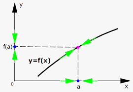
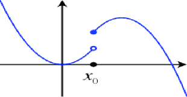
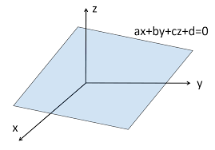
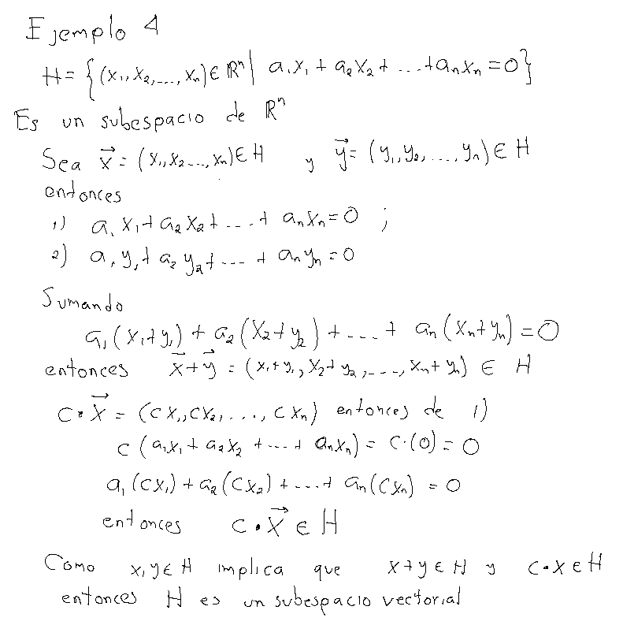

<script type="text/x-mathjax-config">
MathJax.Hub.Config({
  TeX: { equationNumbers: { autoNumber: "AMS" } }
});
</script>

# Espacios Vectoriales

## Definición

Un **espacio** **vectorial** sobre $\mathbb{K}$ también llamado un espacio vectorial real o espacio vectorial complejo, consta de lo siguiente:


1. Un conjunto $V,$ cuyos elementos se llaman vectores.
2. Una operación binaria en $V,$ llamada suma de vectores, denotada por $+$, y que cumple lo
siguiente:

 * I.1 Para todos $\mathbf{x}, \mathbf{y} \in V,$ se cumple que $\mathbf{x} + \mathbf{y} = \mathbf{y} + \mathbf{x}$ (conmutatividad).
 * I.2 Para todos $\mathbf{x},\,\mathbf{y}$ y $\mathbf{z} \in V,$ se cumple que $(\mathbf{x} + \mathbf{y}) + \mathbf{z} = \mathbf{x} + (\mathbf{y} + \mathbf{z})$ (asociatividad).
 * I.3 Existe un elemento en $V$ llamado cero y denotado por  $\vec{\mathbf{0}}$ tal que $\vec{\mathbf{0}} + \mathbf{x} = \mathbf{x}$, pata todo $\mathbf{x} \in V$ (existencia del neutro aditivo).
 * I.4 Para todo $\mathbf{x} \in V$ existe un elemento $-\mathbf{x}$ tal que $\mathbf{x} + (-\mathbf{x}) = 0$ (existencia de elementos inversos).

3. Una operación binaria en $V,$  llamada producto de un escalar por un vector, denotada por $\cdot$, y que cumple lo
siguiente:

 * II.1 Para todo $\mathbf{x} \in V$, se tiene que $1 \cdot \mathbf{x} = \mathbf{x}$, con $1 \in K.$
 * II.2 Para todo $\mathbf{x} \in V$ y para todo $\lambda$ y $\mu \in k$, se tiene que $\lambda(\mu\cdot \mathbf{x}) = (\lambda\mu)\cdot \mathbf{x}$.
 * II.3 El producto por escalar es distributivo, es decir,
 
 \begin{align*}
  (\lambda + \mu) \mathbf{x} &=\lambda\cdot \mathbf{x} + \mu\cdot \mathbf{x}, \\
  \lambda\cdot(\mathbf{x} + \mathbf{y}) &= \lambda\cdot \mathbf{x} + \lambda\cdot \mathbf{y},
\end{align*}

para todos $\lambda,\mu \in K$ y para todos $\mathbf{x}, \mathbf{y} \in V$


## Definición

Si el campo $\mathbb{K}=\mathbb{R}$  es el campo de los números reales se dice que $V$ es un espacio vectorial **real**. Si $\mathbb{K}=\mathbb{C}$ se dice que es un espacio vectorial **complejo**.

# Consecuencias de la definición de espacio vectorial

## Proposición{#sec:prop0}

### Unicidad del $\mathbf{0}$

Si $V$ es un espacio vectorial.

  i) Si $\mathbf{\theta}$ tal que $\mathbf{\theta} + x = x$ para todo $x\in V$. Entonces $\mathbf{\theta}=\mathbf{0}$. Es decir, sólo existe un vector $\mathbf{0}$.
  
  ii) Si $x+y=\mathbf{0}$, entonces $y=-x$. Es decir, el inverso aditivo es **único**.
  
  iii) $\mathbf{0}+\mathbf{0}=\mathbf{0}$ y si $z\in V$ y $z+z=z$ entonces $z=\mathbf{0}$.

En todo espacio vectorial 

\begin{equation}
  0\cdot \vec{x} =\vec{0}\quad\quad \lambda\cdot \vec{0} = \vec{0}\mbox{ para todo }x\in V,\,\,\lambda\in\mathbb{K} \,\,(1)
\end{equation}


\[
\lambda \cdot \vec{\mathbf{x}} =\vec{\mathbf{0}} \quad\mbox{ si y sólo si } \lambda = 0 \mbox{ ó }\vec{\mathbf{x}}=\vec{\mathbf{0}}\quad (2)
\]

**Demostración**

1) Si $\mu=0$ en $II.3$ entonces, sumando $-(\lambda\cdot \mathbf{x})$ 
\begin{array}{ccc}
  \big(\lambda + 0\big)\cdot \mathbf{x} & = &  \lambda\cdot\mathbf{x} + 0\cdot\mathbf{x} \\
        \lambda\cdot \mathbf{x}         & = &  \lambda\cdot\mathbf{x} + 0\cdot\mathbf{x} \\
                    \mathbf{0}          & = &  \mathbf{0} + 0\cdot\mathbf{x} = 0\cdot\mathbf{x}\\
                    \mathbf{0}          & = &  0\cdot\mathbf{x} 
\end{array}

2) si $\mathbf{y}=\mathbf{0}$ en $II.3$ 
\begin{array}{ccc}
  \lambda \cdot (\mathbf{x} + \mathbf{0}) & = &  \lambda\cdot\mathbf{x} +\lambda \cdot\mathbf{0} \\
        \lambda\cdot \mathbf{x}           & = &  \lambda\cdot\mathbf{x} + \lambda \cdot\mathbf{0} \\
                    \mathbf{0}            & = &  \lambda \cdot\mathbf{0} 
\end{array}
Esto prueba ([@eq:p1]).

Ahora suponga $\lambda\cdot \mathbf{x} = \mathbf{0}$, si $\lambda\ne 0$ entonces $1=\lambda\frac{1}{\lambda}$ y por tanto en $II.2$

\[
\mathbf{x} = 1\cdot \mathbf{x} = \frac{1}{\lambda}\cdot\big(\lambda\cdot \mathbf{x}\big) = \mathbf{0}
\]{\#eq:p3}

## Proposición

Para todo vector $x\in V$, $-(-x)=x$.


## Proposición{#sec:prop1}

Para todo $\mathbf{x}\in V$, 
$$
(-\lambda)\cdot \mathbf{x}=-\lambda\cdot\mathbf{x}
$${\#eq:p4}

Por la propiedad II.3 
\[
\lambda\cdot\mathbf{x} + (-\lambda)\cdot \mathbf{x}=(\lambda+ (-\lambda))\cdot \mathbf{x} = 0\cdot\mathbf{x} = \mathbf{0} 
\]
Sumando el inverso aditivo, entonces $-\lambda\cdot \mathbf{x}=(-\lambda)\cdot\mathbf{x}$. De manera similar $-\lambda\cdot \mathbf{x}=\lambda\cdot(-\mathbf{x})$

## Corolario

Para todo $x\in V,$ $(-1)x=-x$.

## Leyes de cancelación

Sea $V$ un espacio vectorial, $\mathbf{x},\,\mathbf{y}\in V$ y $\alpha,\beta\in\mathbb{K}$ escalares.

i) Si $\alpha\cdot \mathbf{x} = \alpha\cdot\mathbf{y}$ y $\alpha\ne 0$ entonces $\mathbf{x}=\mathbf{y}$.

ii) Si $\alpha\cdot\mathbf{x}=\beta\cdot \mathbf{x}$ y $\mathbf{x}\ne\mathbf{0}$ entonces $\alpha=\beta$.

**Demostración**:

Como $\alpha\cdot(-\mathbf{y}) = -\alpha\cdot \mathbf{y}$ 
$$
\alpha\cdot(\mathbf{x}+(-\mathbf{y})) = \alpha\cdot \mathbf{x} + \alpha\cdot(-\mathbf{y}) = \alpha\cdot \mathbf{x} + (-\alpha\cdot\mathbf{y}) = \alpha\cdot \mathbf{x} + (-\alpha\cdot\mathbf{x}) = \mathbf{0}
$${\#eq:p5}

por la proposición [@sec:prop0] como $\alpha \ne 0$ entonces $x+(-y) = \mathbf{0}$ entonces $\mathbf{x} = \mathbf{y}$.

Para ii) la proposición [@sec:prop1]
\[
(\alpha-\beta)\cdot \mathbf{x} = \alpha\cdot \mathbf{x} + (-\beta)\cdot \mathbf{x} = \beta \cdot\mathbf{x} + (-\beta\cdot\mathbf{x})  = \mathbf{0}
\]
como $\mathbf{x}\ne\mathbf{0}$, por la proposición [@sec:prop0] $\alpha - \beta=0$, es decir $\alpha=\beta$.

## Definición {#sec:prop2}

Sea $V$ un espacio vectorial sobre $\mathbb{K}$, definimos a la operación $resta$
$$
\mathbf{x}-\mathbf{y} = \mathbf{x}+(-\mathbf{y})
$$

## Ejemplos 

### Espacio n-dimensional ($\mathbf{R}^{n}$)

### Definición

Para cada entero positivo $n$, definimos el espacio Euclidiano
$n$-dimensional como:
\[
 \Bbb{R}^n = \{(x_1,...,x_n) \mid x_i \in \Bbb{R},\, i =1,2,...,n   \}
\]


Un elemento particular de $\Bbb{R}^n$, digamos $x = (x_1,...,x_n)$
tambi\'en pueden denotarse como vector columna
\[ x^T =
\left(
  \begin{matrix}
  x_1      \\
  x_2 \\
  \vdots \\
x_n
  \end{matrix}
  \right)
\]

se le llama <strong>vector</strong> ( o vector columna)}. Las cantidades
$x_i$ se le llaman componentes (o elementos de x), a $n$ se le llama
el orden de $x$. 

La operación de suma y producto por escalar en $\Bbb{R}^{3}$ se formulan como:

  * Dados $(x_1,x_2,x_3)$, $(y_1,y_2,y_3) \in \Bbb{R}^3$, se define:
  \[
     (x_1,x_2,x_3) + (y_1,y_2,y_3) = (x_1 + y_1,x_2 + y_2, x_3+y_3)
   \]
   * Dados $(x_1,x_2,x_3) \in \Bbb{R}^3$ y $c \in \Bbb{R}$, se define:
   \[
    c\,\,  (x_1,x_2,x_3) = (cx_1,cx_2,cx_3)
   \]


Entonces $\Bbb{R}^3$ con la suma y producto definidos anteriormente
es un **espacio** **vectorial** **real**. Para esto verifiquemos que $\Bbb{R}^3$ con
la operación $+$ cumple las siguientes propiedades

 a) Para todos $x, y \in \Bbb{R}^3$, se cumple que $x + y = y + x$ (conmutatividad).
 
 Sean $x=(x_1,x_2,x_3)$ y $y =(y_1,y_2,y_3)$, entonces
 \[
 x+y = (x_1 +y_1,x_2+ y_2, x_3 + y_3)= (y_1+x_1, y_2+x_2, y_3 + x_3)= y + x
 \]
 
 b) Para todos $x,y,z \in \Bbb{R}^3$, se cumple que $(x + y) + z =x + (y + z)$ (asociatividad).
Sean $x=(x_1,x_2,x_3),$  $y=(y_1,y_2,y_3),$ y $z=(z_1,z_2,z_3)$, entonces

\begin{align*}
  (x + y) + z &=((x_1,x_2,x_3) + (y_1,y_2,y_3))+ (z_1,z_2,z_3) \\
  &=(x_1 +y_1,x_2+y_2,x_3 + y_3) +(z_1,z_2,z_3) \\ 
  &=((x_1 +y_1) +  z_1,(x_2+y_2) + z_2,(x_3 + y_3) + z_3)  \\ 
  & = (x_1 + (y_1 + z_1),x_2+ (y_2 + z_2),x_3 + (y_3 + z_3)) \\ 
  &= (x_1,x_2,x_3) + ((y_1,y_2,y_3)+ (z_1,z_2,z_3)) \\ 
  &= x + (y + z) 
\end{align*}

 c) Existe un elemento en $\Bbb{R}^3$ llamado cero el vector $\mathbf{0}$ tal que $\mathbf{0} + \mathbf{x} = \mathbf{x}$, pata todo $\mathbf{x} \in \Bbb{R}^3$ (existencia del neutro aditivo).
Sea $\mathbf{0} =(0,0,0)$ entonces si $\mathbf{x} = (x_1,x_2,x_3)$ tenemos
\[
\mathbf{0} + \mathbf{x} =(0,0,0) + (x_1,x_2,x_3) = (0 + x_1, 0 + x_2, 0 + x_3) =
(x_1,x_2,x_3) =\mathbf{x}
\]
 * d) Para todo $\mathbf{x} \in \Bbb{R}^3$ existe un elemento $-\mathbf{x}$ tal que $\mathbf{x} + (-\mathbf{x}) =\mathbf{0}$ (existencia de elementos inversos).
Sea $\mathbf{x} \in \Bbb{R}^3$, con $\mathbf{x} =(x_1,x_2,x_3)$, definimos el inverso
de $\mathbf{x}$ por $-\mathbf{x}=(-x_1,-x_2,-x_3)$, entonces tenemos

\begin{align*}
 \mathbf{x} + (-\mathbf{x}) &= (x_1,x_2,x_3) + (-x_1,-x_2,-x_3)\\
  & = (x_1 + (-x_1), x_2 + (-x_2), x_3 +
 (-x_3)) \\   &= (x_1 -x_1, x_2 -x_2, x_3-x_3) = (0,0,0) = \mathbf{0}
\end{align*}


Ahora veamos que $\Bbb{R}^3$ con la multiplicación escalar $\cdot$
cumple

 *  Para todo $\mathbf{x} \in \Bbb{R}^3$, se tiene que $1 \cdot \mathbf{x} = \mathbf{x}$, con $1 \in \Bbb{R}.$
Si $\mathbf{x} \in \Bbb{R}^3$,
\[
 1 \cdot \mathbf{x} = 1 \cdot (x_1,x_2,x_3) = (1 \cdot x_1, 1 \cdot x_2, 1 \cdot
 x_3) = (x_1,x_2,x_3) = \mathbf{x}
\]

 *  Para todo $\mathbf{x} \in \Bbb{R}^3$ y para todo $\lambda$ y $\mu \in \Bbb{R}$, se tiene que $\lambda(\mu \mathbf{x}) = (\lambda\mu) \mathbf{x}$.
 
 Sea $\mathbf{x} \in \Bbb{R}^3$, con $\mathbf{x} = (x_1,x_2,x_3)$, tenemos
 
 \begin{align*}
 \lambda(\mu \mathbf{x}) &=\lambda(\mu (x_1,x_2,x_3)) = \lambda (\mu x_1,\mu
x_2,\mu x_3)   = (\lambda(\mu x_1),\lambda (\mu x_2),\lambda (\mu
x_3)) \\ & = ((\lambda\mu) x_1,(\lambda \mu) x_2,(\lambda \mu) x_3)
 = (\lambda\mu) \mathbf{x}
 \end{align*}
 
   El producto por escalar es distributivo, es decir,

 \begin{align*}
(\lambda + \mu) \mathbf{x} &=\lambda \mathbf{x} + \mu \mathbf{x}, \\
\lambda(\mathbf{x} + \mathbf{y}) &= \lambda \mathbf{x} + \lambda \mathbf{y},
 \end{align*}
para todos $\lambda,\mu \in K$ y para todos $\mathbf{x}, \mathbf{y} \in V$.

Sea $\mathbf{x} \in \Bbb{R}^3$, con $\mathbf{x} = (x_1,x_2,x_3)$, tenemos

\begin{align*}
 (\lambda + \mu)\cdot \cdot \mathbf{x} & = (\lambda +\mu)\cdot (x_1,x_2,x_3) = ((\lambda +\mu) x_1,
(\lambda +\mu) x_2,(\lambda +\mu) x_3)  \\
&= (\lambda x_1 + \mu
x_1,\lambda x_2 + \mu x_2,\lambda  x_3 + \mu x_3) \\
& = (\lambda
x_1,\lambda x_2,\lambda x_3) + (\mu x_1,\mu x_2,\mu x_3) =
 \\ &= \lambda\cdot \mathbf{x} + \mu\cdot \mathbf{x}.
 \end{align*}
\begin{align*}
 \lambda  \cdot ( \mathbf{x} + \mathbf{y}) &= \lambda \cdot ((x_1,x_2,x_3)+ (y_1,y_2,y_3)) = \lambda \cdot
 (x_1 + y_1, x_2 + y_2, x_3 + y_3)  \\ &= (\lambda (x_1 + y_1),\lambda (x_2 +  y_2),\lambda (x_3 + y_3)) \\
 & = (\lambda x_1,\lambda x_2,\lambda x_3) + (\lambda
y_1,\lambda y_2,\lambda y_3) =
 \\ &= \lambda\cdot \mathbf{x} + \lambda\cdot \mathbf{y}.
 \end{align*}

para todos $\lambda,\mu \in K$ y para todos $\mathbf{x}, \mathbf{y} \in V$

## Ejemplos (continuación)

### Ejemplo 2

Sea $\mathbb{K}=\mathbb{R}$ e $I\subset\Bbb{R}$  y sea $V=\mathcal{F}(I; \Bbb{R})$, es decir $f\in\mathcal{F}(I; \Bbb{R})$ si $x:I\rightarrow \Bbb{R}$.

Definimos a la suma en este conjunto $x,y\in V$, $x+y:I\rightarrow\mathbb{R}$ $(x+y)(t) = x(t)+ y(t)$ para todo $t\in I$
La multiplicación por un escalar $\lambda\cdot x:I\rightarrow \mathbb{R}$ se define como $(\lambda\cdot \mathbf{x})=\lambda x(t)$.
A dicho espacio vectorial real se le suele llamar el <strong style="color: red;">espacio de funciones </strong>.

### Ejemplo 3

Sea $\mathbb{K}=\mathbb{R}$ y $p:\mathbb{R}\rightarrow\mathbb{R}$ un polinomio con grado $n\in \mathbb{N}$ , es decir
$$
p(t) = a_0 + a_1 t + a_{2} t^{2} + \ldots + a_{n} t^{n}
$$

para algún entero positivo, con las operaciones 

\begin{array}{ccc}
 p + q :\mathbb{R}\rightarrow \mathbb{R}              &    & (p+q)(t) = p(t) + q(t) \\
 \lambda \cdot p :\mathbb{R}\rightarrow \mathbb{R}    &    & (\lambda\cdot p)(t) = \lambda p(t)
\end{array}

Al espacio vectorial de polinomios con coeficientes reales se le suele denotar con $\mathbb{R}[x]$.
De manera similar, a los polinomios con coeficientes complejos se le suele referir con $\mathbb{C}[x]$

### Ejemplo 4

Sea $\mathbb{K}=\mathbb{R}$ y $m$ un entero positivo fijo, sea $V$ el conjunto de polinomios con grado menor o igual a $m$, con $m$ un entero positivo _fijo_.
Es decir $p\in V$ si $p:\mathbb{R}\rightarrow \mathbb{R}$, función
\[
  p(x) = \sum_{k=1}^m a_{k}x^{k}=a_0+a_1x+a_2x^{2}+\ldots+a_mx^{m}
\]
A dicho espacio se le suele referir como $\mathcal{P}^{m}(\mathbb{R})$.

#### Ejemplo 4 b)
En particular, el conjunto de polinomios de grado menor o igual 3, $V=\mathcal{P}^{3}(\mathbb{R})$. Con la suma de polinomios y la multiplicación por un número real.

### Ejemplo 5

Sea $\mathbb{K}=\mathbb{R}$ e $[a,b]\subset\Bbb{R}$  y sea $V=C([a,b]; \Bbb{R})$, es decir $f\in C([a,b]; \Bbb{R})$ si $f:I\rightarrow \Bbb{R}$ y $f$ es una función continua.

Definimos a la suma en este conjunto $x,y\in V$, $x+y:I\rightarrow\mathbb{R}$ $(x+y)(t) = x(t)+ y(t)$ para todo $t\in I$
La multiplicación por un escalar $\lambda\cdot x:I\rightarrow \mathbb{R}$ se define como $(\lambda\cdot \mathbf{x})=\lambda x(t)$.
A dicho espacio vectorial real se le suele llamar el <strong style="color: red;">espacio de funciones continuas</strong>.

<center>
.
</center>

Una función que no es continua sería una función con la siguiente gráfica

<center>
.
</center>

## Ejemplo 6. El espacio de matrices $\mathcal{M}^{m,n}(\mathbb{K})$

Sea $K$ un campo y $\mathcal{M}^{m,n}(\mathbb{K})$ el conjunto de matrices de tamaño $m\times n$ con entradas $a_{i,j}\in\mathbb{K}$.
Cada matriz representa un _vector_ en este espacio. 

Si $A,B\in \mathcal{M}^{m,n}(K)$ definimos a la suma de matrices

$$
\begin{array}{cc}
A+B = & \begin{bmatrix}
           a_{11} + b_{11}  & a_{21} + b_{21}   & \cdots     & a_{1i} + b_{1i}    & \cdots     & a_{1n} + b_{1n}     \\ 
           a_{21} + b_{21}  & a_{22} + b_{22}   & \cdots     & a_{2i} + b_{2i}    & \cdots     & a_{2n} + b_{2n}     \\
           \vdots           & \vdots            & \ddots     &  \vdots            & \vdots     & \vdots              \\  
           a_{i1} + b_{i1}  &a_{i2} + b_{i2}    &\cdots      & a_{ii} + b_{ii}    & \cdots     & a_{in} + b_{in}     \\
            \vdots          & \vdots            & \ddots     &  \vdots            & \vdots     & \vdots               \\
            a_{n1} + b_{n1} & a_{n2} + b_{n2}   & \cdots     & a_{ni} + b_{ni}    & \cdots     & a_{nn} + b_{nn} 
  \end{bmatrix}
\end{array}  
$$

y la multiplicación por escalar $c \in \mathbb{K}$

$$
\begin{array}{cc}
c \cdot A = & \begin{bmatrix}
              ca_{11}   & ca_{21} & \cdots   & ca_{1i}  & \cdots     & ca_{1n} \\ 
              ca_{21}   & ca_{22} & \cdots   & ca_{2i}  & \cdots     & ca_{2n} \\
              \vdots    & \vdots & \ddots    &  \vdots  & \vdots     & \vdots \\  
              ca_{i1}   & ca_{i2} & \cdots   & ca_{ii}  & \cdots     & ca_{in} \\
              \vdots   & \vdots & \ddots    &  \vdots  & \vdots     & \vdots \\
              ca_{n1}  & ca_{n2} & \cdots   & ca_{ni}  & \cdots     & ca_{nn} 
  \end{bmatrix}
\end{array}  
$$

### Ejemplo 7. El espacio vectorial producto

Sean $V_1$ y $V_2$ dos espacios vectoriales, sobre un mismo campo $\mathbb{K}$.
\[
V:= V_1\times V_2 = \{ (u,v)\,|\, u\in V_1,\,v\in V_2\}
\]

Es decir, $V$ es el producto cartesiano de $V_1$ y $V_2$. 
Sea $+_1$ y $+_2$ las sumas de $V_1$ y $V_2$ respectivamente y $\bullet_1$, $\bullet_2$ el producto escalar de cada espacio.
Entonces definimos a la suma $\oplus$ en $V_1\times V_2$ como 

$$
(u_1,v_1) \oplus (u_2,v_2) = (u_1 +_1 u_2, v_1 +_2 v_2´)
$$
y la multiplicación escalar en $V$ como

\[
\lambda \bullet (u,v) = (\lambda \bullet_1 u, \lambda \bullet_2 v)
\]


### Ejercicio. 

Considere el conjunto de matrices $2\times 2$ y defina las siguientes operaciones usuales

\[
M+N = \begin{pmatrix} a_{11} & a_{12}  \\ a_{21} & a_{22}  \end{pmatrix} + 
      \begin{pmatrix} b_{11} & b_{12}  \\ b_{21} & b_{22} \end{pmatrix} = \begin{pmatrix} a_{11} + b_{11} & a_{12} + b_{12}  \\ a_{21} + b_{21} & a_{22}+b_{22} &  \end{pmatrix} 
\]

y
$c\cdot M= \begin{pmatrix}ca_{11} & ca_{12}  \\ ca_{21} & ca_{22} \end{pmatrix}$

Verificar si los axiomas se cumplen con estas operaciones.

### Ejercicio

Verificar que el conjunto de polinomios con coeficientes reales de grado $\leq 2$ es un espacio vectorial con las mismas operaciones $+,\cdot$ del ejemplo 4.

Es decir,  si $p,q$ son dos polinomios de grado $\leq 2$ digamos
\begin{equation}
p(x)=a_2x^2 + a_1 x +a_0\quad\quad q(x)=b_2x^{2} +b_1 x + b_0
 \end{equation}
 
Definimos el polinomio _suma_ $p+q:\mathbb{R}\rightarrow \mathbb{R}$  como 
\begin{equation*}
(p+q)(x) = (a_2+b_2)x^2 + (a_1+b_1)x + (a_0+b_0)
\end{equation*}

Si $c\in\mathbb{R}$. Definimos el polinomio $c\cdot p :\mathbb{R}\rightarrow \mathbb{R}$ como
\begin{equation*}
(c\cdot p)(x) = ca_2x^2 + ca_1x + a_0
\end{equation*}


# Subespacios Vectoriales

Considere el siguiente ejemplo

## Ejemplo inicial

Sea $I\subset \mathbb{R}$ un intervalo, $[a,b] \subset \mathbb{R}$. Considere a $V=\mathbf{F}(I;\mathbb{R})=\{f:I\rightarrow \mathbb{R}\,:\,f\mbox{ es una función}\}$. Entonces $C(I;\mathbb{R})=\{f:I\rightarrow \mathbb{R}\,:\,f\mbox{ es una función }\textbf{continua}\mbox{ en todo }x\in I\}$ y $\mathbb{R}[x]=\{f:I\rightarrow \mathbb{R}\,|\,f(x)=a_nx^n+a_{n-1}x^{n-1}+\ldots +a_1x+a_0 \}$. 

En todos estos casos, son espacios vectoriales reales, con las _mismas_ operaciones.
\[
\mathbb{R}[x] \subset C(I;\mathbb{R}) \subset \mathbf{F}(I;\mathbb{R})
\]

En este caso decimos que son un **subespacio** **vectorial** de $V$.

## Definición 

Sea $(V,\oplus,\cdot)$ un espacio vectorial. Y sea $W$ un subconjunto de $V$, $W\subset V$, decimos que $W$ es un *subespacio* *vectorial* si $W$ es un espacio vectorial con las mismas operaciones $\oplus,\cdot$ restringidas a $W$.

Para que $W$ sea un subespacio vectorial basta con verificar que $W$ es cerrado bajo la suma vectorial $\oplus$ y la multiplicación escalar $\cdot$.

### Proposición

Sea $W$ un subconjunto no vacío de $V,$ se dice que $W$ es un \textbf{subespacio vectorial} de $V$, si y sólo si satisface las
siguientes propiedades:

 1) Para todos $x$ y $y \in W,$ se tiene que $x+y \in W,$ es decir, $W$ es cerrado bajo la suma.
 
 2) Para todo $x \in W$ y para todo $\lambda \in \Bbb{R}$, $\lambda
  x \in W,$ es decir $W$ es cerrado bajo producto por escalar.

## Ejemplo 1

Todo espacio vectorial $V$ es un subespacio de sí mismo. $V$ es el subespacio más grande de $V$.

## Ejemplo 2

Sea $W=\{\mathbf{0}\}$, entonces $W$ es un subespacio vectorial de $V$. Por ejemplo, para verificar 1) de la proposición anterior, si $u,w\in W$ entonces $u=\mathbf{0}$ y $w=\mathbf{0}$ por lo que $u+w=\mathbf{0} + \mathbf{0}=\mathbf{0}$ por lo que $u+w\in W$. 
Si $u\in W$ y $c\in\mathbb{R}$ entonces $c\cdot u = c\cdot \mathbf{0}=\mathbf{0}$. Entonces $c\cdot \mathbf{u} \in W$.


## Ejemplo 3

Sea
\[
  W = \{(x_1,x_2,x_3) \in \Bbb{R}^3 \mid x_3 = 0  \}
\]
es decir, $x \in W$, entonces $x =(x_1,x_2, 0)$. Entonces $W$ es un
subespacio vectorial de $\Bbb{R}^3.$ 

Para esto verifiquemos que si
$x, y \in W,$ entonces $x + y \in W$. 

Como $x,y \in W,$ $x=(x_1,x_2, 0)$ y $y =(y_1,y_2, 0 )$, luego  
$$
x + y = (x_1+y_1,x_2 + y_2, 0) \in W 
$$.

Ahora veamos que si $x \in W$ y $\lambda \in \Bbb{R}$, $\lambda \cdot x \in W$, lo cual se sigue pues si $x =(x_1,x_2, 0)$, entonces 
$$\lambda \cdot x =\lambda\cdot (x_1,x_2, 0) =
(\lambda x_1,\lambda x_2, 0) \in W$$


## Ejemplo 4

Sea $\mathtt{v}_0 \in V$, con $\mathtt{v}_0\ne \mathbf{0}$. Considere al conjunto $W_{0}=\{\mathbf{v} = t\cdot\mathtt{v}_0  : t \in \mathbb{R}\}$. Es un subespacio vectorial propio de $V$, es decir $W_{0}\subset V$.

## Proposición

a) _Si_ $W_1$ _y_ $W_2$ _son_ _dos_ _subespacios_ _de_ $V$, _entonces_ $W_1\cap W_2$ _es_ _un_ _subespacio_ _vectorial_ _de_ $V$.


b) $L$ es una colección de índices es decir $L=\{1,2,\ldots,n \}$  tales que $W_i \subset V$ es un subespacio para $i\in L$. Entonces
\begin{equation*}
  W = \bigcap_{i\in L} W_i = \bigcap_{i=1}^n W_i
\end{equation*}
 es un subespacio vectorial.
 

### Demostración

Por ser subespacios vectoriales,  $\mathbf{0} \in W_1$ y $\mathbf{0} \in W_2$  entonces $\mathbf{0} \in W_1\cap W_2$

Si $\mathbf{x},\mathbf{y}\in W_1\cap W_2$ entonces, $\mathbf{x}+\mathbf{y}\in W_1\cap W_2$.

Si $\alpha\in \mathbf{R}$ y $\mathbf{x}\in W_1\cap W_2$ entonces $\alpha\cdot \mathbf{x}\in W_1$ y  $\alpha\cdot \mathbf{x}\in W_2$ por que son subespacios. Entonces $\alpha\cdot \mathbf{x}\in W_1\cap W_2$.


## Ejemplo 4{#sec:ej4}

Sea $V=\mathbb{R}^{3}$, y sea $\alpha_1,\alpha_2,\ldots,\alpha_3 \in \mathbb{R}$ números reales. El conjunto $H$ de todos los vectores $\mathbf{v}=(x_1,x_2,x_3) \in \mathbb{R}^{3}$ tales que 

\begin{equation}
  \alpha_1\cdot x_1 + \alpha_2\cdot x_2  +\alpha_3\cdot x_3 = 0
\end{equation}

 es un espacio vectorial de $\mathbb{R}^{n}$. Si todos los escalares $\alpha_i$ son nulos, entonces, $H=V$. Si no todos los escalares son nulos entonces $H$ se dice ser un _hiperplano_ de $\mathbb{R}^{n}$, que pasa por el origen.


```{r echo=FALSE, fig.align='center', out.width='50%'}

```

```{r echo=FALSE, fig.align='center', out.width='60%'}

```

## Ejemplo 5

Si $H_i=\{ x\in \mathbb{R}^{n} | a_{i1} x_1 + a_{i2} x_2 + \ldots +a_{in} x_n = 0 \}$ por [@sec:ej4] es un subespacio. Por la Proposición anterior

\begin{equation*}
  H = \bigcap_{i=1}^{n} H_i
\end{equation*}

es un subespacio, es decir 

\begin{equation}
\begin{array}{cccccc}
     a_{11}x_{1}        & +a_{12}x_{2}    & \cdots  &+ a_{1n}x_{n}    & =       & 0       \\ 
     a_{21}x_{1}        & +a_{22}x_{2}    & \cdots  &+ a_{2n}x_{n}    & =       & 0       \\
    \vdots              & \vdots          & \vdots  & \vdots          & \vdots  &  \vdots      \\
     a_{n-1,1x_{1}}     & +a_{n-1,2}x_{2} & \cdots  &+ a_{n-1,n}x_{n} & =       & 0      \\
     a_{n,1}x_{1}       & +a_{n,2}x_{2}   & \cdots  &+ a_{n,j}x_n     & =       & 0
\end{array}
\end{equation}

Es decir 

## Proposición

Sea $V=\mathbb{R}^{n}$. Para cualquier matriz $A\in\mathcal{M}^{m,n}$ el conjunto solución del sistema

$$
\{\mathbf{x}\in\mathbb{R}^{n}:\, A\mathbf{x}=\mathbf{0}\} 
$$
es un **subespacio** **vectorial** de $\mathbb{R}^n$.

## Ejemplo 6

Sea $V=\mathcal{M}^{n,n}(\mathbb{R})$ el conjunto de matrices cuadradas de tamano $n$.
Dar una demostración o un contraejemplo.

* ¿El conjunto de matrices diagonales es un subespacio vectorial?

* ¿El subconjunto de matrices triangulares inferiores es un subespacio vectorial?

* ¿El conjunto de matrices simétricas es un subespacio vectorial?

* ¿El conjunto de matrices invertibles es un subespacio vectorial?


## Suma directa de subespacios

### Definición

Si $W_1$ y $W_2$ son dos subespacios vectoriales no vacíos de un espacio vectorial $(V,+,\cdot)$ definimos a **la** **suma** de subespacios $W_1+W_2$ como
\[
W_1 + W_2 =\bigg\{v=w_1+w_2\,:\,w_1\in W_1,w_2\in W_2\bigg\}
\]

### Definición

Un espacio vectorial es una **suma** **directa** de $W_1$ y $W_2$ si

* Tanto $W_1$ como $W_2$ son subespacios.

* Su única intersección es el vector $\mathbf{0}\in V$ $W_1\bigcap W_2=\big\{\mathbf{0}\big\}$.

* $V=W_1+W_2$. Es decir, para todo elemento en $x\in V$

## Ejemplo

Sea $\mathtt{v}_1=(1,0)$ y $\mathtt{v}_2=(0,1)$ considere a los subespacios $W_{1}=\{\mathbf{v} = \alpha\cdot\mathtt{v}_1  : \alpha \in \mathbb{R}\}$ y
$W_{2}=\{\mathbf{v} = \alpha\cdot\mathtt{v}_2  : \alpha \in \mathbb{R}\}$

¿Se cumple que $W_1\bigcup W_2$ sea un subespacio vectorial de $\mathbb{R}^2$?

## Combinaciones lineales

Recordamos una definición ya vista para el caso $V=\mathbb{R}^3$.

Sea $V$ un espacio vectorial y $\mathbf{v}_1,\mathbf{v}_2,\ldots,\mathbf{v}_n \in V$ decimos que $\mathbf{w}\in V$ es una combinación lineal de $\mathbf{v}_1,\mathbf{v}_2,\ldots,\mathbf{v}_n$ si existen escalares $\alpha_1,\alpha_2,\ldots,\alpha_n \in \mathbb{R}$ tales que 

\[
 \mathbf{w} = \alpha_1\cdot\mathbf{v}_1+ \alpha_2\cdot\mathbf{v}_2 + \ldots + \alpha_n\cdot\mathbf{v}_n 
\]


**Observación**

Si $W$ es un subespacio y si $\mathbf{v}_1,\ldots,\mathbf{v}_n\in W$ y $\alpha_1,\alpha_2,\ldots,\alpha_n\in\mathbb{R}$ entonces $\alpha_1\cdot\mathbf{v}_1 + \alpha_2\cdot\mathbf{v}_2+\ldots+ \alpha_n\mathbf{v}_n\in W$. 

¿Por qué?

## Ejemplo 6

Sea $X$ un conjunto del espacio vectorial $V$. El _subespacio_ _vectorial_ _de_ $V$ _generado_ _por_ $X$ es el conjunto de todas las combinaciones lineales de vectores en $X$. 

\[
 \mathbf{w} = \alpha_1\cdot\mathbf{v}_1+ \alpha_2\cdot\mathbf{v}_2 + \ldots + \alpha_m\cdot\mathbf{v}_m 
\]

para vectores $\mathbf{v}_1,\mathbf{v}_2,\ldots,\mathbf{v}_m \in X$. A dicho subespacio se escribe como $\mathcal{S}(X)$.
 
### Ejemplo

Sean $\mathtt{v}_1=(1,2,0,3,0)$, $\mathtt{v}_2=(0,0,1,4,0)$, $\mathtt{v}_3=(0,0,0,0,1)$. Sea $W=\mathcal{S}(\mathtt{v}_1,\mathtt{v}_2,\mathtt{v}_3)$, el espacio generado por los 3 vectores en $\mathbb{R}^5$. 

¿Están $\mathtt{x}=(-3,-6,1,5,2)\in W$, $\mathtt{x}=(2,4,6,7,8)\in W$?


### Observación

Sea $V=(\mathbb{R}^m, +, \cdot)$, considere un conjunto de vectores $U=\{\mathtt{v}_1,\mathtt{v}_2,\ldots,\mathtt{v}_k\}\subset \mathbb{R}^m$ y $W =\mathcal{S}(\mathtt{v}_1,\mathtt{v}_2,\ldots,\mathtt{v}_k)$ el espacio generado por un conjunto de vectores.
Formemos la matriz $A$ cuyas columnas sean los vectores de $U$, es decir $A=[\mathtt{v}_1| \mathtt{v}_2|\ldots | \mathtt{v}_k]$
Sea 

\begin{equation*}
\begin{array}{cc}
 A = & \begin{bmatrix}
              a_{11}  & a_{21} & \cdots   & a_{1i}  & \cdots     & a_{1k} \\ 
              a_{21}  & a_{22} & \cdots   & a_{2i}  & \cdots     & a_{2k} \\
              \vdots  & \vdots & \ddots   &  \vdots & \vdots     & \vdots \\  
              a_{i1}  & a_{i2} & \cdots   & a_{ii}  & \cdots     & a_{ik} \\
              \vdots  & \vdots & \ddots   &  \vdots & \vdots     & \vdots \\
              a_{m1}  & a_{m2} & \cdots   & a_{mi}  & \cdots     & a_{mk} 
        \end{bmatrix}
\end{array}  
\end{equation*}

Notar que 
\[
A \mathbf{x} = 
  \begin{array}{cccccc}
     a_{11}x_{1}     &  +       & a_{12}x_{2}  & +   & \cdots  &+ a_{1k}x_{n}          \\ 
     a_{21}x_{1}     &  +       & a_{22}x_{2}  &  + & \cdots  &+ a_{2k}x_{n}          \\
    \vdots           &  \vdots  & \vdots      &   \vdots & \vdots  & \vdots           \\
     a_{m-1,1x_{1}}  &  +       & a_{m-1,2}x_{2} & + & \cdots  &+ a_{m-1,k}x_{n}      \\
     a_{m,1}x_{1}    &  +       & a_{m,2}x_{2}   & +&\cdots  &+ a_{m,k}x_n     
\end{array} = \begin{pmatrix} a_{11} \\ a_{21} \\ \vdots \\ a_{m-1,1} \\ a_{m,1} \end{pmatrix}x_1 +
              \begin{pmatrix} a_{12} \\ a_{22} \\ \vdots \\ a_{m-1,2} \\ a_{m,2} \end{pmatrix}x_2 + \cdots +
              \begin{pmatrix} a_{1k} \\ a_{2k} \\ \vdots \\ a_{m-1,k} \\ a_{m,k} \end{pmatrix}x_k
\]


### Proposición

Sea $A$ la matriz de los vectores $\{\mathtt{v}_1, \mathtt{v}_2, \ldots, \mathtt{v}_k\}$, como columnas. Entonces son equivalentes los siguientes enunciados son equivalentes
\[
 a) \mbox{El sistema }A\mathbf{x} = \mathbf{b} \mbox{ tiene solución}\\
 b) \mathbf{b} \mbox{ es combinación lineal de los vectores columna de }A
\]

### Ejemplo

Demostrar que $\mathcal{S}\{(1,1),(1,-1)\} = \mathbb{R}^2$ 

Sea $\mathbf{b}=(x,y)$ un vector arbitrario en $\mathbb{R}^2$ para revisar si $(x,y)$ es combinación lineal de $(1,1),(1,-1)$ por la proposición anterior basta con considerar el sistema

\begin{equation*}
\begin{bmatrix} 
     1 & 1  & \bigm| & x      \\ 
     1 & -1  & \bigm| & y      
  \end{bmatrix}
\end{equation*}


## Combinación lineal e independencia lineal

**Definición**

Sean $\mathbf{v}_1,\mathbf{v}_2,\ldots,\mathbf{v}_n \in V$, decimos que el conjunto de vectores es **linealmente** **dependiente** si existe un conjunto de escalares $\alpha_1,\alpha_2,\ldots,\alpha_n \in \mathbb{R}$ tal que
 - No todos los escalaes $\alpha_i$ son simultaneamente cero
 - Y además

\begin{equation}
\alpha_1\cdot\mathbf{v}_1+ \alpha_2\cdot\mathbf{v}_2 + \ldots + \alpha_n\cdot\mathbf{v}_n = 0
\end{equation}

## Subespacios generados por conjuntos de vectores

### Definición 

Sea $A$ un subconjunto de $V$, no necesariamente un subespacio, un espacio vectorial, definimos al **subespacio** **generado** **por** $A$ como el conjunto de vectores que se expresan como combinaciones lineales de vectores que pertenecen a $A$. Para referirnos al subespacio generado por $A$, escribimos $\mathcal{G}(A)$


$$
\mathcal{g}(A) = \{\mathbf{v}\in V\,\, |\,\, v=\alpha_1 \mathbf{v}_1 + \alpha_2 \mathbf{v}_2 + \ldots + \alpha_k \mathbf{v}_k \,:\, \mathbf{v}_i \in A, \,\, \alpha_i\in \mathbb{K}   \}
$$

Claramente $\mathcal{g}(A)$ es un subespacio de $V$. ¿Por qué?

### Propiedades de los subespacios generados
 
 Sea $V$ un espacio vectorial y $U\subset V$ subconjunto no vacío de $V$, el subespacio generado por $U$, entonces
 
 1) $\mathcal{g}(U)$ es un subespacio de $V$.
 
 2) $U\subset \mathcal{g}(U)$
 
 3) Si $W\subset V$ es un subespacio vectorial de $V$, tal que $U\subset W$ entonces $\mathcal{g}(U)\subseteq W$, es decir, $\mathcal{g}(U)$ es el subespacio _mínimo_ que contiene a $U$.
 
 __Respuesta__
 
 1) Ya se vió por que es un subespacio.
 
 2) Si $v\in U$ entonces $1\cdot v$ es ua combinación lineal entonces $v\in \mathcal{g}(U)$, es decir $U\subset \mathcal{g}(U)$.
 
 3) Si $U \subseteq W$ las combinaciones lineales de vectores de $U$ pertenecen a $W$ es decir $\sum_{i=1}^k \alpha_i\mathbf{u}_i\in W$ pues $W$ es un subespacio. Pero entonces $\mathcal{g}(U)\subseteq W$
 
### Corolario
 
 Si $A=\{v_1,v_2,\ldots,v_n\}$ entonces 
 \[
 \mathcal{g}(A) = \{\alpha_1\cdot \mathbf{v}_1 + \alpha_2\cdot \mathbf{v}_2 + \ldots + \alpha_n\cdot \mathbf{v}_n,\,\, \alpha_i\in\mathbb{K}\}
 \]

#### Ejemplo 1

Considere $V=\mathbb{R}^{2}[x]$ el espacio de polinomipos de grado $\le 2$ y $v_1(x)=x^{2}+1$, $v_2(x)=x^{2}-1$ y $v_3(x)=x^2 + x +1$. Sea $W=\mathcal{g}(v_1,v_2,v_3)$

¿Cuál de los siguientes polinomios pertenecen a $W$?

a) $p(x)=2x^{2}$

b) $p(x)=5x^{2}+6x+5$

c) $p(x)=x^3$

d) $p(x)=1$

_Respuesta_

a) $2x^2\in W$ si existe una combinación lineal de $v_1,v_2,v_3$ tal que 
$$
2x^{2} = a\cdot v_1(x) + b\cdot v_2(x) + c\cdot v_3(x)
$$

$$
\begin{array}{ccc}
a(x^{2}+1) + b(x^2 -1) + c(x^2+x+1) & = & 2x^{2} \\
(a+b+c) x^2 +cx + a-b+c & = & 2x ^2
\end{array}
$$

Obtenemos el siguiente sistema de ecuaciones, comparando los coeficientes de los polinomios del lado izquierdo y lado derecho.

$$
\begin{array}{ccccccc}
a & +& b & +& c & = & 2\\
  &  &   &  & c & = & 0 \\
a & -&b  & +&c  & = & 0
\end{array}
$$

Resolviendo el sistema: $c=0,\, a=1,\, b=1$ 
\[ 
2x^{2}=1(x^{2}+1)+1(x^{2}-1)+0 v_3(x),
\] 
es decir $2x^2 \in \mathcal{g}(v_1,v_2,v_3)$.

b) De la misma forma, obtenemos el siguiente sistema

$$
\begin{array}{ccccccc}
a & +& b & +& c & = & 5\\
  &  &   &  & c & = & 6 \\
a & -&b  & +&c  & = & 5
\end{array}
$$

Resolviendo el sistema: $c=6,\, a=-1,\, b=0$ por lo que $5x^{2}+6x+5$ es combinación lineal de los vectores
\[
5x^{2}+6x+5=-1(x^{2}+1)+0(x^{2}-1)+6 (x^{2}+x+1)$,
\]
es decir $5x^2 + 6x +5 \in \mathcal{g}(v_1,v_2,v_3)$.

c) $x^{3} \notin \mathcal{g}(v_1,v_2,v_3)$. Pues ninguna combinación lineal de polinomios de 2do grado tendrá grado mayor o igual a 2.

d) De igual forma obtenemos el siguiente sistema

$$
\begin{array}{ccccccc}
  a & +& b & +& c & = & 0\\
    &  &   &  & c & = & 0 \\
  a & -&b  & +&c  & = & 1
\end{array}
$$

Resolviendo el sistema: $c=0,\, a=1/2,\, b=-1/2$ es decir $1 =\frac{1}{2}(x^{2}+1)-\frac{1}{2}(x^{2}-1)+ 0\cdot(x^{2}+x+1)$, es decir $1\in \mathcal{g}(v_1,v_2,v_3)$.

#### Ejemplo 2

Determinar si $(3,6,9)\in \mathcal{g}((1,4,6), (2,5,8))$.

Se desea saber si 

$$
\begin{array}{ccc}
\alpha\cdot \begin{pmatrix} 1\\ 4 \\ 6 \end{pmatrix} + \beta \cdot \begin{pmatrix} 2\\ 5 \\ 8 \end{pmatrix} & = & 
\begin{pmatrix} 3\\ 6 \\ 9 \end{pmatrix}
\end{array}
$$

\begin{equation*}
\begin{array}{cccccc}
 &  \begin{bmatrix} 
     1 & 2  & \bigm| & 3      \\ 
     4 & 5  & \bigm| & 6      \\
     6 & 8  & \bigm| & 9
  \end{bmatrix}
 & \rightarrow & 
\begin{bmatrix} 
     1 & 2  & \bigm| & 3      \\ 
     0 & -3 & \bigm| & -6      \\
     0 & -4 & \bigm| & -9
  \end{bmatrix}
 & \rightarrow &
\begin{bmatrix} 
     1 & 2  & \bigm| & 3      \\ 
     0 & -3 & \bigm| & -6      \\
     0 & 0  & \bigm| & -1
  \end{bmatrix}
\end{array}
\end{equation*}


Como el sistema no es compatible entonces $(3,6,9) \notin \mathcal{g}((1,4,6), (2,5,8))$.


Un caso importante  de los subespacios generados es cuando el subespacio $\mathcal{g}(U)=V$, es decir el subespacio resulta ser **todo** el espacio vectorial $V$.

### Definición. Conjunto generador 

Decimos que $U$ es un conjunto generador de $V$ o bien que $U$ _genera_ a $V$ si 

\[
\mathcal{g}(U) = V
\]

#### Ejemplo 3

Sea $V=\mathbb{R}^{2}$ y sea $W=\{(0,1),(1,0)\}$, para todo vector $\mathbf{x}=(x_1,x_2)$ tenemos que 
$$
(x_1,x_2) = x_1\cdot (1,0) + x_2\cdot (0,1)
$$

es decir todo elemento de $\mathbb{R}^{2}$ es una combinación lineal de vectores de $W$, entonces $\{(1,0), (0,1)\}$ **genera** a $W$.
De manera más general

#### Ejemplo 4

Sea $V=\mathbb{R}^{n}$ y sea $W=\{ e_i=(0,\ldots,0,1,0,\ldots,0) \, \mbox{ para }i=1,2,\ldots,n \}$, para todo vector $\mathbf{x}=(x_1,x_2,\ldots,x_n)$ tenemos que 
$$
(x_1,x_2,\ldots,x_n) = x_1\cdot e_1 + x_2\cdot e_2 + \ldots x_n\cdot e_n
$$

#### Ejemplo 5

En $\mathbb{R}^{3}$ calcular $\mathcal{g}(W)$ con $W=\{(1,0,0),(0,0,1)\}$.
\[
\mathcal{g}(W)=\{\alpha\cdot (1,0,0)+\beta\cdot (0,0,1):\,\alpha,\beta\in\mathbb{R} \} = \{(x,0,z):x,z\in\mathbb{R}\}
\]

#### Ejemplo 6

¿Que subespacio generan los vectores $\begin{pmatrix} 1 \\ 1 \\ 1 \end{pmatrix}$, $\begin{pmatrix} 1 \\ 2 \\ 3 \end{pmatrix}$, $\begin{pmatrix} 1 \\ 3 \\ 2 \end{pmatrix}$
La pregunta es equivalente a verificar si el sistema tiene solución para cualquier vector $\begin{pmatrix} a\\b\\c \end{pmatrix}$
\begin{equation*}
\begin{array}{ccc}
[\mathbf{A}|\mathbf{b}]     = &  \begin{bmatrix} 
                                  1     & 1        &  1 &|& x    \\ 
                                  1     & 2        &  3 &|& y    \\
                                  1     & 3        &  2 &|& z
  \end{bmatrix} 
\end{array}
\end{equation*}

Haciendo la reducción gaussiana obtenemos que el sistema es equivalente a 


\begin{equation*}
\begin{array}{ccc}
[\mathbf{A}|\mathbf{x}]     = &  \begin{bmatrix} 
                                  1     & 1        &  1 &|& x    \\ 
                                  0     & 1        &  2 &|& y-x    \\
                                  0     & 0        &  1 &|& \frac{2}{3}y -\frac{z}{3} -\frac{x}{3}
  \end{bmatrix} 
\end{array}
\end{equation*}

Como la matriz escalonada es triangular y sin _ceros_ en la diagonal, entonces el sistema tiene solución _para_ _cualquier_ $(x,y,z)\in \mathbb{R}^{3}$. 
Por tanto 
$\begin{pmatrix} 1 \\ 1 \\ 1 \end{pmatrix}$, $\begin{pmatrix} 1 \\ 2 \\ 3 \end{pmatrix}$, $\begin{pmatrix} 1 \\ 3 \\ 2 \end{pmatrix}$ generan a $\mathbb{R}^{3}$.

#### Ejemplo 7

Si $V=\mathbb{R}^{2}[x]$ son los polinomios con grado $\leq 2$. Sean $p(x)= 1+ 2x +x^{2}$ y  $q(x)=2+x^{2}$. ¿Es  $\{p(x),q(x)\}$ un generador de $\mathbb{R}^{2}[x]$?

No. Pues $V$ es un espacio de polinomios de grado 2.

#### Ejemplo 6

¿El conjunto de matrices $U$ genera a $\mathcal{M}^{2,2}(\mathbb{R})$?

$$
U=\Bigg\{ \begin{pmatrix} 1 & 1 \\ 0 & 0 \end{pmatrix},\,
          \begin{pmatrix} 0 & 0 \\ 1 & 1 \end{pmatrix},\,
          \begin{pmatrix} 1 & 0 \\ 0 & 1 \end{pmatrix},\,
          \begin{pmatrix} 0 & 1 \\ 1 & 1 \end{pmatrix}
          \Bigg\}
$$


Si aplicamos la definición de combinación lineal obtenemos...

\[
  \begin{pmatrix} x & y \\ z & w \end{pmatrix} = \alpha_1 \cdot 
  \begin{pmatrix} 1 & 1 \\ 0 & 0 \end{pmatrix} + \alpha_2 \cdot
  \begin{pmatrix} 0 & 0 \\ 1 & 1 \end{pmatrix} + \alpha_3 \cdot
  \begin{pmatrix} 1 & 0 \\ 0 & 1 \end{pmatrix} + \alpha_4 \cdot
  \begin{pmatrix} 0 & 1 \\ 1 & 1 \end{pmatrix}
\]

Esta combinación lineal se puede expresar como un sistema de ecuaciones si aplicamos las operaciones entrada por entrada

\begin{equation*}
  \begin{array}{ccc}
    x  & = & \alpha_1 + \alpha_3 \\
    y  & = & \alpha_1 + \alpha_4 \\
    z  & = & \alpha_2 + \alpha_4 \\
    w  & = & \alpha_2 + \alpha_3 + \alpha_4
  \end{array}
\end{equation*}

Por lo que las combinaciónes lineales resultan en la siguiente matriz extendida del sistema anterior

\begin{equation*}
 \begin{array}{ccc}
  \begin{bmatrix} 
      1 & 0 & 1 & 0 &\bigm|& x\\ 
      1 & 0 & 0 & 1 &\bigm|& y\\
      0 & 1 & 0 & 1 &\bigm|& z\\
      0 & 1 & 1 & 1 &\bigm|& w
   \end{bmatrix} & 
   \rightarrow   &
    \begin{bmatrix} 
      1 & 0 & 1 & 0 &\bigm|& x\\ 
      0 & 1 & 1 & 1 &\bigm|& w \\
      0 & 0 &-1 & 0 &\bigm|& z-w\\
      0 & 0 & 0 & 1 &\bigm|& y-x-z+w
   \end{bmatrix}
  \end{array} 
\end{equation*}

Como el sistema de ecuaciones tiene solución única para cada $(x,y,z,w)$ entonces las combinaciones lineales de las matrices existen y nos dan igual a la matriz $\begin{pmatrix} x & y \\ z & w \end{pmatrix}$.


## Dependencia lineal de vectores

Los siguientes conceptos nos permiten describir cuando un vector "no depende" de otros. O dicho de otra forma, cuando un conjunto de generador de vectores será "mínimo".

Sea $V$ un espacio vectorial y $U=\{v_1,v2,\ldots,v_n\}$ un conjunto de vectores, suponga que $\mathbf{w}\ne 0, \,\,\mathbf{w}\in\mathcal{g}(v_1,v2,\ldots,v_n)$ entonces 
$$
\mathbf{w} = \alpha_1\cdot \mathbf{v}_1 + \alpha_2\cdot \mathbf{v}_2 + \ldots + \alpha_k\cdot \mathbf{v}_k
$$
como $\mathbf{w}\ne \mathbf{0}$ entonces existe al menos un escalar $\alpha_i\ne 0$ por lo que la combinación lineal se puede escribir como

$$
\mathbf{0} = (-1)\cdot \mathbf{w} + \alpha_1\cdot \mathbf{v}_1 + \alpha_2\cdot \mathbf{v}_2 + \ldots + \alpha_k\cdot \mathbf{v}_k
$$
Es decir, la última condición expresa de otra manera la existencia de un vector (en la combinación lineal) que está en términos de los otros.

## Dependencia lineal de vectores

<div style="background-color: #FFE9B1">

**Definición**: Sea $V$ un espacio vectorial, $\mathbf{x}_1,\mathbf{x}_2,\ldots,\mathbf{x}_n \in V$ se dice que son **linealmente** **dependientes** si existen escalares $c_1,c_2,\ldots,c_n$ no todos igual a cero tal que 

$$
c_1\cdot \mathbf{x}_1 + c_2\cdot \mathbf{x}_2 + \ldots + c_n\cdot \mathbf{x}_n = \mathbf{0}
$$
</div>


## Observación

Si $\mathbf{x}_1,\mathbf{x}_2,\ldots,\mathbf{x}_n$ son linealmente dependientes entonces al menos un escalar $c_i$ es no nulo, entonces $\mathbf{x}_i$ es combinación lineal de los otros vectores pues
$$
\mathbf{x}_i = \sum_{i\ne j} -\frac{c_j}{c_i}\cdot \mathbf{x}_j  = 
\sum_{i\ne j} \beta_{j}\cdot \mathbf{x}_j 
$$

#### Ejemplo 1.

Sea $V=\mathbb{R}^{3}$ verificar si el conjunto $U=\Bigg\{ \begin{pmatrix} 1\\ 1 \\ 0 \end{pmatrix}, \begin{pmatrix} 2\\ 5 \\ 3 \end{pmatrix} , \begin{pmatrix} 0\\ 1 \\ 1 \end{pmatrix}   \Bigg\}$.
Considerando las combinaciones lineales, obtenemos el siguiente sistema


\begin{equation*}
\begin{array}{cccccc}
 &  \begin{bmatrix} 
     1 & 2 &  0 & \bigm| & 0      \\ 
     1 & 5 &  1 & \bigm| & 0      \\
     0 & 3 &  1 & \bigm| & 0
  \end{bmatrix}
 & \rightarrow & 
\begin{bmatrix} 
     1 & 2 &  0 & \bigm| & 0      \\ 
     0 & 3 &  1 & \bigm| & 0      \\
     0 & 3 &  1 & \bigm| & 0
  \end{bmatrix}
 & \rightarrow &
\begin{bmatrix} 
     1 & 2 &  0 & \bigm| & 0      \\ 
     0 & 3 &  1 & \bigm| & 0      \\
     0 & 0 &  0 & \bigm| & 0
  \end{bmatrix}
\end{array}
\end{equation*}
Obteniendo el siguiente sistema

$$
\begin{array}{cc}
\alpha + 2\beta & = 0 \\
3\beta + \gamma & = 0
\end{array}
$$
es decir $\gamma = -3\beta$, $\alpha = -2\beta$, entonces
$$
 \begin{pmatrix} \alpha \\ \beta \\  \gamma \end{pmatrix}  =  \begin{pmatrix} -3\\ 1 \\ -2 \end{pmatrix} \cdot \beta
$$

En particular si $\beta = -1$, 
$$
\begin{pmatrix} 2\\ 5 \\ 3 \end{pmatrix} = 2 \cdot \begin{pmatrix} 1\\ 1 \\ 0 \end{pmatrix} +  3 \cdot \begin{pmatrix} 0\\ 1 \\ 1 \end{pmatrix} ¸
$$

# Independencia lineal

Sea $S$ un conjunto no vacío de un espacio vectorial $V$ sobre $\mathbb{K}$. Se dice que el conjunto de vectores $S$ es **linealmente** **independiente** si ninguna combinación lineal de vectores de $S$ genera a $\{\mathbf{0}\}$ salvo la combinación lineal _trivial_.
Es decir, la única forma de expresar al $\mathbf{0}$ con vectores de $S$ es cuando $\alpha_i=0$. También significa que ninguno de los vectores de $S$ se puede escribir como combinación lineal no nula, de los otros vectores.

<div style="background-color:#FFE9B1">
**Definición**. Decimos que un conjunto de vectores $\{\mathbf{v}_1,\mathbf{v}_2,\ldots,\mathbf{v}_k\}$ es **linealmente** **independiente** si
\[
\alpha_1\cdot\mathbf{v}_1+\alpha_2\cdot\mathbf{v}_2+\ldots+\alpha_k\cdot\mathbf{v}_k= \mathbf{0}
\]
implica que $\alpha_1=0,\,\alpha_2=0,\,\ldots,\,\alpha_k=0$.
</div>

Dicho de otra forma, ninguno de los vectores es combinación lineal de los otros. 

### Proposición 

Si $U=\{\mathbf{v}_1,\mathbf{v}_2,\ldots,\mathbf{v}_n\}$ es un conjunto de vectores, los siguientes enunciados son equivalentes:

a) $\{\mathbf{v}_1,\mathbf{v}_2,\ldots,\mathbf{v}_k\}$ son linealmente independientes

b) ningún $\mathbf{v}_i$ es una combinación lineal de los otros vectores $\{\mathbf{v}_j\}_{j\ne i}$.

c) ningún $\mathbf{v}_j$ es una combinación lineal de los otros vectores $\{\mathbf{v}_i\}_{i\leq j}$.

\textsl{Verificar que un conjunto de vectores es linealmente independiente es equivalente a verificar que un sistema de ecuaciones homogéneo tiene solamente a la solución trivial como solución.}

#### Ejemplo 

¿Son linealmente independientes los vectores $\begin{pmatrix} 2 \\ -1 \\ 1 \end{pmatrix}$, $\begin{pmatrix} -1 \\ 2 \\ 1 \end{pmatrix}$, $\begin{pmatrix} 1 \\ 1 \\ 1 \end{pmatrix}$?

Para probar que los vectores son linealmente independientes partimos de suponer que tenemos una combinación lineal que es igual a $\mathbf{0}$.

$$
\alpha_1\cdot \begin{pmatrix} 2 \\ -1 \\ 1 \end{pmatrix} + \alpha_2 \begin{pmatrix} -1 \\ 2 \\ 1 \end{pmatrix} + \alpha_3 \begin{pmatrix} 1 \\ 1 \\ 1 \end{pmatrix} = \begin{pmatrix} 0 \\ 0 \\ 0 \end{pmatrix}  
$$

Esto resulta en el siguiente sistema de ecuaciones

$$
\begin{array}{cc}
2\alpha_1 - \alpha_2  + \alpha_3 & = 0 \\
-\alpha_1 + 2\alpha_2  + \alpha_3 & = 0 \\
\alpha_1 + \alpha_2  + \alpha_3 & = 0
\end{array}
$$

\begin{equation*}
\begin{array}{cccccc}
 &  \begin{bmatrix} 
     2 &-1 &  1 & \bigm| & 0      \\ 
    -1 & 2 &  1 & \bigm| & 0      \\
     1 & 1 &  1 & \bigm| & 0
  \end{bmatrix}
 & \rightarrow & 
\begin{bmatrix} 
     1 & 1 &  1 & \bigm| & 0      \\ 
    -1 & 2 &  1 & \bigm| & 0      \\
     2 &-1 &  1 & \bigm| & 0
  \end{bmatrix}
 & \rightarrow &
\begin{bmatrix} 
     1 & 1 &  1 & \bigm| & 0      \\ 
     0 & 3 &  2 & \bigm| & 0      \\
     0 & -3 & -1 & \bigm| & 0
  \end{bmatrix}
\end{array}
\end{equation*}


\begin{equation*}
\begin{array}{ccc}
 &  \begin{bmatrix} 
     1 & 1 &  1 & \bigm| & 0      \\ 
     0 & 3 &  2 & \bigm| & 0      \\
     0 & 0 &  1 & \bigm| & 0
  \end{bmatrix}
 & 
\end{array}
\end{equation*}
Como la matriz escalonada es triangular entonces $\alpha_3=0$, $3\alpha_2+2\alpha_3=0$, $\alpha_2=0$ y $\alpha_1 = 0$.
Luego los vectores son linealmente independientes.

#### Proposición

 Si $\mathbf{x}_1,\mathbf{x}_2,\ldots,\mathbf{x}_{n+1}$ es un conjunto de vectores linealmente independientes entonces $\mathbf{x}_1,\mathbf{x}_2,\ldots,\mathbf{x}_{n}$ también lo es.
 
### Teorema

Sea $V$ un espacio vectorial y $S$ un conjunto de vectores linealmente independientes y sea $\mathbf{v}_0 \in V$ un vector que no pertenece a $S$. Entonces $S\cup \{\mathbf{v}_0\}$ es un conjunto linealmente dependiente si y sólo si $\mathbf{v}_0\in \mathcal{g}(S)$. Y $S\cup \{\mathbf{v}_0\}$ es un conjunto linealmente independiente si y sólo si $\mathbf{v}_0\notin \mathcal{g}(S)$. 

### Proposición

Suponga que $\{\mathbf{v}_1,\,\mathbf{v}_2,\ldots,\mathbf{v}_m\}$ es un conjunto de vectores linealmente independientes.

Si $v=\alpha_1\cdot \mathbf{v}_1+\alpha_2\cdot \mathbf{v}_2+\ldots \alpha_m \mathbf{v}_m = \beta_1\cdot \mathbf{v}_1+\beta_2\cdot \mathbf{v}_2+\ldots \beta_m \mathbf{v}_m$
entonces $\alpha_1=\beta_1,\,$ $\alpha_2=\beta_2,\,\ldots,$ $\alpha_m = \beta_m$.


# Bases de espacios vectoriales

## Generadores de un espacio vectorial

<div style="background-color:#FFE9B1">
<strong>Definición</strong> Sea $V$ un espacio vectorial y $U\subset V$, un conjunto de vectores. 
 Decimos que un conjunto de vectores $U=\{\mathbf{v}_1,\mathbf{v}_2,\ldots,\mathbf{v}_k\}$  genera a $V$ si todo vector $\mathbf{v}\in V$ se puede expresar como una combinación lineal de los vectores en $U$.
\[
\mathbf{v}=\alpha_1\cdot\mathbf{v}_1+\alpha_2\cdot\mathbf{v}_2+\ldots+\alpha_k\cdot\mathbf{v}_k
\]
</div>


### Ejemplo 

En $\mathbb{R}^3$ el conjunto de vectores $\mathbf{e}_1 = (1,0,0),$ $\mathbf{e}_2 = (0,1,0),$ $\mathbf{e}_3 = (0,0,1)$ genera a $\mathbb{R}^3$. De igual manera el conjunto de vectores

\begin{equation}
  \begin{array}{ccc}
  \mathbf{e}_1      & =      & (1,0,\ldots,0) \\
  \mathbf{e}_2      & =      & (0,1,\ldots,0) \\
  \vdots            & \vdots & \vdots    \\
  \mathbf{e}_{n-1}  & =      & (0,0,\ldots,1,0) \\
  \mathbf{e}_{n}    & =      & (0,0,\ldots,0,1) 
  \end{array}
\end{equation}
generan a $\mathbb{R}^{n}$.
Los vectores $\{\mathbf{e}_i\,:\,i=1,2\ldots,n\}$ son llamados la _base_ _canónica_.

### Ejemplo

En $\mathbb{R}_n[x]$ el conjunto de monomios $p_0(x)=1,\,$ $p_1(x) =x,\,$ $p_2(x)=x^{2},\,$...$p_n(x)=x^{n}$ genera al $\mathbb{R}_n[x]$.

Si $\mathbf{x}_1,\mathbf{x}_2,\ldots,\mathbf{x}_n$ genera al espacio $V$ entonces $\mathbf{x}_{n+1}$ es una combinación lineal de los vectores $\mathbf{x}_1,\mathbf{x}_2,\ldots,\mathbf{x}_n$. Entonces $\{\mathbf{x}_1,\mathbf{x}_2,\ldots,\mathbf{x}_n,\mathbf{x}_{n+1}\}$ es un conjunto linealmente dependiente.

De manera similar, si $\mathbf{x}_1,\mathbf{x}_2,\ldots,\mathbf{x}_n$ es linealmente independiente en $V$ entonces $\mathbf{x}_1,\mathbf{x}_2,\ldots,\mathbf{x}_{n-1}$ no puede generar a todo $V$.


## Proposición

Si un conjunto de vectores $U=\{\mathbf{v}_1,\mathbf{v}_2,\ldots,\mathbf{v}_n\}$ generan a $W$ y un vector, digamos, $\mathbf{v}_j$ es combinación lineal de los otros, entonces, $U/\{\mathbf{v}_j\}$ (eliminar $\mathbf{v}_j$ de $U$) sigue generando a $W$.

## Lema de intercambio de vectores

Sea $L=\{\mathbf{v}_1,\mathbf{v}_2,\ldots,\mathbf{v}_n \}$ y $S=\{\mathbf{w}_1,\mathbf{w}_2,\ldots,\mathbf{w}_m\}$ dos conjuntos finitos de vectores de $V$, un espacio vectorial. Suponga que $L$ es un conjunto _linealmente_ _independiente_ y $S$ un conjunto _generador_ de $V$. Entonces $n\leq m$ y podemos encontrar $\mathbf{s}_1,\mathbf{s}_2,\ldots,\mathbf{s}_{m-n}$ **en** **S** tal que $L\cup\{\mathbf{s}_1,\mathbf{s}_2,\ldots,\mathbf{s}_{m-n}\}$ es un conjunto generador. 

El siguiente concepto es fundamental:

<div style="background-color:#FFE9B1">
Sea $V$ un espacio vectorial y $U\subset V$, un conjunto de vectores. 
 Decimos que un conjunto de vectores $U=\{\mathbf{v}_1,\mathbf{v}_2,\ldots,\mathbf{v}_k\}$  es una **base** de $V$ si se cumple
 
 1) todo vector $\mathbf{v}\in V$ se puede expresar como una combinación lineal de los vectores en $U$.
\[
\mathbf{v}=\alpha_1\cdot\mathbf{v}_1+\alpha_2\cdot\mathbf{v}_2+\ldots+\alpha_k\cdot\mathbf{v}_k
\]

 2) el conjunto de vectores $U=\{\mathbf{v}_1,\mathbf{v}_2,\ldots,\mathbf{v}_k\}$ es linealmente independiente
</div>

### Ejemplo

Determinar si $\{(-1,2,3),(2,-3,-6),(1,-3,-2)\}$ forman una base para $\mathbb{R}^{3}$.
Hay que ver si 

i) El conjunto de vectores es linealmente independiente. 

ii) El conjunto genera a todo el espacio $\mathbb{R}^{3}$.

Formamos la matriz asociada a la combinación lineal. Aplicando eliminación gaussiana a los vectores

\begin{equation*}
\begin{array}{cccccc}
 &  \begin{bmatrix} 
    -1 & 2 &  1 & \bigm| & 0      \\ 
     2 &-3 & -3 & \bigm| & 0      \\
     3 &-6 & -2 & \bigm| & 0
  \end{bmatrix}
 & \rightarrow & 
\begin{bmatrix} 
    -1 & 2 &  1 & \bigm| & 0      \\ 
     0 & 1 & -1 & \bigm| & 0      \\
     0 & 0 &  1 & \bigm| & 0
  \end{bmatrix}
\end{array}
\end{equation*}

De aqui se concluye que si tenemos una combinación lineal de los vectores, $c_1\cdot\begin{pmatrix} -1 \\ 2 \\ 3 \end{pmatrix} + c_2\cdot\begin{pmatrix} 2 \\ -3 \\ -6 \end{pmatrix} + c_3\cdot \begin{pmatrix} 1 \\ -3 \\ -2 \end{pmatrix} = \begin{pmatrix} 0 \\ 0 \\ 0 \end{pmatrix}$ entonces los coeficientes cumplen con la siguiente ecuación
$$
\begin{array}{cccccccc}
  &    & &     & &c_3 & = & 0 \\
  &    & &c_2  &-&c_3 & = & 0 \\
 -&c_1 &+&2c_2 &+&c_3 & = & 0
\end{array}
$$
El siguiente sistema tiene una única solución ($c_1=c_2=c_3=0$), por lo que el conjunto de vectores es linealmente independiente.

ii) Los vectores generan a $\mathbb{R}^{3}$, es decir, para cualquier vector $\mathbf{v} = \begin{pmatrix} x\\ y \\z \end{pmatrix}\in\mathbb{R}^{3}$ hay que probar que existe una combinación lineal de los vectores $\{(-1,2,3),\,(2,-3,-6),\,(1,-3,-2)\}$

\begin{equation*}
\begin{array}{cccccc}
 &  \begin{bmatrix} 
    -1 & 2 &  1 & \bigm| & x     \\ 
     2 &-3 & -3 & \bigm| & y      \\
     3 &-6 & -2 & \bigm| & z
  \end{bmatrix}
 & \rightarrow & 
\begin{bmatrix} 
    -1 & 2 &  1 & \bigm| & x      \\ 
     0 & 1 & -1 & \bigm| & y+2x      \\
     0 & 0 &  1 & \bigm| & z+3x
  \end{bmatrix}
\end{array}
\end{equation*}

Obtenemos el sistema 
$$
\begin{array}{cccccccc}
  &    & &     & &c_3 & = & z+3x \\
  &    & &c_2  &-&c_3 & = & y+2x \\
 -&c_1 &+&2c_2 &+&c_3 & = & x
\end{array}
$$

Es decir, $c_3=z+3x$, $c_2=y+2x + z+ 3x = 5x + y +z$ y $c_1= 12x + 2y + 3z$.
Por lo que el sistema siempre tiene solución y cualquier vector es combinación lineal de los 3 vectores, es decir, $\{(-1,2,3),\,(2,-3,-6),\,(1,-3,-2)\}$ es un conjunto generador.
Y por tanto $\{(-1,2,3),\,(2,-3,-6),\,(1,-3,-2)\}$ forma una base de $\mathbb{R}^{3}$.

### Ejemplo

Encontrar una bases que contenga a $(1,2,3)$ y a $(2,3,4)$.
Para calcular una base, primer hay que encontrar una forma de caracterizar al espacio generado por $(1,2,3), (2,3,4)$. Procedemos de manera análoga a lo realizado cuando se verifica que el conjunto de vectores genera a todo $\mathbb{R}^{3}$.


\begin{equation*}
\begin{array}{cccccc}
 &  \begin{bmatrix} 
     1 & 2 &  \bigm| & x     \\ 
     2 & 3 &  \bigm| & y      \\
     3 & 4 &  \bigm| & z
  \end{bmatrix}
 & \rightarrow & 
\begin{bmatrix} 
     1 & 2  & \bigm| & x      \\ 
     0 & -1 & \bigm| & y-2x      \\
     0 & -2 & \bigm| & z-3x
  \end{bmatrix}
 & \rightarrow &
\begin{bmatrix} 
     1 & 2  & \bigm| & x      \\ 
     0 & -1 & \bigm| & y-2x      \\
     0 & 0 & \bigm|  & x-2y+z
 \end{bmatrix}
\end{array}
\end{equation*}

Entonces, la combinación lineal existe si y solamente cuando $x-2y+z=0$. Basta encontrar un vector que no cumple con la ecuación $x-2y+z=0$ para tener a un vector $\omega\mathbb{R}^{3}$ tal que $\omega\notin \mathcal{G}((1,2,3), (2,3,4))$. Por ejemplo, $\omega = (1,0,1)$ no cumple con la ecuación anterior y por tanto no está en el espacio generado por los dos vectores. De entrada, entonces $U=\{(1,2,3),(2,3,4),(1,0,1)\}$ es un conjunto linealmente independiente.


\begin{equation*}
\begin{array}{cccccc}
 &  \begin{bmatrix} 
     1 & 2 &  1 & \bigm| & 0      \\ 
     2 & 3 &  0 & \bigm| & 0      \\
     3 & 4 &  1 & \bigm| & 0
  \end{bmatrix}
 & \rightarrow & 
\begin{bmatrix} 
     1 & 2 &  1 & \bigm| & 0      \\ 
     0 &-1 & -2 & \bigm| & 0      \\
     0 &-2 & -2 & \bigm| & 0
  \end{bmatrix}
& \rightarrow & 
\begin{bmatrix} 
     1 & 2 &  1 & \bigm| & 0      \\ 
     0 & 1 &  2 & \bigm| & 0      \\
     0 & 0 &  2 & \bigm| & 0
  \end{bmatrix} 
\end{array}
\end{equation*}

Este último sistema implica que $c_3=0,c_2=0,c_1=0$. De manera similar, verificamos que generan a todo el espacio vectorial.

\begin{equation*}
\begin{array}{cccccc}
 &  \begin{bmatrix} 
     1 & 2 &  1 & \bigm| & x      \\ 
     2 & 3 &  0 & \bigm| & y      \\
     3 & 4 &  1 & \bigm| & z
  \end{bmatrix}
 & \rightarrow & 
\begin{bmatrix} 
     1 & 2 &  1 & \bigm| & x      \\ 
     0 &-1 & -2 & \bigm| & y-2x      \\
     0 &-2 & -2 & \bigm| & z-3x
  \end{bmatrix}
& \rightarrow & 
\begin{bmatrix} 
     1 & 2 &  1 & \bigm| & x      \\ 
     0 & 1 &  2 & \bigm| & y-2x      \\
     0 & 0 &  2 & \bigm| & z+x-2y
  \end{bmatrix} 
\end{array}
\end{equation*}

Como la matriz escalonada es una matriz triangular entonces el sistema tiene solución única y por tanto, todo vector $\mathbf{v} = \begin{pmatrix} x\\ y \\z \end{pmatrix}\in\mathbb{R}^{3}$ se puede obtener como una combinación lineal de $U=\{(1,2,3),(2,3,4),(1,0,1)\}$.

Es decir, <em> $U=\{(1,2,3),(2,3,4),(1,0,1)\}$ es una base </em> de $\mathbb{R}^{3}$.

Este proceso, se le suele llamar <em> extender un conjunto de vectores linealmente independientes</em> a una base del espacio.

## Espacio vectorial finito-dimensional

<div style="background-color:#FFE9B1">
<strong>Definición</strong> Sea $V$ un espacio vectorial y $\mathcal{B}$ es una conjunto generador del espacio $V$ entonces decimos que el espacio vectorial es de dimensión finita o finito dimensional si $\mathcal{B}$ es un conjunto finito . 
</div>

## Teorema

Sea $V$ un espacio vectorial, suponga que es de dimensión finita. Entonces

a) $V$ contiene una base con un número finito de elementos

b) Si $\mathcal{B}$ y $\mathcal{B}'$ son dos bases de $V$ entonces tienen el mismo número de elementos.

Demostración

a) Como $V$ es de dimensión finita, considere al conjunto $\mathcal{B}$, generador de $V$ con el menor número de vectores. $\mathcal{B}$ es un conjunto generador. Suponga que no es linealmente independiente, entonces existe al menos un vector en $\mathcal{B}$ tal que $v\in\mathcal{g}(\mathcal{B}/\{v\})$ pero entonces $\mathcal{g}(\mathcal{B}/\{v\})$ genera a $V$, lo cual no es posible pues $\mathcal{B}$ tenía el menor número de vectores que generan a $V$.

b) Si $\mathcal{B}$ es una base con $n$ elementos. Sea $\mathcal{B}'$ otra base de $V$, suponga que tiene $m$ elementos. Como $\mathcal{B}'$ es un conjunto linealmente independiente de vectores y $\mathcal{B}$ es un conjunto generador de $V$ entonces $\mathcal{B}'$ tiene a lo más $n$ elementos, es decir $m\leq n$. Intercambiando los roles
tenemos que $n\leq m$.

## Dimensión de un espacio vectorial

<div style="background-color:#FFE9B1">
Sea $V$ un espacio vectorial de dimensión finita. La **dimensión** de $V$ es el número elementos que tiene cualquier base de $V$
</div>

### Teorema 
Sea $V$ un espacio vectorial de dimension $n$. Entonces

a) Todo conjunto de vectores linealmente independiente de $V$ tiene *a* *lo* *más* $n$ elementos.

b) Cualquier conjunto generador de vectores de $V$ tiene al menos $n$ elementos.

c) Si $S$ es un subconjunto de $V$ con $n$ elementos, entonces:

 1) $S$ es linealmente independiente.
 2) $S$ es un conjunto generador de $V$
 3) $S$ es una base de $V$.
 
## Teorema{#sec:teom4}

Si $V$ es un espacio vectoral, tal que $dim(V)=n$ entonces

1) Si $\{y_1,y_2,\ldots,y_m\}$ es un conjunto de vectores linealmente independiente entonces $n\leq m$.

2) Si $\{y_1,y_2,\ldots,y_m\}$ es un conjunto generador entonces $m\geq n$.

3) Si $\{y_1,y_2,\ldots,y_n\}$ son linealmente independientes entonces forman una base.

4) Si $\{y_1,y_2,\ldots,y_n\}$ son generadores de $V$ entonces forman una base.

El siguiente resultado es útil para verificar si un conjunto de $n$ vectores en $\mathbb{R}^{n}$ es linealmente independiente.

## Teorema{#sec:teom5}

Sean $\{\mathbf{v}_1,\,\mathbf{v}_2,\,\ldots,\, \mathbf{v}_n\}\subset \mathbb{R}^{n}$ es linealmente independiente si y solo si la matriz de vectores columna 

\[
 A=\begin{bmatrix} \mathbf{v}_1 | \mathbf{v}_2 | \ldots | \mathbf{v}_n \end{bmatrix}
\]
es tal que $\det(A)\ne 0$

Por el teorema de la [@sec:teom4] esto implica que si $n$ vectores forman una matriz con determinante no nulo entonces forman una base de $\mathbb{R}^{n}$.

### Ejemplo

Sea $S=\mathcal{g} \{(1,0,1),(1,2,-1),(1,-2,3)\}$. Hallar una base para $S$ y su dimensión.

Primero verifiquemos si $S$ es linealmente independiente, como la dimensión es 3, podemos calcular el determinante

\begin{equation*}
\begin{array}{cccc}
 &  \begin{vmatrix} 
     1 & 1 &  1 \\ 
     0 & 2 & -2 \\
     1 &-1 &  3 
  \end{vmatrix}
& = & (-1)^{2}\cdot 1 \cdot \begin{vmatrix} 2 & -2 \\ -1 & 3 \end{vmatrix} + (-1)^{3}\cdot 0 \cdot \begin{vmatrix} 1 & 1 \\ -1 & 3 \end{vmatrix} + (-1)^{4}\cdot 1 \cdot \begin{vmatrix} 1 & 1 \\ 2 & -2 \end{vmatrix} \\
  &  \begin{vmatrix} 
     1 & 1 &  1 \\ 
     0 & 2 & -2 \\
     1 &-1 &  3 
  \end{vmatrix}
& = & (6 - 2) +\quad 0 \quad + (-2-2) = 0
\end{array}
\end{equation*}

Entonces los vectores no son linealmente independientes y por tanto no pueden formar una base.

Aplicando el método de Gauss-Jordan

\begin{equation*}
\begin{array}{cccccccc}
 &  \begin{bmatrix} 
     1 & 1 &  1 & \bigm| & 0      \\ 
     0 & 2 & -2 & \bigm| & 0      \\
     1 &-1 &  3 & \bigm| & 0
  \end{bmatrix}
 & \rightarrow & 
\begin{bmatrix} 
     1 & 1 &  1 & \bigm| & 0      \\ 
     0 & 2 & -2 & \bigm| & 0      \\
     0 &-2 &  2 & \bigm| & 0
  \end{bmatrix}
& \rightarrow & 
\begin{bmatrix} 
     1 & 1 &  1 & \bigm| & 0  \\ 
     0 & 1 & -1 & \bigm| & 0   \\
     0 & 0 &  0 & \bigm| & 0
  \end{bmatrix} 
& \rightarrow &
\begin{bmatrix} 
     1 & 0 &  2 & \bigm| & 0  \\ 
     0 & 1 & -1 & \bigm| & 0   \\
     0 & 0 &  0 & \bigm| & 0
  \end{bmatrix} 
\end{array}
\end{equation*}

Por tanto el tercer vector se puede ver como combinación lineal de los dos primeros. Es decir
 \[
   \begin{pmatrix} 1 \\ -2 \\ 3 \end{pmatrix} = 2\cdot \begin{pmatrix} 1 \\ 0 \\ 1 \end{pmatrix} + (-1)\cdot\begin{pmatrix} 1 \\ 2 \\ -1 \end{pmatrix}   
 \]
 
 Removiendo a $\begin{pmatrix} 1 & -2 & 3 \end{pmatrix}$ se puede ver que los vectores $\begin{pmatrix} 1 & 0 & 1 \end{pmatrix}, \begin{pmatrix} 1 & 2 & -1 \end{pmatrix}$ son linealmente independientes y que por tanto la dimensión de $S$ es  igual a 2.
 
### Ejemplo
 
Sea $W=\mathcal{G} \begin{Bmatrix}   \begin{pmatrix} 1 & 1\\ 0 & 0 \end{pmatrix}, \begin{pmatrix} 0 & 1\\ 1 & 0 \end{pmatrix} \end{Bmatrix}$ encontrar una base de $\mathcal{M}^{2,2}(\mathbb{R})$ a partir de los vectores de $W$.

Se puede ver que el espacio generado de $W$ es
\[
\alpha \begin{pmatrix} 1 & 1 \\ 0 & 0 \end{pmatrix} + \beta \begin{pmatrix} 0 & 1 \\ 1 & 0 \end{pmatrix} = 
\begin{pmatrix} x & y \\ z & w \end{pmatrix}
\]
Entonces $\alpha = x$, $\beta = z$, $\alpha + \beta = y$, $w=0$.

\[
W=\begin{Bmatrix} 
    A =  \begin{pmatrix} a & b \\ 
                      c & d 
         \end{pmatrix} \in \mathcal{M}^{2,2}(\mathbb{R}) \,:\,\, A= \begin{pmatrix} x & x+z \\ z & 0 \end{pmatrix}, \,\, x,z\in\mathbb{R}
\end{Bmatrix}
\]{\#eq:b1}

Si $E_4=\begin{pmatrix} 0 & 0 \\ 0 & 1 \end{pmatrix}$ entonces $E_4 \notin W$. Claramente si agregamos a $E_4$ el conjunto es linealmente independiente pues

 \[
   \alpha \begin{pmatrix} 1 & 1 \\ 0 & 0 \end{pmatrix} + \beta \begin{pmatrix} 0 & 1 \\ 1 & 0 \end{pmatrix} + 
   \gamma \begin{pmatrix} 0 & 0 \\ 0 & 1  \end{pmatrix} = \begin{pmatrix} 0 & 0 \\ 0 & 0 \end{pmatrix}   
 \]

Implica que $\alpha=0$, $\beta = 0$, $\gamma = 0$.

Ahora sea $Y=\mathcal{G} \begin{Bmatrix}  \begin{pmatrix} 1 & 1\\ 0 & 0 \end{pmatrix}, \begin{pmatrix} 0 & 1\\ 1 & 0 \end{pmatrix}, \begin{pmatrix} 0 & 0\\ 0 & 1 \end{pmatrix} \end{Bmatrix}$. Entonces
\[
Y=\begin{Bmatrix} 
    A =  \begin{pmatrix} a & b \\ 
                      c & d 
         \end{pmatrix} \in \mathcal{M}^{2,2}(\mathbb{R}) \,:\,\, A= \begin{pmatrix} x & x+z \\ z & w \end{pmatrix}, \,\, x,z,w\in\mathbb{R}
\end{Bmatrix}
\]{\#eq:b2}

Tomemos $E_{-2}= \begin{pmatrix} 1 & 0 \\ 1 & 1 \end{pmatrix}$, $E_{-2}\notin Y$

Verifiquemos que $\begin{Bmatrix}  \begin{pmatrix} 1 & 1\\ 0 & 0 \end{pmatrix}, \begin{pmatrix} 0 & 1\\ 1 & 0 \end{pmatrix}, \begin{pmatrix} 0 & 0\\ 0 & 1 \end{pmatrix}, \begin{pmatrix} 1 & 0\\ 1 & 1 \end{pmatrix}  \end{Bmatrix}$ es un conjunto linealmente independiente

 \[
   a \begin{pmatrix} 1 & 1 \\ 0 & 0 \end{pmatrix} + b \begin{pmatrix} 0 & 1 \\ 1 & 0 \end{pmatrix} + 
   c \begin{pmatrix} 0 & 0 \\ 0 & 1 \end{pmatrix} + d \begin{pmatrix} 1 & 0 \\ 1 & 1  \end{pmatrix} = \begin{pmatrix} 0 & 0 \\ 0 & 0 \end{pmatrix}   
 \]
Esto implica

$$
\begin{array}{ccccccc}
  a&  &    &+d& = & 0\\
  a&+b&    &  & = & 0 \\
   & b&    &+d& = & 0 \\
   &  &+c  &+d & = & 0 
\end{array}
$$
Resolviendo el sistema de ecuaciones se obtiene que $a=0,b=0,c=0,d=0$. Como son 4 vectores linealmente independientes y $\dim(\mathcal{M}^{2,2}(\mathbb{R}))=4$ entonces forman una base.

# Dimensión de subespacios

Dado que la definición de subespacio, si $M$ es un subespacio entonces las operaciones de suma y multiplicación escalar hacen que $(M,+\cdot)$ sea un espacio vectorial y por tanto las definiciones anteriores también aplican a $M$. 
Es decir, tenemos la siguiente definición, que es una adaptación a la definición de dimensión de un espacio vectorial.


<div style="background-color:#FFE9B1">
<strong>Definición</strong>

Sea $V$ un espacio vectorial y $M\subset V$, un subespacio vectorial de $V$.  
 Decimos que un conjunto de vectores $U=\{\mathbf{v}_1,\mathbf{v}_2,\ldots,\mathbf{v}_k\}, U\subset M$  es una **base** de $M$ si se cumple
 
 1) todo vector $\mathbf{v}\in M$ se puede expresar como una combinación lineal de los vectores en $U$.
\[
\mathbf{v}=\alpha_1\cdot\mathbf{v}_1+\alpha_2\cdot\mathbf{v}_2+\ldots+\alpha_k\cdot\mathbf{v}_k
\]

 2) el conjunto de vectores $U=\{\mathbf{v}_1,\mathbf{v}_2,\ldots,\mathbf{v}_k\}\subset M$ es linealmente independiente
 
 <strong>Observación:</strong> Los vectores que forman base del subespacio $M$ deben ser elementos de $M$.
</div>

Y similarmente tenemos la definición de **dimensión** **de** **un** **subespacio**


<div style="background-color:#FFE9B1">
<strong>Definición</strong>

Sea $V$ un espacio vectorial de dimensión finita y $M$ un subespacio. La **dimensión** de $M$ es el número elementos que tiene cualquier base de $M$
</div>

En el caso de que $M=\{\mathbf{0}\}$ entonces $\dim(\{\mathbf{0}\})=0$.

## Proposición

Si V es un espacio vectorial _finito-dimensional_ y $M\subseteq V$ es un subespacio de $V$ entonces 

1) $M$ es un subespacio finito-dimensional, es decir tiene un conjunto generador finito.

2) $\dim(M) \leq \dim(V)$.

3) Si $\dim(M)=\dim(V)$ entonces $M=V$.

Al igual que antes, si tenemos una lista de vectores $\{y_1,y_2,\ldots,y_m\}$ generadores de $V$ entonces generan a $M$.
Sea $\mathcal{B}_M = \{w_1,w_2,\ldots,w_k\}$ una base de $M$ en particular son un conjunto linealmente independiente y por tanto $k\leq \dim(V)$ por el lema de intercambio.

Para ver 3) observe que si $\dim(M) = \dim(V) = n$ entonces $\{w_1,w_2,\ldots,w_n\}$ son un conjunto de $n$ vectores linealmente independientes entonces por el teorema  [@sec:teom5], $\det(A)=\det([w_1 | w_2 | \ldots | w_n])\ne 0$ por tanto la matriz es invertible, esto implica que para todo vector $\mathbf{v}\in V$ $A\vec{c} =\mathbf{v}$ tiene solución, es decir $\{w_1,w_2,\ldots,w_n\}$ son linealmente independientes y generan a $V$ entonces $M=\mathcal{g}(w_1,w_2,\ldots,w_n)=V$.

## Teorema de expansión

Si $V$ es un espacio vectorial finito dimensional, $\dim(V)=n$ y $\mathbf{x}_1,\mathbf{x}_2,\ldots,\mathbf{x}_m$ es una lista de vectores linealmente independientes en $V$ y $m\leq n$ entonces $V$ tiene una base $\mathcal{B}_V$ tal que $\mathcal{B}_V=\{\mathbf{x}_1,\mathbf{x}_2,\ldots,\mathbf{x}_m,\mathbf{x}_{m+1},\mathbf{x}_{m+2},\ldots,\mathbf{x}_n\}$