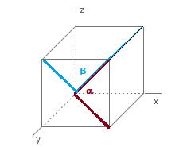

1- Calcular la norma de los siguientes vectores

* $\vec{v}=(-1,2,1)$     $\quad\quad \vec{u}=(-1,2,4,1)$.

2- Calcular la distancia entre los siguientes puntos

\[
\begin{array}{cc}
  \vec{a} = (-1,0)  \quad y \quad \vec{b}=(1,1)  &   \vec{a}=(1,-1,1) \quad y  \vec{b}=(-3,1,2)  \\
  \vec{a} = (1,-1,0,1) \,\,\, y\,\,\,\vec{b}=(-2,1,3,2)
\end{array}
\]

3- Calcular el perímetro del triángulo con vértices en $\vec{u}=(0,0,1)$, $\vec{v}=(1,1,0)$ y $\vec{w}=(-1,1,0)$.

4- Calcular el ángulo entre las diagonales del siguiente cubo

```{r fig.align='center', echo=FALSE, message= FALSE, warning=FALSE}

```

5- Realizar 2 ejercicios de los problemas 28 - 41 del libro álgebra lineal de Grossman, sección 3.5.

6- Realizar los ejercicios 43 y 45 del libro álgebra lineal de Grossman, sección 3.5