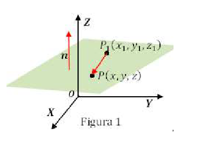

# Recta en $\mathbb{R}^2$, $\mathbb{R}^3$

Las expresiones algebraicas que cumplen todos los puntos $P=(x,y)$ que pertenecen a una recta $l$, se les llama *ecuaciones* *de* *la* *recta*. La ecuación de la recta no tiene una única expresión. Pues las ecuaciones están determinadas por los puntos elegidos y por el tipo de ecuación, sin embargo son equivalentes. 

En $\mathbb{R}^2$ la ecuación de la recta tiene diversas formas

\begin{array}{cc}
  Ax+By+C\,=\, 0, & \quad\quad y=mx+b, & \quad\quad \frac{x}{a}+\frac{y}{b}=1\\
\end{array}

## Vectores equipotentes

Dos vectores son equipotentes si tienen la misma dirección, sentido y magnitud, pero no necesariamente un mismo punto de partida.

## Ecuación vectorial

Suponga que $\vec{p}=\overrightarrow{OP}$ es el vector del origen al punto $P$ y $\vec{d}$ un vector adicional.

Todos los puntos que pertenecen a una recta $\vec{v}=(x,y)=\overrightarrow{OQ}$ están dados por

\begin{equation}
  \vec{v}=\vec{p} + t \vec{d}
\end{equation}

a dicha ecuación se le suele llamar la forma vectorial de la ecuación de la recta. Con $\vec{p}$ es un punto conocido que pasa por la recta y el vector $\vec{d}$ es un vector que tiene una _dirección_ de la recta.
Otra forma de escribir la forma vectorial

\begin{equation}
  \overrightarrow{OQ} = \overrightarrow{OP} + t \overrightarrow{PQ}
\end{equation}

si ahora se conocen dos puntos sobre la recta $l$. En dicho caso una dirección de la recta está dada por $\vec{d}=\overrightarrow{PQ}$.

## Ecuación paramétrica

Las ecuaciones paramétricas, expresan explicitamente la dependencia de los puntos de la recta con un parámetro.

## Ecuación canónica o continuas

La ecuación resultante de igualar el parámetro entre sus coordenadas
Si $\vec{v}=(x,y,z)$
\[
\begin{pmatrix} x \\ y\\ z \end{pmatrix} = \vec{v} = \vec{p} + t\vec{d} 
\]

Igualando los vectores, se obtiene la ecuación en su forma paramétrica.

### Ejemplos

1. Determinar la ecuación vectorial y la ecuación paramétrica de la recta que pasa por $P=(1,2)$ y $Q=(3,-2)$.

1. Determinar la ec. vectorial y ec. paramétrica de la recta con vector dirección $\vec{d}=(-3,-4)$ y que pasa por el punto $\vec{p} = (2,2)$.

1. Determinar el vértice $D$ del paralelogramo $ABCD$ tal que $A=(2,3,1)$, $B=(1,5,3)$ y $C=(3,4,0)$.

### Ejemplos

Encontrar la recta en $\mathbb{R}^3$ que contiene  los puntos $\vec{p}=(3,-1,4)$ y $\vec{q}=(1,3,-1)$ encontrar una ecuación de la recta en su forma vectorial

\quad En este caso el vector director o la dirección de la recta es igual a $\vec{qp} = \vec{p} - \vec{q} = (2,-4,5)$ entonces 
\[
\vec{r}(t) = \begin{pmatrix} 1 \\ 3\\ -1  \end{pmatrix} = \begin{pmatrix} 1 \\ 3\\-1 \end{pmatrix} + t  \begin{pmatrix} 2 \\ -4\\ 5 \end{pmatrix}
\]

La ecuación paramétrica está dada por 
\[
\begin{array}{cc}
 x(t)  & = 1 + 2t \\
 y(t)  & = 3-4t   \\
 z(t)  & = -1 + 5t
\end{array}
\]

La ecuación canónica se obtiene despejando el parámetro $t$, por tanto está dado por 
\[
\frac{x-1}{2} = \frac{y-3}{-4} = \frac{z+1}{5}
\]

#### Ejemplo

1. Encontrar una ecuación vectorial para la línea que pasa por $P(-5,2,10)$ y $Q=(3,-4,-4)$.

2. Encuentra la ecuación de la línea en su forma paramétrica y simétrica, si pasa por $(1,4,-2)$ y $(-3,5,0)$.

3. Encontrar las ecuaciones vectorial y canónica de las siguientes rectas.
\[
x=1+t, \quad\quad y=3+t\quad\quad z= 5 + 4t\quad t\in \mathbb{R}
\]

## Ecuación del plano (en  $\mathbb{R}^3$ o $\mathbb{R}^n$)

Suponga que $\Pi$ es el conjunto de puntos $Q=(x,y,z)$ tales que, para un punto $P=(x_0,y_0,z_0)$ el segmento $\overrightarrow{PQ}$ es perpendicular a un vector *normal* $\vec{n}$.

{ width=40% }		

entonces
\[
(\vec{Q} - \vec{P}) \boldsymbol{\cdot} \vec{n} = 0
\]

o bien $\vec{Q}\boldsymbol{\cdot} \vec{n} = \vec{P}\boldsymbol{\cdot} \vec{n}$. Si $\vec{Q}$ es un punto arbitrario sobre el plano $\Pi$, $\vec{n}=(A,B,C)$ y $\vec{P}=(x_0,y_0,z_0)$ es un punto conocido sobre el plano, entonces tenemos que 
$$
A(x-x_0) + B(y-y_0) + C(z-z_0) = 0
$$

El vector que es perpendicular a todo vector *contenido* en el pñlano se le llama el **vector** **normal** 

Si conocemos 3 puntos en el plano $P$, $Q$ y $R$ entonces, los vectores contenidos en el plano serán $\vec{u} =\overrightarrow{QP}$ y $\vec{v} =\overrightarrow{QR}$ entonces
\[
\vec{n}= \vec{u} \times \vec{v}
\]
es un vector normal al plano. (¿Por que basta con que sea perpendicular a  2 vectores no colineales?)

## Ecuación general del plano

Si $\vec{n}=(A,B,C)$ es un vector normal al plano, $Q=(x,y,z)$ es un vector sobre el plano y $\vec{P}=(x_0,y_0,z_0)$ entonces

\[
  Ax + By+Cz = Ax_0+ By_0+Cz_0
\]

si $D=-(Ax_0+By_0+Cz_0)$ entonces la ecuación general del plano es igual a 
\[
Ax + By+Cz +D = 0
\]

### Ejemplo

Calcular la ecuación del plano $xy$. En este caso, el origen pasa por $\vec{P}=(0,0,0)$ y el vector normal $\vec{n}=(0,0,1)$, si $\vec{Q}=(x,y,z)$ entonces la ecuación vectorial del plano esta dada por

\begin{equation}
  \begin{array}{cc}
  (\vec{Q}-\vec{P}) \boldsymbol{\cdot} \vec{n} = 0
  \end{array}
\end{equation}

Sustituyendo $\vec{Q}=\begin{pmatrix} x \\ y \\ z \end{pmatrix}$ y $\vec{P}=\begin{pmatrix} 0 \\ 0 \\ 0 \end{pmatrix}$ y $\vec{n} = \begin{pmatrix} 0 \\ 0 \\ 1 \end{pmatrix}$
\[
\begin{array}{ccc}
\vec{Q}\cdot \vec{n}= \vec{P} \cdot \vec{n} \\
\begin{pmatrix} x\\ y \\ z \end{pmatrix} \boldsymbol{\cdot} \begin{pmatrix} 0 \\ 0 \\ 1 \end{pmatrix} =0 \rightarrow z = 0 
\end{array}
\]

### Ejemplo

Calcular la ecuación del plano $xz$, en este caso $\vec{P} = \begin{pmatrix} 0 \\ 0 \\ 0 \end{pmatrix}$ y $\vec{n}=\begin{pmatrix} 0 \\ 1 \\0  \end{pmatrix}$, por tanto, la ecuación
\[
\begin{array}{ccc}
\vec{Q}\cdot \vec{n}= \vec{P} \cdot \vec{n} \\
\begin{pmatrix} x\\ y \\ z \end{pmatrix} \boldsymbol{\cdot} \begin{pmatrix} 0 \\ 1 \\ 0 \end{pmatrix} =0 \rightarrow y = 0 
\end{array}
\]

Si consideramos que existen 3 puntos sobre el plano y se busca calcular la ecuación del plano, $\vec{Q},\vec{P}$ y $\vec{R}$, en este caso  $\vec{u}=\overrightarrow{QP}$ y $\vec{v} = \overrightarrow{QR}$ entonces un vector normal se puede calcular como $\vec{n} = \vec{u} \times \vec{v}$.

#### Ejemplo. 

 Encontrar el plano que pasa por $\vec{P}=\begin{pmatrix} 2 \\ 1 \\ 3 \end{pmatrix}$, $\vec{Q}=\begin{pmatrix} 1 \\ 3 \\ 2 \end{pmatrix}$ y $\vec{R} = \begin{pmatrix} -1 \\ 2 \\ 4 \end{pmatrix}$.
 
 En este caso $\overrightarrow{PQ} = \vec{Q}-\vec{P} = \begin{pmatrix} -1 \\ 2 \\ -1 \end{pmatrix}$ 
 $\overrightarrow{PR} = \vec{R}-\vec{P} = \begin{pmatrix} -3 \\ 1 \\ 1 \end{pmatrix}$. El vector normal del plano se calcula como
 
 \begin{equation}
 \vec{n} = \begin{vmatrix} 
            \hat{i} & \hat{j} & \hat{k} \\
            -1      &     2   & -1      \\
            -3      &    1    & 1
          \end{vmatrix} = \hat{i}(2+1) - \hat{j}(-1-3) + \hat{k}(-1+6) = \begin{pmatrix} 3 \\ 4 \\ 5 \end{pmatrix}
 \end{equation}
 
 Si $\vec{X}=\begin{pmatrix} x \\ y \\ z \end{pmatrix}$ entonces $\vec{X} \cdot \vec{n} = \vec{p}\cdot \vec{n}$ entonces la ecuación del plano está dada por  $3x+4y+5z=25$.
 
#### Ejemplo
 
 Encontrar una ecuación del plano que pasa por $P_1$ y paralelo a $\Pi_1$.
 
 a) Si $\Pi_1$ tiene como ecuación $3x+2y-z+4=0$y $P_1=(1,-2,-1)$.
 
 b) Si $\Pi_2$ tiene como ecuación $x+2y+1 = 0$ y $P_1=(3, 0, 2)$.

<strong>Solución</strong> 

a) El plano que se busca, tiene como vector normal al mismo vector normal del plano $3x+2y-z+4=0$  es decir $\vec{n}=(3,2,-1)$. Aplicando la ecuación del plano 

\begin{equation}
  \begin{pmatrix} x \\ y \\ z \end{pmatrix} \boldsymbol{\cdot} \begin{pmatrix} 3 \\ 2 \\ -1\end{pmatrix} = \begin{pmatrix} 1 \\ -2 \\ -1\end{pmatrix} \boldsymbol{\cdot} \begin{pmatrix} 3 \\ 2 \\ -1\end{pmatrix}
\end{equation}

Entonces $3x+2y-z=0$.

b) En este caso $\vec{n}=(1,2,1)$ y pasa por $P_1=(3,0,2)$ aplicando la forma vectorial del plano, tenemos

\begin{equation}
  \begin{pmatrix} x \\ y \\ z \end{pmatrix} \boldsymbol{\cdot} \begin{pmatrix} 1 \\ 2 \\ 1\end{pmatrix} = \begin{pmatrix} 3 \\ 0 \\ 2\end{pmatrix} \boldsymbol{\cdot} \begin{pmatrix} 1 \\ 2 \\ 1\end{pmatrix}
\end{equation}

La ecuación está dada por $x+2y+z= 5$
 
#### Ejemplo
 
 Encontrar la ecuación del plano $\Pi$ que contiene $l_1$ y $l_2$ dada por 
 \[
 \begin{array}{cc}
 L_1: & \frac{x-1}{3} = \frac{y+2}{2} = \frac{z-2}{2}
 \end{array} 
 
 \begin{array}{cc}
 L_2: & \frac{x-1}{1} = \frac{y+2}{1} = \frac{z-2}{0}
 \end{array} 
 
 
#### Ejemplo
 
 Mostrar que el plano $2x-3y + z -2 = 0$ es paralelo a la recta $L: \frac{x-2}{1}=\frac{y+2}{1} = \frac{z+1}{1}$.
 
 Mostrar que el plano, contiene a la recta
 \[
 \vec{r}(t) = \begin{pmatrix} 1 \\ -1 \\ 2\end{pmatrix} + t \begin{pmatrix} 2 \\ 3 \\ 1 \end{pmatrix} 
 \]
 
### Representación paramétrica del plano
 
 Considere la ecuación del plano $Ax+By+Cz=D$ entonces podemos expresar a una de las coordenadas de los puntos en el plano en función de las otras coordenadas. 
 
 Por ejemplo, en la ecuación del plano $\Pi$ del primer ejemplo
 \[
   3x+4y+5z=25, \quad\quad\Rightarrow z=5-\frac{3}{5}x-\frac{4}{5}y
 \]
 
 Es decir 
 \[
 \left\{ \begin{pmatrix} x \\ y \\z \end{pmatrix} \in \mathbb{R}^3\, :\, 3x + 4y + 5z = 25\right\} =  \left\{ \begin{pmatrix} x \\ y \\z \end{pmatrix} \in \mathbb{R}^3\, :\, z = 5 -\frac{3}{5}x-\frac{4}{5}y \right\} 
 \]

 Es decir, todo punto en el plano $\Pi$,  $Q=\begin{pmatrix} x \\ y \\ z \end{pmatrix}\in \Pi$ tiene que cumplir con  
 \[Q=\begin{pmatrix} x \\ y \\ 5-\frac{3}{5}x-\frac{4}{5}y \end{pmatrix}=
     \begin{pmatrix} 0 \\ 0 \\ 5 \end{pmatrix} + \begin{pmatrix} 1 \\ 0 \\ -\frac{3}{5} \end{pmatrix} x + \begin{pmatrix} 0 \\ 1 \\ -\frac{4}{5} \end{pmatrix} y  
\]

